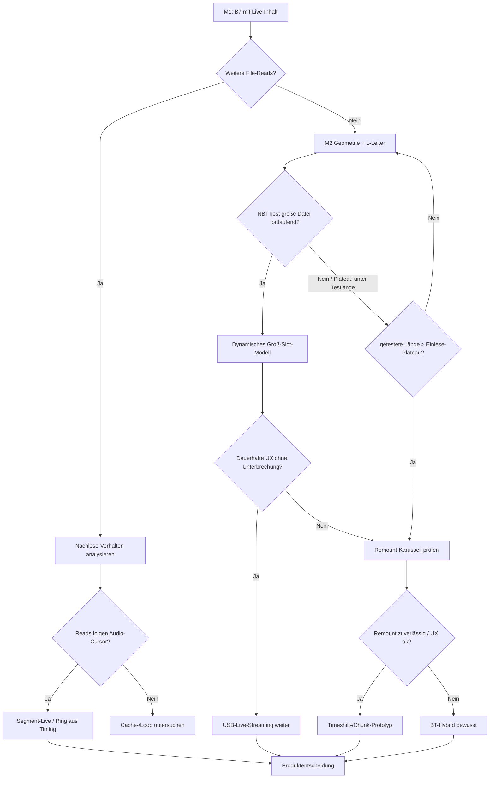

# Auftrag — MSC Host-Read-Nachweis (B7 → L-Leiter → Architektur)

**Stand:** 2026-10-03 · aktiv  
**Anlass:** Multi-KI-Konsens + Speicher-/Cache-Hypothese (HU-Cache endlich; 2‑MiB-Stick erklärt „nie Nachlesen“ nicht als Absolutgrenze)  
**Feldbericht:** [`../betrieb/FELDTEST-ESP-MSC-BMW-2026-09-28.md`](../betrieb/FELDTEST-ESP-MSC-BMW-2026-09-28.md) §11.10  
**Teilauftrag B7:** [`AUFTRAG-B7-HU-REREAD.md`](AUFTRAG-B7-HU-REREAD.md)  
**Ring/BT-Papier:** [`../betrieb/POST-1110-RING-BT-NOTES.md`](../betrieb/POST-1110-RING-BT-NOTES.md)

---

## 0. Problemformulierung (verbindlich)

**Alt (zu stark):** Das NBT cached den initialen Burst und liest danach nicht weiter.

**Neu:** Das NBT liest beim Mount einen initialen Datenbestand weitgehend ein. Ob es bei einer bereits mit Live-Audio gefüllten, **wesentlich größeren** und weiterhin abspielbaren Datei während der Wiedergabe weitere MSC-Reads anfordert, ist **noch nicht nachgewiesen**.

Aktuelle Geometrie (~2 MiB, 4×512 KiB, Mount-Scan ~1,6 MiB) macht „alles cachen“ für die HU **rational**. Der Befund „keine weiteren Reads“ in 60 s-Fenstern gilt für diesen Stick — nicht automatisch für Dateien über der Cache-Grenze.

Zusätzlich unterscheiden: **Indexlauf** (ID3/Xing/Dauer: Anfang/Ende) vs. **Wiedergabe-Cache** (Payload bis Plateau). Messung muss Scan-LBAs von Play-LBAs trennen.

---

## 1. Entscheidungsbaum (nach Messungen, nicht nach einer Beobachtung)

**Gate vor Szenario „auch große Dateien nur einmal“:** nur gültig, wenn getestete Länge **über** dem gemessenen Einlese-Plateau lag. Sonst: zu kleine Testdatei → Fehlschluss.

---

## 2. Maßnahmen (streng sequentiell)

| ID | Name | Repo / Ort | FW-Änderung? | Gate zum Weiter |
|----|------|------------|--------------|-----------------|
| **M0** | Telemetrie absichern | `esp32.pidrive` | ja (klein) | Queue droppt keine entscheidenden Samples |
| **M1** | B7-A / B7-B / B7-C | Auto + Tools hier | **nein** (0.4.36) | Messpaket komplett; UID-OK wo nötig |
| **M2** | Geometrie-Vorstufe L0 | `esp32.pidrive` | ja (eigenes FW) | Disk ≥ Zielslot; Menü-Listing ok |
| **M3** | L-Leiter L1→L4 | Auto + Lab | L1 auf Ist-FW; L2+ braucht M2 | Plateau-Kurve + Play-Reads |
| **M4** | Ring/PSRAM | nur nach M3-Nachweis | ja | gemessene Read-Lücken → Kapazität |
| **M5** | Fallback Remount / BT | Produkt | je nach Ergebnis | UX-Zahlen, nicht nur Technik |

**Nicht parallel:** M2 nicht während M1-Feldfenster; Ring nicht vor Host-Read-Nachweis; Remount/BT nicht als gleichwertiger Parallelpfad zur L-Leiter.

---

## 3. M0 — Telemetrie (vor weiterem Feldurteil)

Ziel: Host-Reads beweisbar klassifizieren, ohne dass Burst-Samples verloren gehen.

| Arbeit | Akzeptanz |
|--------|-----------|
| `readOverflow` prüfen: Queue-Größe / Drop-Politik / Zeitreihe durch Burst | `readOverflow_delta≈0` während Mount-Burst **oder** Drops erklärt + Trace vollständig |
| Read-Arten in Export/Status: FAT / DIR / Slot-Head / Slot-Body / Meta (Xing-Seek) | Filter „nur File-Payload-Reads“ möglich |
| LBA ↔ Slot-Offset ↔ `hostAbsCursor` korrelierbar | Scan-Fenster vs. Play-Fenster in Artefakt trennbar |
| Optional: Counter-Reset-API nur wenn B7-Poll ohne sie unlesbar bleibt | dokumentiert in COUNTER-SEMANTICS |

Kein Ring-Umbau in M0. Kein Probe-Fork-Repo (bestehende Lab-APIs nutzen).

---

## 4. M1 — B7 scharf (Details in AUFTRAG-B7)

Drei **getrennte** Messungen auf **0.4.36-dev**, Live-Inhalt vor/bei Auswahl bereit:

| Pass | Frage | Kurz |
|------|-------|------|
| **B7-A** | Nach Mount-Scan: weitere File-Reads bei ≥150 s einer Station? | Ist-Geometrie, Sync vor Select, UID=Ohr |
| **B7-B** | Armed-Replug: Overlay/Cursor vor HU-Burst warm? | Replug mit vorbereitetem Stream; Burst-Fenster einfangen |
| **B7-C** | Ordnerwechsel / erneute Auswahl | Meta-Reads ≠ Audio-Reads; erzeugt Auswahl neue Payload-Reads? |

Auswertung: nicht eine Zeile `readCount` flat — Scan-LBAs, Play-LBAs, `streamBytesΔ`, Ohr-Stoppuhr, UID-Match getrennt notieren.

---

## 5. M2 — Geometrie-Vorstufe (L0) — **vor** L3/L4

**Kollision:** L3 (8 MiB) / L4 (50 MiB) passen **nicht** in FAT12-Image ~2 MiB (`total≈4096` Sektoren). Cluster-Kette und Capacity müssen die deklarierte Dateilänge tragen.

Regel **0.4.12** bleibt: Geometrie/FAT/Dir **immutable nach Setup**; Stream = Payload-Overlay. L0 = **neuer** fester Geometrie-Build (oder Lab-Config), kein Live-Mutieren der Chains während Stream.

| Anforderung | Hinweis |
|-------------|---------|
| Disk-Kapazität ≥ größter Testslot | FAT16 oder größere Cluster ab ~16 MiB prüfen |
| Eine lange zusammenhängende Datei (Cluster-Kette algorithmisch, nicht im RAM) | Menü: vorerst 1 Live-Slot + minimale Nav **oder** L2 = „ganzer Stick = eine Datei“ nur als Zwischenmessung |
| Xing/CBR-Header glaubwürdige Dauer | sonst Import-Abbruch / Kaputtkürzen |
| Indexzeit messen | Zeit bis Menü/Titel sichtbar pro Stufe |

**FW-Auftrag (esp32.pidrive):** eigener kleiner Auftrag „L0 Geometrie 4–16 MiB Slot“ — **nicht** parallel zu B7-Feld.

Empfohlene erste L0-Ziele: **4 MiB** und **16 MiB** Disk/Slot (Lab-Smoke + Listing am BMW), bevor L3/L4.

---

## 6. M3 — L-Leiter (nur Länge als Variable)

Inhalt/Stub-Form **identisch** (gültige Silence/Xing bzw. Live-Overlay-Pfad); **nur deklarierte Länge** ändert sich.

| Stufe | Größe | Voraussetzung | Ziel |
|-------|-------|---------------|------|
| **L1** | 512 KiB | Ist-FW | Referenz (heutiges Verhalten) |
| **L2** | ~2 MiB | Ist oder L0-klein | größerer Slot / ggf. 1-Datei-Stick |
| **L3** | 8 MiB | **M2** | fortlaufende Reads? Plateau? |
| **L4** | 50 MiB | **M2** + FAT-fähig | Langzeit / Cache-Grenze |

Pro Stufe Artefakt:

1. `bytesRead` / `readCount` **über Zeit** (Plateau-Erkennung = Cache- bzw. Scan-Grenze)  
2. LBA-Mengen: Scan vs. Play  
3. Indexzeit (Mount → Liste/Titel)  
4. Ohr: Dauer Ton, Abbruch, Loop, Stille  
5. Erfolg **nur** wenn während Wiedergabe **zuvor ungelesene** Sektoren angefordert werden — nicht weil FAT-Größe groß ist

Langfrist-Hinweis (nicht M3-Scope): ~10 h @ 48 kbit/s ≈ 216 MB → Endmodell ohnehin „deklariert riesig, on-demand“. L4 ist Messhebel, kein Produktziel.

---

## 7. M4 — Ring erst nach Read-Nachweis

- 48 KiB **beibehalten**, bis M1/M3 fortlaufende Host-Reads zeigen.  
- Dann Puffergröße aus gemessenen Read-Abständen und Chunk-Größen rechnen.  
- PSRAM/1,5 MiB-Ring **erst** wenn Kapazität die gemessene Lücke nicht hält (`freeHeap` Lab: 256 KiB-Ring heute ohne Umbau/PSRAM nicht frei).

Größerer Ring verlängert höchstens ein bereits geliefertes Fragment — ersetzt kein Nachlesen und keine Play-Detection.

---

## 8. M5 — Fallbacks (nachrangig)

| Pfad | Wann | Produktfrage |
|------|------|--------------|
| Remount-/Chunk-Karussell | L-Leiter: Plateau erreicht, aber keine Play-Nachlese; Remount erzeugt Reads | Ton-Dauer, Mount-Lücke, HU-Reaktion — anderes Produkt als Dension-Live |
| BT-Hybrid | Remount unzuverlässig **oder** UX inakzeptabel | USB = Menü/Cover; BT = Ton; getrennte NBT-Quellen; explizite UX — **keine** stille Vermischung |

Konzeptziel USB=UI+Ton bleibt, bis M3 das Gegenteil belegt. BT jetzt **nicht** festlegen.

---

## 9. Explizit nicht tun (jetzt)

| Maßnahme | Warum nicht |
|----------|-------------|
| Ring sofort auf 1,5 MiB / PSRAM-Streaming | Host-Read-Variable nicht adressiert |
| Remount-Karussell als Hauptpfad entwickeln | UX/Re-Enum ungeklärt |
| Ordnerwechsel als Audio-Trigger | Directory-Reads ≠ File-Transport |
| READ künstlich offenhalten | erzeugt keine Host-Anforderungen |
| FW-Großumbau vor L-Nachweis | Architekturfrage offen |
| BT-Hybrid jetzt Produktentscheid | M1+M3 fehlen |
| L3/L4 ohne Geometrie-Auftrag | physikalisch/FAT unmöglich auf 2‑MiB-Image |

---

## 10. Abnahme-Kernfrage

> Veranlasst eine geeignete MSC-Dateistruktur (Länge ≫ Einlese-Plateau, gültiger MP3-Header, Live-Overlay) den BMW NBT Evo zu **fortlaufenden** File-Reads während der Wiedergabe?

- **Ja** → USB-Live (Segment/Groß-Slot) weiterentwickeln; Ring aus Messung.  
- **Nein** (nach Gate) → Remount prüfen → sonst BT-Hybrid als bewusste Architektur.

---

## 11. Sofort-Checkliste (nächste Sitzung)

1. [ ] M0-Status: reicht Ist-Telemetrie für Burst-Capture, oder `readOverflow`-Fix zuerst?  
2. [ ] B7-A fahren (`feld_150s_slot_pass.py`, Live vor Select)  
3. [ ] B7-B Armed-Replug getrennt  
4. [ ] B7-C Ordnerwechsel getrennt  
5. [ ] Ergebnis in Feldbericht §11.11 + Verweis hierher  
6. [ ] Bei „keine Play-Reads“: L0-FW-Auftrag in `esp32.pidrive` öffnen (nicht Ring)  
7. [ ] L1–L4 mit Plateau-Kurven; Szenario-3 nur nach Gate  

Owner-Feld: Auto `.89` / Lab `.88` / Bridge Pi — wie B7-Checkliste.
