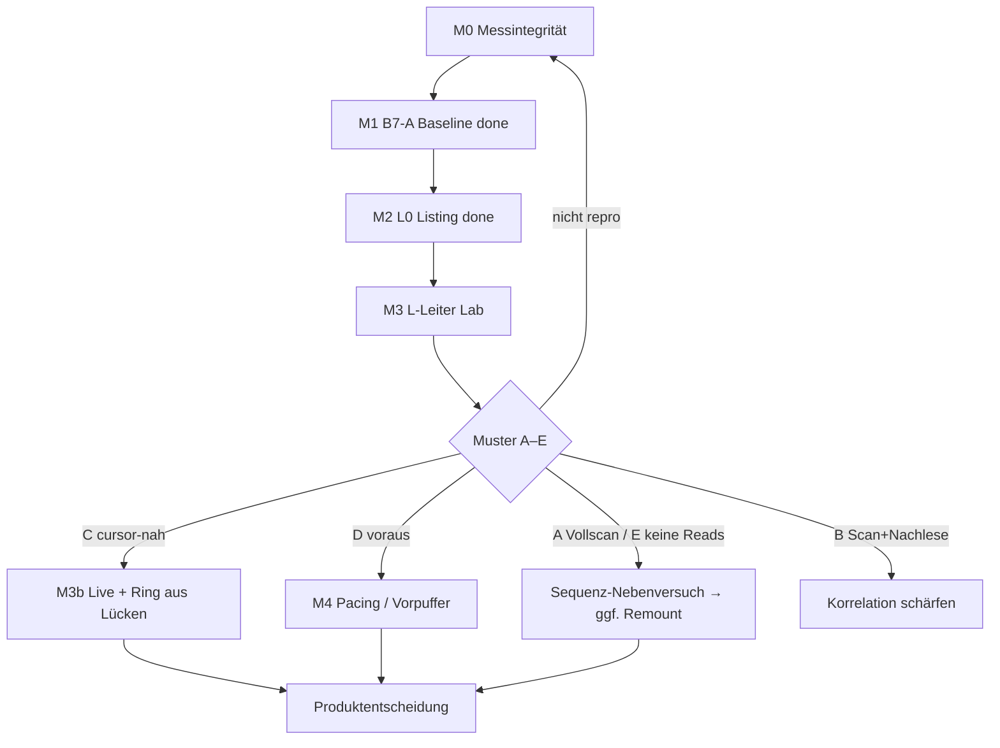

# Auftrag — MSC Host-Read-Nachweis (B7 → L-Leiter → Architektur)

**Stand:** 2026-10-03 · aktiv (**Rev. 4** — GPT-Übergabe + Mistral-Nachtrag)  
**Anlass:** Multi-KI-Konsens; L0 zeigt: Lesevolumen skaliert mit Angebot → **kein fixes Cache-Plateau**  
**Feldbericht:** [`../betrieb/FELDTEST-ESP-MSC-BMW-2026-09-28.md`](../betrieb/FELDTEST-ESP-MSC-BMW-2026-09-28.md) §11.10–§11.12  
**Übergabe:** [`../betrieb/UEBERGABE-MSC-BEWERTUNG-2026-10-03.md`](../betrieb/UEBERGABE-MSC-BEWERTUNG-2026-10-03.md)  
**M0:** [`AUFTRAG-M0-MESSINTEGRITAET.md`](AUFTRAG-M0-MESSINTEGRITAET.md)  
**Teilauftrag B7:** [`AUFTRAG-B7-HU-REREAD.md`](AUFTRAG-B7-HU-REREAD.md)  
**Ring/BT-Papier:** [`../betrieb/POST-1110-RING-BT-NOTES.md`](../betrieb/POST-1110-RING-BT-NOTES.md)

**Feld-Stand 2026-10-03:**  
- **M1 B7-A** = Baseline kleine Ist-Geometrie (Cache-only im Pass; kein Beweis „NBT liest nie nach“).  
- **M2 L0** Auto `0.4.39` FAT12 = Listing ok; Prefetch ~3,19 MB; Select danach oft ohne neue Reads / `play.guess=0`.  
- **Nächster Gate:** **M0 Messintegrität** → dann **M3** (Sweep-Ende → Play-Phase), **nicht** „Datei > Plateau“.

---

## 0. Problemformulierung (verbindlich)

**Alt (zu stark):** Das NBT cached den initialen Burst und liest danach nicht weiter.

**Neu:** Das NBT liest beim Mount große Teile der deklarierten Dateien **schnell** ein (~0,8 MB/s, typisch 4 KiB-Reads). Ob es **nach erkennbarem Sweep-Ende** während Wiedergabe **neue, zuvor ungelesene** Sektoren anfordert — und wo relativ zur Wiedergabeposition — ist **nicht nachgewiesen**.

L0 zeigt: Mid-File-Reads und Dateibytes **skalieren ~proportional** mit Slot-/Angebotsgröße (~2× bei 2× Slot). Das spricht für **Datei-Sweep / Index**, nicht für ein festes Cache-Limit. Eine größere Datei erzwingt also **nicht** automatisch Play-Reads.

### 0.1 Vier Ebenen (nicht vermischen)

| # | Ebene | Bedeutung |
|---|--------|-----------|
| 1 | **Host-Read** | HU fordert Sektoren an |
| 2 | **Read-Ahead / Scan** | Reads weit vor Wiedergabe / Indexlauf |
| 3 | **Play-Read** | Während Wiedergabe neue, positionsrelevante Sektoren |
| 4 | **Live-Verwertbarkeit** | Sektor enthält bereits gültige Live-Audiodaten |

Nachweis auf 1/2 ≠ Nachweis auf 3/4. `play.guess=0` ≠ „keine Reads“.

### 0.2 Read-Ahead ≠ Live-Daten

Host-Rate ~0,8 MB/s ≫ Live-Erzeugung ~6 KiB/s. Reads können Sektoren fordern, deren Live-Inhalt noch fehlt → Overlay = Stille/Stub. Ring allein löst das nicht; Fall **D** (Vorauslauf) → später Pacing/Vorpuffer (M4).

### 0.3 L-Leiter ohne Live-Pfad

M3 = **statische**, gültige, markierte MP3-Frames. Keine Bridge, kein Overlay als Messvariable. Transportmessung **unabhängig** von `play.guess`.

---

## 1. Entscheidungsbaum (nach Messungen)

**Gestrichen:** Gate „getestete Länge > Einlese-Plateau“ als alleinige Abbruchbedingung.

**Neues Gate:** Identifizierbares **Sweep-Ende** → während Wiedergabe **neue** Sektoren? Cursor-nah (**C**) vs. voraus (**D**) vs. keine (**A/E**).

---

## 2. Maßnahmen (Reihenfolge)

| ID | Name | Status / Gate |
|----|------|----------------|
| **M0** | Messintegrität (`readCount`/`readsEmit`/Export/Session) | **jetzt zuerst** — siehe AUFTRAG-M0 |
| **M1** | B7-A/B/C | A **done** (Baseline); B/C optional |
| **M2** | L0 Geometrie | **done** Auto 0.4.39 Listing |
| **M3** | L-Leiter L1→L4 **statisch** + Muster **A–E** | nach M0; Lab zuerst |
| **M3seq** | Autoplay-Sequenz (kurze Dateien) | Lab-Nebenversuch, kein Architekturpfad |
| **M3det** | Mid-Seq-Detect nach Prefetch | Lab parallel; **nicht** Gate für Transport |
| **M3b** | Live-Overlay | erst nach C oder D verstanden |
| **M4** | Ring / Pacing / PSRAM | nach Pace-Klassifikation |
| **M5** | Remount / BT | nach M3 A/E + Sequenz-Fail |

**Eingefroren:** Ring, PSRAM-Streaming, Remount-Karussell, BT-Hybrid-Festlegung.

---

## 3. M0 — siehe eigener Auftrag

Kurz: Zuerst prüfen, ob `readsEmit` **Burst-Zeilen** zählt (`kBurstGapMs=50`, Code bestätigt) — Hypothese 806/218≈3,7. Dann Session-ID, Exportpfad (leere `pidrive_msc_reads.jsonl` in B7-A!), Gleichung:

`readCount = Σ(n in exportierten Bursts) + gezählte Drops`  
pro **einer** Session-ID.

Ohne M0: keine LBA-Verteilungsinterpretation als Play-Verhalten.

---

## 4. M1 — B7 (Kurz)

| Pass | Einordnung |
|------|------------|
| **B7-A** | Baseline Ist-Geometrie; Session-Grenze/Kaltstart beachten; **kein** Beweis gegen USB-Live |
| **B7-B/C** | optional; C hart nur mit Read-Klassen |

---

## 5. M2 — L0 (erledigt)

FAT12 L0 4 MiB / 1 M-Slots Auto: Listing 3 Dateien. Prefetch skaliert. Play-Pfad offen → M3.

Für L3/L4 später: FAT16-Geometrie **im Lab validieren**, bevor 50 MiB.

---

## 6. M3 — L-Leiter (Rev. 4)

### 6.1 Testdatei

Gültige synthetische MP3: konsistente Frames, plausible Bitrate/Dauer, kontrolliertes Xing, **Marker alle ~30 s** mit bekanntem Dateioffset. **Kein** Stub+Padding.

### 6.2 Stufen

| Stufe | Größe | Zweck |
|-------|-------|--------|
| L1 | 512 KiB | Referenz |
| L2 | ~2 MiB | bekannte Größenordnung |
| L3 | 8 MiB | größerer Sweep; nach Geometrie-OK |
| L4 | 50 MiB | Langzeit; **erst nach FAT16-Validierung** |

Länge = Hauptvariable; Format/Marker/Header zwischen Stufen gleich. Xing-Varianten = **Reihe 2** erst nach Reihe 1 (nur Lab).

### 6.3 Pflichtmessgrößen

| Größe | Bedeutung |
|-------|-----------|
| `readRate` | Host-Bytes/s |
| `readOffset` / LBA | was gelesen wird |
| `playOffset` | aus Audio-Marker (nicht blind UI-Balken) |
| `readAheadDistance` | readOffset − playOffset |
| Sweep-Ende | Zeitpunkt / letzter LBA des initialen Sweeps |

Transport **ohne** `play.guess` auswerten.

### 6.4 Muster A–E (Abnahme)

| Code | Muster | Folge |
|------|--------|--------|
| **A** | Vollständiger Scan vor/zu Beginn | Sequenz / Remount prüfen |
| **B** | Scan + spätere Reads ohne Cursor-Korrelation | Korrelation schärfen |
| **C** | Cursor-nahe Play-Reads | M3b Live; Ring aus Lücken |
| **D** | Fortlaufende Reads, weit voraus | M4 Pacing/Vorpuffer |
| **E** | Keine Payload-Reads nach Sweep | wie A |

### 6.5 Nebenversuche (getrennt)

- **M3seq:** kurze Dateien, Slot-ID-Marker, Autoplay, LBA↔Titelwechsel.  
- **M3det:** Mid-Seq nach Prefetch-Cooldown — UX/Detect, nicht Transport-Gate.

---

## 7. M4 / M5

Unverändert nachrangig: Ring/Pacing nur nach C/D; Remount/BT nur nach A/E + Sequenz-Negativ.

---

## 8. Explizit nicht tun (jetzt)

| Maßnahme | Warum |
|----------|--------|
| Ring / PSRAM | kein Pace-Nachweis |
| Live-Overlay in M3 | vermischt Ebenen |
| Remount/BT als Hauptpfad | Produkt vorzeitig |
| Play-Detect als einzige Read-Messung | Zirkelschluss |
| „Datei > Plateau“ als einziges Gate | Plateau nicht belegt |
| L3/L4 ohne FAT-Validierung | Geometrie-Risiko |
| Autoplay-Reads als bewiesen | Kausalität fehlt |
| M3 vor M0 | Vertrauensintervall unbekannt |

---

## 9. Abnahme-Kernfragen

1. Nach Sweep-Ende: neue, zuvor ungelesene Sektoren während Wiedergabe? → A–E.  
2. Bei C/D: Leserate ≈ Abspieltempo oder voraus?  
3. Erst dann: Live-Overlay / Ring / Pacing.

---

## 10. Sofort-Checkliste

1. [ ] **M0** — Zählsemantik + Export + Session (AUFTRAG-M0)  
2. [x] B7-A Baseline — 2026-10-03  
3. [x] L0 Listing Auto 0.4.39 — §11.12  
4. [ ] M3 L1/L2 Lab mit A–E + Marker  
5. [ ] M3 L3 nach Geometrie-OK; L4 nach FAT16  
6. [ ] Feld nur Hypothesen-Bestätigung nach Lab  
7. [ ] Ring/BT weiter eingefroren  

Owner: Lab `.88` zuerst; Auto `.89` erst nach M0+M3-Lab.
