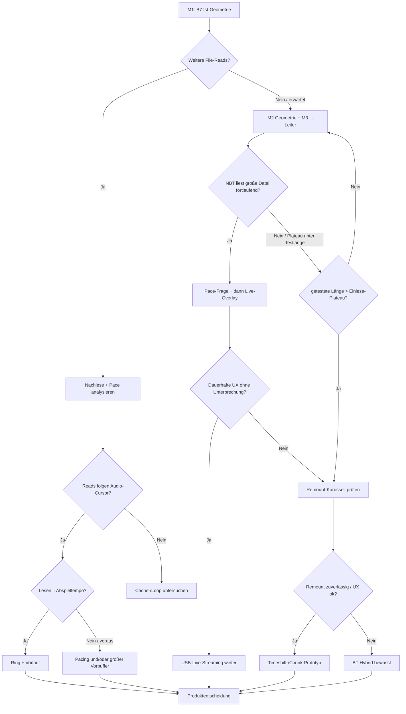

# Auftrag — MSC Host-Read-Nachweis (B7 → L-Leiter → Architektur)

**Stand:** 2026-10-03 · aktiv (Rev. 2: Pace-Frage + L-Leiter ohne Live)  
**Anlass:** Multi-KI-Konsens + Speicher-/Cache-Hypothese (HU-Cache endlich; 2‑MiB-Stick erklärt „nie Nachlesen“ nicht als Absolutgrenze)  
**Feldbericht:** [`../betrieb/FELDTEST-ESP-MSC-BMW-2026-09-28.md`](../betrieb/FELDTEST-ESP-MSC-BMW-2026-09-28.md) §11.10  
**Teilauftrag B7:** [`AUFTRAG-B7-HU-REREAD.md`](AUFTRAG-B7-HU-REREAD.md)  
**Ring/BT-Papier:** [`../betrieb/POST-1110-RING-BT-NOTES.md`](../betrieb/POST-1110-RING-BT-NOTES.md)

---

## 0. Problemformulierung (verbindlich)

**Alt (zu stark):** Das NBT cached den initialen Burst und liest danach nicht weiter.

**Neu:** Das NBT liest beim Mount einen initialen Datenbestand weitgehend ein. Ob es bei einer **wesentlich größeren** und weiterhin abspielbaren Datei während der Wiedergabe weitere MSC-Reads anfordert, ist **noch nicht nachgewiesen**.

Aktuelle Geometrie (~2 MiB, 4×512 KiB, Mount-Scan ~1,6 MiB) macht „alles cachen“ für die HU **rational**. Der Befund „keine weiteren Reads“ in 60 s-Fenstern gilt für diesen Stick — nicht automatisch für Dateien über der Cache-Grenze.

Zusätzlich unterscheiden: **Indexlauf** (ID3/Xing/Dauer: Anfang/Ende) vs. **Wiedergabe-Cache** (Payload bis Plateau). Messung muss Scan-LBAs von Play-LBAs trennen.

### 0.1 Lücke: Read-Ahead ≠ Live-Daten

Selbst wenn die HU bei großer Datei fortlaufend liest, tut sie das typisch mit **~1 MB/s** (Scan-Messung). Live-Audio braucht nur **~6 KiB/s**. Die HU fragt damit oft Sektoren an, deren Live-Inhalt **noch nicht existiert** — Overlay liefert dann nur Stille/Platzhalter.

**Folge:** „Weitere Reads“ sind **notwendig, aber nicht hinreichend** für Live-Radio. Dension löst das mit ABSA (15–40 s Puffer). Vor Ring-Umbau (M4) muss M3 klären:

> Folgt die **Lesegeschwindigkeit** dem Abspieltempo, oder läuft sie voraus?

- **Tempo-Folge** → Ring + Vorlauf/Verzögerung kann reichen.  
- **Vorauslauf** → zusätzlich **Pacing** (Antworten verzögern) oder großer Vorpuffer nötig.

### 0.2 Lücke: L-Leiter ohne Live-Pfad

Die Frage „liest die HU fortlaufend?“ braucht **keine** Bridge und kein WLAN. Live-Overlay vermischt Variablen.

**M3 = statische, synthetische MP3-Frames**, Inhalt zeitlich hörbar markiert (z. B. alle 30 s anderer Ton/Beep). Dann: gelesene LBA ↔ gehörte Position korrelieren. Live-Overlay erst **nach** bekanntem Leseverhalten (Übergang zu Produkt-Stream).

---

## 1. Entscheidungsbaum (nach Messungen, nicht nach einer Beobachtung)

**Gate vor Szenario „auch große Dateien nur einmal“:** nur gültig, wenn getestete Länge **über** dem gemessenen Einlese-Plateau lag. Sonst: zu kleine Testdatei → Fehlschluss.

---

## 2. Maßnahmen (Reihenfolge)

| ID | Name | Repo / Ort | FW-Änderung? | Gate zum Weiter |
|----|------|------------|--------------|-----------------|
| **M0** | Telemetrie absichern | `esp32.pidrive` | ja (klein) | Drops **quantifiziert** (Anzahl + LBA-Bereich); sonst Ist reicht |
| **M1** | B7-A / B7-B / B7-C | Auto + Tools hier | **nein** (0.4.36) | Baseline-Messpaket; UID-OK wo nötig |
| **M2** | Geometrie-Vorstufe L0 | `esp32.pidrive` | ja (eigenes FW) | Disk ≥ Zielslot; Listing ok; **Lab jetzt**, Auto-OTA nach B7 |
| **M3** | L-Leiter L1→L4 (**statisch**) | Auto + Lab | L1 Ist; L2+ braucht M2 | Plateau + Play-Reads + **Pace** |
| **M3b** | Live-Overlay erst danach | Bridge + ESP | ggf. klein | Leseverhalten bekannt |
| **M4** | Ring/PSRAM / Pacing | nach M3 Pace | ja | aus Tempo- vs. Voraus-Messung |
| **M5** | Fallback Remount / BT | Produkt | je nach Ergebnis | UX-Zahlen |

**Parallel erlaubt:** L0 **im Lab** entwickeln, während B7 noch aussteht — OTA ins Auto **erst nach** B7-Fahrt. Verstößt nicht gegen „kein Geometrie-FW während des Feldfensters“.

**Nicht parallel:** Ring vor Pace-Nachweis; Remount/BT als Ersatz für L-Leiter; Live-Overlay als Variable in M3.

---

## 3. M0 — Telemetrie (nur wenn nötig)

Ziel: Host-Reads beweisbar klassifizieren. **Nur anfassen, wenn Burst-Samples tatsächlich droppen.**

Selbsttest: Mount-Scan mit typisch ~421 Reads — reproduzierbar; danach `readOverflow` und Trace prüfen.

| Arbeit | Akzeptanz |
|--------|-----------|
| `readOverflow` | Drops **quantifiziert**: Anzahl **und** betroffener LBA-Bereich (nicht nur „erklärt“) |
| Ideal | `readOverflow_delta≈0` durch Mount-Burst **oder** Drop-Liste lückenlos den fehlenden LBAs zuordenbar |
| Read-Arten | FAT / DIR / Slot-Head / Slot-Body / Meta (Xing-Seek) — Filter Payload möglich |
| LBA ↔ Slot-Offset ↔ Cursor | Scan- vs. Play-Fenster trennbar |

**B7-C hängt hart an M0:** ohne DIR/FAT-vs-Body-Klassifizierung sehen Directory-Reads wie Audio-Reads aus. Wenn Klassifizierung fehlt: B7-C nur grob (Ohr + `playingUid`), kein Transport-Urteil.

Kein Ring-Umbau in M0. Kein Probe-Fork-Repo.

---

## 4. M1 — B7 scharf (Details in AUFTRAG-B7)

Drei **getrennte** Messungen auf **0.4.36-dev**:

| Pass | Frage | Erwartung / Hinweis |
|------|-------|---------------------|
| **B7-A** | Weitere File-Reads bei ≥150 s? | Sehr wahrscheinlich **keine Play-Reads** (2 MiB komplett im Cache). Wert = **saubere Baseline**, nicht Endurteil |
| **B7-B** | Armed-Replug: Live im Burst? | Physikalische Obergrenze: 48 KiB Ring ≈ **~8 s** Live @ 6 KiB/s. „Nur ~8 s“ = **erwarteter Deckel**, kein Misserfolg |
| **B7-C** | Ordnerwechsel / erneute Auswahl | Payload vs. Meta — ideal mit M0-Klassen; sonst kein hartes Audio-Urteil |

Auswertung: Scan-LBAs, Play-LBAs, `streamBytesΔ`, Ohr-Stoppuhr, **UI-Position** (iDrive-Anzeige / Stoppuhr-Marke), UID-Match getrennt.

---

## 5. M2 — Geometrie-Vorstufe (L0)

**Kollision:** L3/L4 passen nicht in ~2 MiB-FAT12-Image.

Regel **0.4.12:** Geometrie/FAT/Dir **immutable nach Setup**; Payload synthetisch oder später Overlay.

| Anforderung | Entscheidung |
|-------------|--------------|
| FS für 8–50 MiB | **FAT16, 4 KiB-Cluster** (nicht FAT12 mit exotisch großen Clustern) — HU-üblicher, Tabelle algorithmisch |
| Cluster-Kette | algorithmisch, nicht im RAM halten |
| Menü | 1 langer Mess-Slot + minimale Nav; oder L2 = 1-Datei-Stick als Zwischenmessung |
| Xing/CBR | glaubwürdige Dauer |
| Indexzeit | Zeit bis Menü/Titel pro Stufe |

**Lab jetzt:** L0 in `esp32.pidrive` entwickeln + Lab-Smoke `.88`.  
**Auto:** OTA erst **nach** B7-Fahrt (Baseline auf 0.4.36 ungestört).

Erste L0-Ziele: **4 MiB** und **16 MiB** Disk/Slot.

---

## 6. M3 — L-Leiter (statisch; nur Länge als Variable)

**Inhalt:** gültige synthetische MP3-Frames, **zeitlich markiert** (z. B. alle 30 s anderer Ton). **Kein** Live-Overlay, **keine** Bridge als Messvariable.

| Stufe | Größe | Voraussetzung | Ziel |
|-------|-------|---------------|------|
| **L1** | 512 KiB | Ist-FW | Referenz / Baseline |
| **L2** | ~2 MiB | Ist oder L0-klein | größerer Slot |
| **L3** | 8 MiB | **M2** | fortlaufende Reads? Plateau? |
| **L4** | 50 MiB | **M2** + FAT16 | Langzeit / Cache-Grenze |

Pro Stufe Artefakt:

1. `bytesRead` / `readCount` über Zeit (Plateau)  
2. LBA-Mengen: Scan vs. Play  
3. Indexzeit (Mount → Liste/Titel)  
4. Ohr + **UI-Position** (Stoppuhr / iDrive-Zeit) ↔ LBA / Dateioffset  
5. **Pace:** Leserate vs. Abspieltempo (folgen vs. voraus) — **vor M4**  
6. Erfolg nur wenn während Wiedergabe **zuvor ungelesene** Sektoren kommen

### M3b — Live-Overlay (erst danach)

Wenn fortlaufende Reads + Pace bekannt: Live-Pfad einschalten. Dann Ringgröße / Pacing / ABSA-ähnlich aus Messung (M4).

Langfrist: ~10 h @ 48 kbit/s ≈ 216 MB → Endmodell „deklariert riesig, on-demand“. L4 = Messhebel.

---

## 7. M4 — Ring / Pacing erst nach Pace-Nachweis

- 48 KiB beibehalten, bis M3 fortlaufende Host-Reads **und** Pace-Klassifikation hat.  
- Tempo-Folge → Ringkapazität aus gemessenen Lücken.  
- Vorauslauf → Pacing und/oder großer Vorpuffer (Dension-ABSA-Muster), nicht blind Ring aufblasen.  
- PSRAM erst wenn Kapazität die gemessene Lücke nicht hält.

---

## 8. M5 — Fallbacks (nachrangig)

| Pfad | Wann | Produktfrage |
|------|------|--------------|
| Remount-/Chunk-Karussell | L-Leiter: Plateau erreicht, keine Play-Nachlese; Remount erzeugt Reads | Ton-Dauer, Mount-Lücke — anderes Produkt als Dension-Live |
| BT-Hybrid | Remount unzuverlässig **oder** UX inakzeptabel | USB = Menü/Cover; BT = Ton; getrennte Quellen; explizite UX |

Konzeptziel USB=UI+Ton bleibt, bis M3+Gate das Gegenteil belegt. BT jetzt **nicht** festlegen.

---

## 9. Explizit nicht tun (jetzt)

| Maßnahme | Warum nicht |
|----------|-------------|
| Ring sofort / PSRAM-Streaming | Host-Read- und Pace-Variable nicht adressiert |
| Remount als Hauptpfad | UX/Re-Enum ungeklärt |
| Ordnerwechsel als Audio-Trigger | Directory-Reads ≠ File-Transport |
| READ künstlich offenhalten | erzeugt keine Host-Anforderungen |
| Live-Overlay in der L-Leiter | vermischt Leseverhalten mit Transport |
| L3/L4 ohne Geometrie | unmöglich auf 2‑MiB-Image |
| B7-A „keine Reads“ = USB tot | Baseline auf winzigem Stick, kein Plateau-Gate |
| B7-B „nur ~8 s“ = Fail | Ring-Deckel @ 48 KiB, erwartet |
| BT-Hybrid jetzt | M1+M3 fehlen |
| M0 „auf Verdacht“ | nur bei realen Burst-Drops |

---

## 10. Abnahme-Kernfragen

1. Veranlasst eine geeignete MSC-Dateistruktur (Länge ≫ Einlese-Plateau, gültiger Header) den NBT zu **fortlaufenden** File-Reads?  
2. Folgt die Lesegeschwindigkeit dem Abspieltempo oder läuft sie voraus?  
3. Erst danach: reicht Ring+Vorlauf, oder braucht es Pacing — und dann Live-Overlay?

- **Ja zu 1+2 (Tempo)** → USB-Live mit gemessenem Ring.  
- **Ja zu 1, Voraus** → Pacing/großer Puffer, dann Live.  
- **Nein zu 1** (nach Gate) → Remount → sonst BT-Hybrid.

---

## 11. Sofort-Checkliste

1. [ ] M0 nur bei `readOverflow`/fehlenden Burst-Samples — sonst skip  
2. [ ] **L0 im Lab** starten (FAT16/4 KiB), Auto noch 0.4.36 — **Lab `.88` = 0.4.37-dev, sectorCount=8192 (2026-10-03 Smoke)**  
3. [x] B7-A fahren (Baseline; „keine Play-Reads“ erwartbar) — **2026-10-03 PD0029 Cache-only**  
4. [ ] B7-B Armed-Replug (Erwartung ≤~8 s Live) — optional  
5. [ ] B7-C nur mit Klassifizierung hart werten; sonst Meta-only — optional  
6. [x] §11.11 + Verweis hierher  
7. [ ] Nach B7: L0-OTA → L1–L4 statisch + Pace → M3b Live → M4  

Owner: Auto `.89` / Lab `.88` / Bridge Pi — B7-Checkliste.
