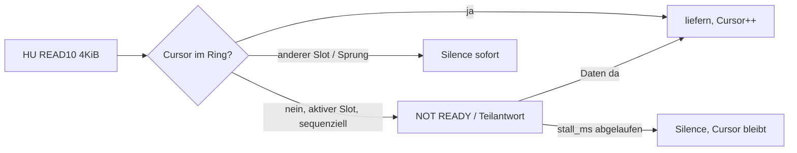

# Analyse: HU-File-Cache statt Decoder-Burst — Bewertung GPT/Mistral und Lösungsvorschlag

**Stand:** 2026-10-06 · **Datenbasis:** `feld-av-0723/` (0.4.46-dev, L3-Geometrie), `artifacts-2026-10-01-heimabend/` (0.4.31-dev), FW-Quellstand `esp32.pidrive` (Env `pidrive-s3-l3`, 0.4.46-dev)
**Begleitdokumente:** [`../artifacts-2026-10-06-lab/KONZEPT-HU-SIM-NBT-2026-10-06.md`](../artifacts-2026-10-06-lab/KONZEPT-HU-SIM-NBT-2026-10-06.md) (Lab-Simulator) · [`../../fahrzeug/HU-Technical-Facts.md`](../../fahrzeug/HU-Technical-Facts.md) (Faktensammlung HU)
**Freeze:** Alle hier vorgeschlagenen FW-Änderungen sind Freeze-Brüche und brauchen ein explizites Go.

---

## 1. Kurzfazit

Das Problem war nie die Ringgröße. Der Live-Pfad liefert **Stille statt Rückstau**.

Die NBT-Evo-HU liest eine gewählte Datei mit dem Tempo des USB-Full-Speed-Busses (~1 MB/s; `mscTrace`: 4 KiB alle 3–5 ms, `xfer.n8kPlus=0`) bis zum Dateiende oder bis zur Abwahl. Danach liest sie die nächste Datei ebenfalls vor, spielt aus ihrem Cache und springt am Dateiende zum nächsten Track.

Der beobachtete „Erstburst“ (438.272 B, 360.448 B, 4,1 MiB) ist deshalb **der zum Arm-Zeitpunkt noch ungelesene Rest der Datei**, keine Puffergröße des Decoders. `hostAbs` ist kein Maß für eine erforderliche Ringgröße.

Der Producer liefert dagegen Echtzeit (6–8,7 KB/s), 130–170× langsamer als die HU liest. Mit dem heutigen Read-Pfad (Miss → Stille, Cursor läuft weiter) sind pro Auswahl **höchstens ~9 s** echtes Audio möglich, unabhängig von Prefill, Hold oder Pump-Leistung.

Die Lösung ist ein **MSC-Flow-Control-Adapter**: Fehlen Live-Daten, wird der Read verzögert („not ready“ bzw. Teilantwort) statt mit Stille beantwortet. Die Leserate der HU koppelt sich so an die Producer-Rate. Der 48-KiB-Ring reicht dafür, PSRAM ist nicht nötig.

---

## 2. Beweiskette (aus Rohdaten nachgerechnet)

| # | Befund | Rechnung / Beleg | Quelle |
|---|--------|------------------|--------|
| B1 | Burst = Restdatei (07:58 Bayern) | 86.016 B vor Arm (Stille) + 438.272 B Live-Pfad = **524.288 B = Dateigröße `fav1`** | `status-0758-bayern-*.json` (`slotMap fav1 bytes=524288 maxSeq=524288`), `correlate-run-post-rst` |
| B2 | Burst = Restdatei (08:12:35 Bayern) | 163.840 + 360.448 = **524.288** | `runde-0810/status/st-51..52.json` |
| B3 | Muster B = Datei vor Arm schon komplett gelesen | `fav1`/`fav2` `bytes=524288`, `streamBytes` unverändert, `hostAbs=0` | `status-0800-bob-*`, `status-0804-bayern-*`, `correlate-run-0805` |
| B4 | 8-MiB-Datei wird ebenfalls ganz gelesen | `fav0 bytes=8.421.376` ≥ 8.388.608, `maxSeq=7.049.216` | `status-pre-rst-0755.json` |
| B5 | HU-Leserate | 4 KiB / 4 ms ≈ 1 MB/s (`mscTrace`); netto 665–816 KB/s (Runde 08:10, st-13..18 / st-30..35); 774 KB/s (Replug 08:05:30–32) | `st-55.json`, `series.txt`, `correlate-run-replug` |
| B6 | Next-Track-Prefetch | nach `fav1` komplett (st-52) wird `fav2` komplett gelesen (st-55: +128 Reads = 524.288 B), während `fav1` spielt | `runde-0810/status/st-52..55.json` |
| B7 | Track-Ende = Dateiende | (524.288 − 3.044 ID3) / 5.973 B/s (156-B-Frames à 26,12 ms) = **87,3 s**; HU wechselt nach **93,2 s** (`switch fav1 → fav2 (age=93.2s)`) | `bridge-0759-switch.txt` |
| B8 | Burst lief bei leerem Ring | 07:58:02,3 `act=1 end=0 host=294.912`; 07:58:02,9 `host=438.272`; erstes Producer-Byte 07:58:05,4 (`end=4096`) | `correlate-run-post-rst/correlate-watch.jsonl` |
| B9 | Producer-Rate | erste ~60 s 8,4–8,9 KB/s (~70 kbit/s), danach 5,85–6,0 KB/s (48 kbit/s); in drei Läufen identisch | `correlate-run-post-rst`, `-replug`, `-0807` |
| B10 | Producer-Startlatenz | `audio_start` 07:58:01,9 → erstes Byte 07:58:05,4 = **~3,4 s** | `bridge-0758-bayern.txt` + Watch |
| B11 | Golden Reference 01.10. | `streamBytes` 167.936 − `underruns` 115.740 − ID3 3.044 = **49.152 = exakt eine Ringfüllung** = 8,2 s bei 48 kbit/s (gehört: „~6 s“). Cursor: 587.241 + 164.892 = 752.133 ✓ | `esp89-after-6s-loop-174626.json` |
| B12 | Warum 01.10. ging und 06.10. nicht | 0.4.31: Overlay erst ab 8 KiB Ringinhalt (`warmup=8192`), Stream lief da schon ≥ 98 s (Ring voll). 0.4.46 (B6): `kOverlayWarmupBytes = 0` → Arm bei leerem Ring | `PumpServer.h`, `bridge-play-filter.txt` vs. `bridge-0758-bayern.txt` |

### Obergrenze der heutigen Architektur

\[
\text{hörbar pro Auswahl} \approx \frac{\text{Ringinhalt beim Arm} + R_\text{prod}\cdot T_\text{HU-Read}}{6000\ \text{B/s}}
\le \frac{49152 + 8700 \cdot 0{,}6}{6000} \approx 9\ \text{s}
\]

\(T_\text{HU-Read}\) ≈ 512 KiB / 0,85 MB/s ≈ 0,6 s. Das deckt sich exakt mit allen Beobachtungen: 0 s (06.10., Ring leer) und ~6–8 s (01.10., Ring voll).

### Zwei Code-Befunde

1. **Cursor-Runaway** — [`StreamBuffer.h`](../../../../../esp32.pidrive-main/esp32.pidrive-main/src/core/StreamBuffer.h) `readAt()`: Bei einem Miss werden Stille ausgegeben **und** `hostAbsCursor_++`. Ist der Cursor einmal vor `absEnd`, bekommt die HU bis zum nächsten Head-Resync dauerhaft Stille, obwohl der Producer weiterläuft.
2. **`liveBytes` ist nach einem Senderwechsel falsch** — `streamBytesServed_` wird nur im Plug-/Remount-Block zurückgesetzt (`UsbMscGadget.cpp`, Zeile ~847), `underruns_` dagegen bei jedem `StreamBuffer::start()`. Belege: `status-0800-bob` zeigt `live=438.272` (Rest von Bayern), `correlate-run-0805` zeigt `live=7.823.360` bei `und=0`.

Damit sind Mistrals offene Punkte **O1** (`und ≫ host`: nicht-sequenzielle Reads > `kSeqSlop=8192` laufen über den `fileOff`-Pfad, zählen `underruns` hoch, bewegen den Cursor nicht), **O2** (Zähler-Artefakt) und **O3** (Muster-B-Trigger = Datei schon im HU-Cache) erklärt.

---

## 3. Bewertung des GPT-Vorschlags

**Gesamturteil: zustimmend.** Reihenfolge (Telemetrie → Mimic → Stall), die Zustandsmaschine, „Cursor darf bei Miss nicht laufen“, „kein PSRAM“, „128k für den Proof of Concept“ und „Muster B separat“ sind richtig. Präzisierungen:

| GPT-Aussage | Bewertung | Präzisierung |
|-------------|-----------|--------------|
| `startStream()` → `streamBytesServed_ = 0; underruns_ = 0;` | 🟡 halb | `underruns_` wird bereits über `StreamBuffer::start()` → `clear()` zurückgesetzt. Neu nötig ist nur `streamBytesServed_ = 0` in `UsbMscGadget::startStream()`. |
| „Cursor bei fehlenden Daten nicht erhöhen“ als eigenständiger P0-Fix | 🟡 nur mit Stall | Ohne Stall bekommt die HU an derselben Position weiter Stille und liest dabei immer neue Datei-Offsets. Cursor und Datei-Offset driften dann *anders* auseinander. Sinnvoll nur hinter demselben Flag wie der Stall. |
| Variante C „im Callback warten“ | 🔴 ausschließen | Der MSC-Callback läuft im TinyUSB-Task. Blockieren dort hält auch TEST UNIT READY / INQUIRY auf und riskiert Bus-Reset. Nur A (Rückgabe 0 = not ready) oder B (Teilantwort) kommen infrage. |
| Stall-Leiter 300/700/1500/3000 ms im Auto | 🟡 Reihenfolge | Zuerst im Lab mit einstellbarem SG_IO-Timeout (Mechanik), erst danach im Auto (HU-Toleranz). |
| „Liest immer komplett“ nicht als universelle Regel festschreiben | 🟢 | Richtig. Formulierung: „liest vor bis EOF oder Abwahl“. Der 164-KiB-Fall vom 01.10. bleibt offen (R4). |
| Kontrollierter Producer-Gap 500 ms | 🟢 | Sehr gut. Zusätzlich 3 s Gap testen (realistischer WLAN-Aussetzer). |
| Kein PSRAM | 🟢 | Unter dem Modell konsequent. PSRAM nur, falls Stall an HU-Timeouts scheitert (dann als Zeitversatz-Puffer, nicht als Burst-Puffer). |

---

## 4. Bewertung Mistral (§1–8 und Nachtrag §9)

**§1–8 (Erst-Review):** Die Rohzahlen stimmen (A1–A8). Die Schlussfolgerungen „Erstburst ≥ 428 KiB → Ring/Slot-Geometrie/PSRAM“ und „Bridge-only praktisch ausgeschlossen“ sind unter dem File-Cache-Modell **überholt**. Mistral räumt das in §9.4 selbst ein.

**§9 (Nachtrag):**

| Mistral-Aussage | Bewertung | Kommentar |
|-----------------|-----------|-----------|
| Code-Befunde (Cursor++, `kSeqSlop`, `streamBytesServed_`) | 🟢 | unabhängig bestätigt |
| „Liest bis EOF oder Abwahl“ statt „liest komplett“ | 🟢 übernehmen | — |
| „fav0 nur 5,97 MiB gelesen“ als Gegenbeleg | 🟡 | Snapshot mit Abwahl während des Reads. `status-pre-rst-0755` zeigt `fav0 bytes=8.421.376` ≥ Dateigröße. Beides passt zu „bis EOF oder Abwahl“. |
| **Batch-then-Play vs. inkrementell** als Kernfrage | 🟢 wichtigster Beitrag | Mit den vorhandenen Daten nicht entscheidbar, weil der Read nach ~1 s fertig war. Spielt die HU erst nach EOF des Reads, liefert Stall nur einen um Dateilänge/Producer-Rate versetzten Track. Messbar nur im Auto (R2). |
| Per-Slot-Stall-Politik | 🟢 übernehmen | Präzisierung: Stall **nur** bei sequenziellen Cursor-Reads des aktiven Live-Slots. `fileOff`-Sprünge und andere Slots bekommen sofort Stille. |

**Plausibilitätsabschätzung zu Batch-then-Play:** Medien-Player mit Read-Ahead-Cache dekodieren üblicherweise asynchron zum Read (sonst gäbe es bei großen Dateien minutenlange Startlatenz; die 8-MiB-Datei würde ~10 s brauchen). Die 93,2 s bis zum Track-Wechsel passen zu „Start sofort, 87,3 s Spielzeit + ~6 s Wechsel“. Das ist ein Indiz, kein Beweis.

---

## 5. Lösung: MSC-Flow-Control-Adapter

### 5.1 Prinzip

### 5.2 Bausteine

| Baustein | Inhalt | Begründung |
|----------|--------|------------|
| Stall-Zustandsmaschine | `HIT` → liefern; `WAIT` → `read10_cb` gibt 0 zurück (not ready) oder liefert nur die verfügbaren Bytes; nach `live_stall_ms` → Stille als Fallback | Koppelt die HU-Leserate an die Producer-Rate |
| Cursor nur bei echten Bytes | `hostAbsCursor_++` nur im Treffer-Zweig, im Stall-Modus | Verhindert den irreversiblen Cursor-Runaway |
| Per-Slot-Politik | Stall nur: aktiver Slot ∧ `useCursor` ∧ sequenziell | Next-Track-Prefetch und Scan dürfen nicht blockieren |
| Ring 48 KiB | bleibt | Muss nur eine HU-Anfrage (4 KiB) plus Jitter fassen |
| Großer Live-Slot | ≥ 64 MiB (≈ 3,1 h bei 48k, ≈ 70 min bei 128k) | Kein EOF → kein Track-Wechsel, kein Next-Prefetch während Live |
| Bitrate PoC 128k | 4096 B / 16.000 B/s = 0,26 s pro Read bei leerem Ring | Kürzere Einzelstalls = geringeres Timeout-Risiko |
| Burst-on-Connect weiterreichen | Der Pi verwirft den Server-Burst nicht | Füllt in den ersten 60 s ~27 s Polster im HU-Cache |
| Telemetrie | `streamBytesServed_ = 0` in `startStream()`; neue Zähler `stallCount`, `stallMsMax`, `stallTimeouts` | Messbarkeit |

### 5.3 Rechenwerte

| Größe | 48 kbit/s | 96 kbit/s | 128 kbit/s |
|-------|-----------|-----------|------------|
| Producer-Rate (Echtzeit) | 6.000 B/s | 12.000 B/s | 16.000 B/s |
| Stall pro 4-KiB-Read bei leerem Ring | 0,68 s | 0,34 s | 0,26 s |
| 48-KiB-Ring als Polster | 8,2 s | 4,1 s | 3,1 s |
| 512 KiB Slot | 87 s | 44 s | 33 s |
| 8 MiB Slot | 23 min | 11,7 min | 8,7 min |
| 64 MiB Slot | 3,1 h | 1,6 h | 70 min |

Der Pump schafft unter Last ≥ 268 KB/s (Lab), also mehr als das 16-Fache der 128k-Rate.

### 5.4 Erwarteter Ablauf bei Erfolg

1. Play-Erkennung → Arm. Die HU liest den Ringinhalt (bis 48 KiB) sofort.
2. Danach liest sie pro 4 KiB so schnell, wie der Producer liefert (~16 KB/s bei 128k).
3. Burst-on-Connect: In den ersten 60 s liefert der Producer ~1,45× Echtzeit. Der HU-Cache wächst um ~27 s Audio (Polster).
4. Dauerbetrieb: Leserate = Producer-Rate. Clock-Drift (~100 ppm) verbraucht ~0,4 s Polster pro Stunde.

---

## 6. Risiken und offene Fragen

| ID | Risiko / Frage | Warum relevant | Test |
|----|----------------|----------------|------|
| R1 | HU-Timeout-Toleranz pro READ10 unbekannt | Überschreitung → USB-Reset/Remount | Auto: Stall-Leiter 300/700/1500/3000 ms bei 128k. Messen: `msc.host.inquiry`, `plugCount`, `remountGen` |
| R2 | Batch-then-Play | Entscheidet „live“ vs. „Zeitversatz“ | Pi mischt alle 10 s einen Piepton bzw. eine Ansage mit Zeitstempel in den Producer. Handy-Aufnahme im Auto gegen ESP-/Bridge-Zeitstempel → Latenz Read → hörbar |
| R3 | Muster B bei großem Slot | Der Prefetch vor Play cacht Stille. 4 MiB Stille = 11,6 min bei 48k bzw. 4,4 min bei 128k | Auto: (a) Invalidiert ein Remount (neue Serial / UNIT ATTENTION) den Cache? (b) Liest die HU eine Datei neu, deren Größe sich geändert hat? (c) Was passiert, wenn Body-Reads vor Play gestallt werden? (Risiko UI-Hänger) |
| R4 | 164-KiB-Fall vom 01.10. | Widerspricht „bis EOF“ in seiner reinen Form | Vermutlich Cache-Zustand aus vorheriger Session (PD0004 → PD0005). Im Muster-B-Test mitklären |
| R5 | TinyUSB-Verhalten bei Rückgabe 0 / Teilantwort in arduino-esp32 2.0.x (`espressif32@6.4.0`) | Voraussetzung für Variante A/B | Code-Spike: `tud_msc_read10_cb` → `USBMSC` → `pidrive_msc_read`; im Lab mit SG_IO verifizieren |
| R6 | Verhalten bei gültigem MP3 | Bisher wurde fast nur Stille gelesen | Erledigt sich mit dem ersten erfolgreichen Stall-Lauf |

---

## 7. Roadmap

| Prio | Aufgabe | Ort | Abnahme |
|------|---------|-----|---------|
| P0 | `streamBytesServed_ = 0` in `startStream()` | FW | `liveBytes` nach Senderwechsel = 0 |
| P0 | TinyUSB-Spike: Rückgabe 0 / Teilantwort | Code-Lesen + Lab | Lab-Host sieht verlängerte Kommandodauer, keine Fehler |
| P0 | Normative Doku korrigieren: „HU-Burst = ungelesener Dateirest, `hostAbs` ≠ Ringmaß“ | `MSC-AKTUELL.md` | — |
| P1 | HU-Simulator (siehe Konzeptdokument) inkl. Golden-Regression gegen 0.4.46 | Lab | Feldzahlen B1/B3/B11 reproduziert |
| P1 | `live_stall_ms` + Cursor-nur-bei-Treffer hinter Flag | FW, Lab | Sim: 30 s ohne Dropout im virtuellen Ohr, Gap 500 ms / 3 s überstanden |
| P2 | Auto: Stall-Leiter bei 128k mit hörbaren Markern | Feld | Ton ≥ 60 s am Stück, Latenz gemessen (R1, R2) |
| P2 | Muster-B-Cache-Test | Feld | Antwort auf R3/R4 |
| P3 | Bitraten 96k / 48k | Feld | Grenzkurve Stall-Dauer vs. HU-Toleranz |
| P3 | PSRAM | — | nur falls R1 scheitert |

---

## 8. Was nicht gemacht werden sollte

- Ring vergrößern oder PSRAM als Burst-Puffer einbauen
- Prefill an „≥ 400 KiB Erstburst“ ausrichten
- Detect/Lock umbauen (Detect funktioniert; das Problem liegt dahinter)
- Mehrere Hypothesen in einem Feldlauf gleichzeitig ändern
