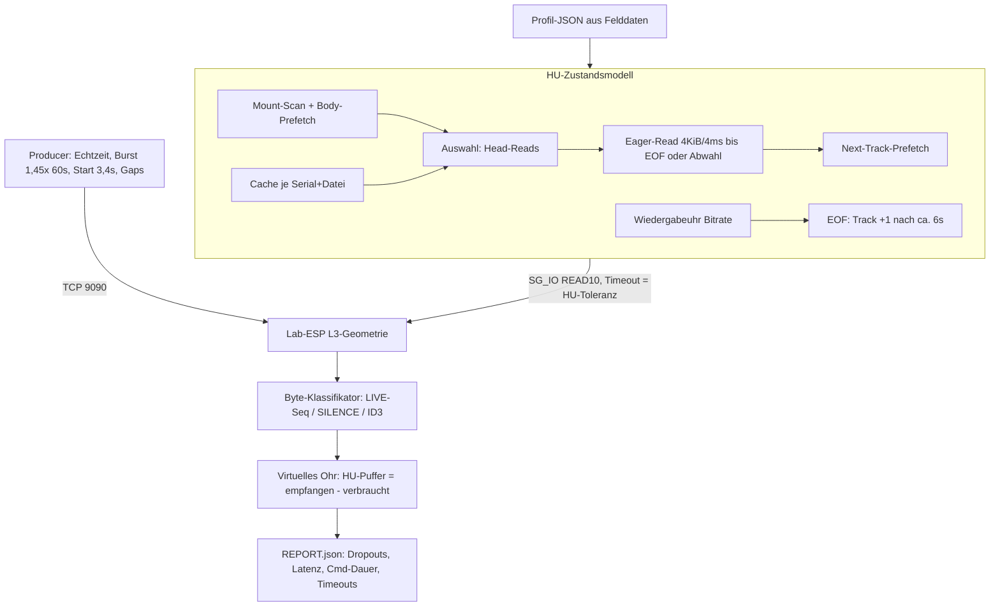
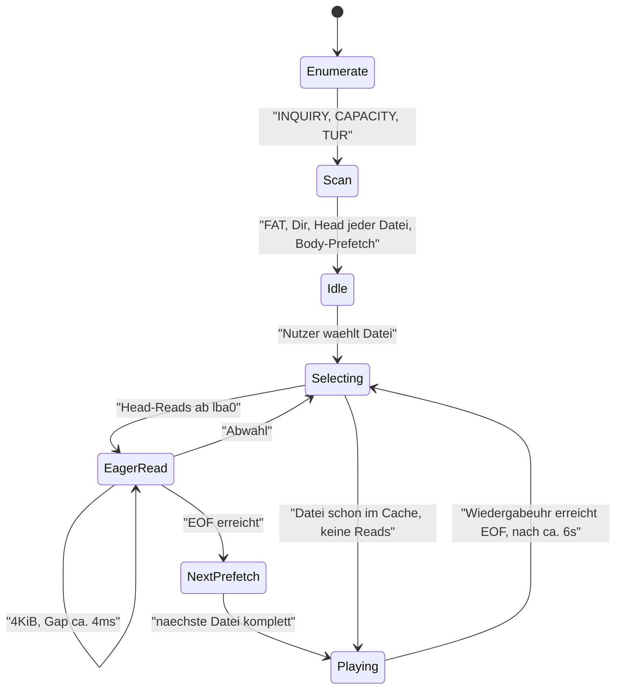

# Konzept: Zustandsbehafteter NBT-HU-Simulator für den Lab-ESP

**Stand:** 2026-10-06 · **Lab:** ESP `.88` am Debian-Container (Proxmox, USB-Passthrough), Pump-TCP `:9090`
**Bezug:** [`../artifacts-2026-10-06-feld/ANALYSE-HU-FILE-CACHE-BACKPRESSURE-2026-10-06.md`](../artifacts-2026-10-06-feld/ANALYSE-HU-FILE-CACHE-BACKPRESSURE-2026-10-06.md) · [`../../fahrzeug/HU-Technical-Facts.md`](../../fahrzeug/HU-Technical-Facts.md)
**Zweck:** Das Lab soll sich so verhalten wie die HU im Auto, damit ein Lab-PASS ins Auto übertragbar wird. Dieses Dokument beschreibt das Konzept; die Umsetzung macht die Lab-Instanz.

---

## 1. Warum die bisherigen Lab-Tests nicht übertragbar waren

| Tool | Was es tut | Was der HU fehlt |
|------|-----------|------------------|
| [`esp32.pidrive/tools/nbt_replay.py`](../../../../../esp32.pidrive-main/esp32.pidrive-main/tools/nbt_replay.py) | spielt statische Event-Listen über SG_IO ab (`timeout = 5000` ms) | kein Zustand, keine Reaktion auf gelieferte Daten |
| [`tools/m3_lab_hu_mimic_1541.py`](../../../tools/m3_lab_hu_mimic_1541.py) | feste Szenarien A/B/C (race, fill_then_pace, fill_then_outrun) | kein File-Cache, kein EOF, kein Next-Track |
| [`tools/m3_lab_async_producer.py`](../../../tools/m3_lab_async_producer.py) | Host-Reads mit festem Gap (`--host-gap-ms 4.5`) gegen einen Producer mit **`--pump-bps 900000`** | Der Producer ist **150× schneller als das echte Radio** (6–8,7 KB/s). Deshalb konnte ein Hold-PASS entstehen, den es im Auto nie geben kann |
| `tools/traces/*.replay.json` | synthetische Mini-Traces (z. B. `feld_heimabend_6s_cache`: 4 × 4 KiB, dann `quiet`) | nicht aus echten Read-Traces abgeleitet |

**Kernlücke:** Kein Tool modelliert den HU-*Zustand*: Datei-Cache, Lesen bis EOF/Abwahl, Next-Track-Prefetch, Wiedergabeuhr, Track-Wechsel am Dateiende. Und keines prüft, *welche Bytes* ankommen; alle verlassen sich auf FW-Zähler, deren Semantik nachweislich wackelt (`liveBytes`-Artefakt).

---

## 2. Zielarchitektur `nbt_hu_sim.py`

Ort: `esp32.pidrive/tools/nbt_hu_sim.py`. Nutzt `read_sg()` / `SgIoHdr` aus `nbt_replay.py` und den Pump-Client aus `m3_lab_async_producer.py` (beide wiederverwenden, nicht kopieren).

Drei Threads/Tasks, gemeinsame monotone Zeitbasis (`time.monotonic_ns()`), alle Ereignisse in ein `events.jsonl`:

1. **HU-Modell** (Reader): erzeugt READ10-Kommandos nach Zustand und Profil.
2. **Producer**: speist markierte MP3-Frames im Radio-Zeitprofil über Pump-TCP ein.
3. **Poller**: `/api/status` alle 250 ms (nur zur Korrelation mit FW-Zählern, nicht als PASS-Quelle).

---

## 3. HU-Zustandsmodell

### 3.1 Zustände

### 3.2 Verhalten pro Zustand (kalibriert)

| Zustand | Modellregel | Felddaten-Beleg |
|---------|-------------|-----------------|
| Scan | Liest FAT/Dir, je Datei Head (`from=lba0 +4096B`), dann Body-Prefetch in Dateireihenfolge, große Datei zuerst (fav0) | `status-post-rst*.json`: nach 5–14 s `fav0` 3,8–5,6 MiB, `fav1`/`fav2` je nach Fortschritt 0 oder 524.288 |
| Selecting | `seq_short` 4 KiB am Kopf, dann `cooldown` +12 KiB, dann `cold_body_burst` 32 KiB ab lba0+16 | `bridge-0758-bayern.txt`, `bridge-0804-bayern.txt` |
| EagerRead | 4-KiB-READ10, Gap aus Profilverteilung (Median 4 ms), sequenziell bis EOF oder Abwahl; **nächstes Kommando erst nach Abschluss des vorigen** (Queue-Tiefe 1) | `st-55.json mscTrace` (`gap` 3–5 ms, `n=4096`), `xfer.n8kPlus=0` |
| NextPrefetch | nächste Datei in Verzeichnisreihenfolge komplett | `st-52..55` |
| Playing | keine Reads, solange der Cache reicht; Wiedergabeuhr = Bytes ÷ Bitrate aus Frame-Header | `status-0758..0759`: `readCount` konstant 1539 über ≥ 63 s |
| Track-Ende | nach Ende der Cache-Wiedergabe + `track_gap_s` (≈ 6 s) → nächste Datei auswählen | 87,3 s gerechnet vs. 93,2 s beobachtet |
| Cache | Menge gelesener Bereiche je (Serial, Datei). Auswahl einer voll gecachten Datei erzeugt **keine** Reads | Muster B: `08:00 BOB`, `08:04 Bayern`, `08:06 BOB` |

### 3.3 Unbekannte als Parameter

Nicht raten, sondern in der Testmatrix durchspielen. Der Report weist jedes Ergebnis pro Variante aus.

| Parameter | Werte | Bedeutung | Klärung im Auto |
|-----------|-------|-----------|-----------------|
| `decode_start` | `incremental:N_KiB` (8/32/64) · `after_eof` | Ab wann die HU abspielt | R2: Marker-Latenz |
| `cmd_timeout_ms` | 2000 / 5000 / 10000 | SG_IO-Timeout = angenommene HU-Toleranz pro READ10 | R1: Stall-Leiter |
| `on_timeout` | `reset` (Bus-Reset simulieren: Re-Enumerate) · `skip` | Reaktion der HU auf Timeout | R1 |
| `cache_persist_remount` | true / false | Überlebt der HU-Cache einen Remount / neue Serial? | R3 |
| `prefetch_on_mount` | full / head_only / none | Wie weit liest die HU beim Scan vor | R3 |
| `track_gap_s` | 6 | Pause beim Track-Wechsel | gemessen |

---

## 4. Producer-Modell (realistisch statt 900 KB/s)

| Phase | Profil | Beleg |
|-------|--------|-------|
| Startlatenz | erstes Byte **3,4 s** nach `audio_start` | B10 |
| Burst-on-Connect | **1,45× Echtzeit für ~60 s** (8,7 KB/s bei 48k) | B9 |
| Dauer | Echtzeit (6.000 / 12.000 / 16.000 B/s) mit Jitter ±10 % in 0,5-s-Chunks | B9 |
| Gap-Injektion | 500 ms und 3 s Pause (WLAN-Aussetzer), Nachlieferung danach mit Pump-Maximalrate | GPT-Vorschlag |

**Inhalt mit Sequenzmarke:** gültige CBR-MPEG-1-Layer-III-Frames (Header `FF FB …` passend zur Bitrate). Im Nutzdatenbereich jedes Frames steht ein 16-Byte-Stempel `PDSQ | seq32 | absOff32 | crc32`, analog zu `LabBodySeed` („Q3B1“-Zellen). Ein Decoder würde das als Rauschen spielen; der Sim braucht nur den Stempel.

---

## 5. Byte-Klassifikator und virtuelles Ohr

Jeder gelesene 4-KiB-Block wird klassifiziert:

| Klasse | Erkennung |
|--------|-----------|
| `ID3` | `fileOff < id3Len` bzw. Präfix `ID3` |
| `LIVE(seq, absOff)` | Stempel `PDSQ` gefunden, CRC ok |
| `SILENCE` | `kSil`-Muster (156-B-Frame mit `LAME3.100`) bzw. `Mp3Silence`-Fill |
| `SEED` | `Q3B1`-Zellen |
| `OTHER` | Rest → Fehler |

**Virtuelles Ohr:** Puffer `B(t)` = Summe der `LIVE`-Bytes in Reihenfolge − Verbrauch (Bitrate × Zeit ab `decode_start`).

| Ereignis | Bedingung |
|----------|-----------|
| `dropout` | `B(t) ≤ 0` während `Playing` |
| `gap_in_content` | `seq` springt vorwärts (Daten verloren, z. B. Ring-Scroll) |
| `duplicate` | `seq` wiederholt sich |
| `silence_in_play` | `SILENCE` nach dem ersten `LIVE`-Block |
| `latency` | Zeit zwischen Producer-Senden von `seq` und Wiedergabe von `seq` im Modell |

**PASS (Stall-Lauf):** ≥ 30 s (Ziel 120 s) ohne `dropout` / `gap_in_content` / `silence_in_play`, keine SG-Timeouts, `latency` stabil (Drift < 1 s/min). `liveBytes` der FW wird nur noch zur Korrelation geloggt.

---

## 6. Golden-Regression (Pflicht vor jedem Stall-Test)

Der Sim muss gegen **FW 0.4.46-dev, Env `pidrive-s3-l3`, Stall aus** die Feldzahlen reproduzieren. Gelingt das nicht, ist das Modell falsch und Stall-Ergebnisse sind wertlos.

| Szenario | Setup | Erwartung (Feld) |
|----------|-------|------------------|
| G1 „07:58 Bayern“ | Scan ohne `fav1`-Prefetch; Auswahl `fav1`; Arm 50 ms; Producer-Start 3,4 s | Vor-Arm-Read ≈ 86.016 B; `hostAbs = und = streamBytes = 438.272`; `absEnd = 0` am Burst-Ende; danach keine Reads bis Track-Ende ≈ 93 s |
| G2 „08:04 Muster B“ | Body-Prefetch `fav1` vor Play; Arm-Latenz 3 s | `hostAbs = 0`, `armed = false`, Datei `bytes = 524.288` vor Arm |
| G3 „01.10. Golden“ | Producer läuft ≥ 98 s vor Auswahl (Ring voll), Warmup 8 KiB (0.4.31-Verhalten via Ring voll) | `LIVE` = 49.152 B; virtuelles Ohr ≈ 8 s Ton, dann `silence_in_play` |
| G4 „Next-Prefetch“ | Auswahl `fav1`, Read bis EOF | direkt danach `fav2` komplett (+128 Reads) |
| G5 „8 MiB“ | Auswahl `fav0` | `fav0` bis EOF bzw. Abwahl; `und ≫ host` bei Sprüngen > 8 KiB |

---

## 7. Testmatrix nach der Regression

| Achse | Werte |
|-------|-------|
| `live_stall_ms` (FW-Flag) | 0 (heute) / 300 / 700 / 1500 / 3000 |
| Bitrate | 128k (zuerst) / 96k / 48k |
| `cmd_timeout_ms` | 2000 / 5000 / 10000 |
| `decode_start` | incremental:8 / incremental:64 / after_eof |
| Producer-Gap | keiner / 500 ms / 3 s |

Erste Pflichtläufe: (128k, stall 1500, timeout 5000, incremental:8, gap 500 ms) und dieselbe Konfiguration mit gap 3 s. Erwartung: Die Kommandodauer (`SgIoHdr.duration`) steigt auf ≈ 4096 / Producer-Rate, das Ohr bleibt ohne Dropout.

---

## 8. Rahmenbedingungen Lab

- **Geometrie wie im Auto:** Env `pidrive-s3-l3` (FAT16 16 MiB, `fav0` 8 MiB, `fav1`/`fav2` 512 KiB). Für den Stall-Test zusätzlich eine Geometrie mit großem Live-Slot (≥ 64 MiB) vorsehen.
- **Nicht mounten.** Nur SG_IO (`/dev/sgN`), sonst liest der Linux-Kernel selbst vor und verfälscht das Muster. udev/automount für das Gadget im Container abschalten.
- **Kommandodauer loggen:** `SgIoHdr.duration` und `host_status`/`driver_status` je READ10.
- **Remount simulieren:** über die vorhandene Lab-API bzw. Soft-RST; neue Serial (`PDxxxx`) prüfen.
- **Tool-Hygiene:** `restart_err=Expecting value` (Mistral O6) im Prep beseitigen, damit jeder Lauf mit definiertem Zustand startet.

---

## 9. Profil-Extraktion aus Felddaten

Neues Skript `tools/nbt_profile_extract.py`. Eingang: ein Feldordner (z. B. `feld-av-0723/`). Ausgabe: `tools/profiles/nbt_evo_2026-10-06.json`.

| Quelle | extrahierte Größe |
|--------|-------------------|
| `status-*.json`, `st-*.json` → `msc.mscTrace` (96 Einträge je Snapshot ≈ 0,4 s Fenster) | Verteilung `gap`, `n`, Reihenfolge der `tag`s |
| `slotMap` (`bytes`, `maxSeq`, `fromHead`, `midFile`) | Fortschritt pro Datei über die Zeit, Scan-Reihenfolge |
| `msc.xfer` | Größenverteilung (n512/n2k/n4k/n8kPlus) |
| `correlate-watch.jsonl` | Arm-Zeitpunkt, `absEnd`-Rate (Producer-Profil), Burst-Zeitpunkt |
| `bridge-*.txt` | `play_uid` → `audio_start` → `audio_ack` (Arm-Latenz), `switch … age=` (Track-Wechsel) |

---

## 10. Datenlage

**Ausreichend** für ein belastbares Modell von:
- Read-Größe (4 KiB) und Kadenz (3–5 ms Gap, ~1 MB/s)
- Lesen bis EOF oder Abwahl, Next-Track-Prefetch
- Scan-Reihenfolge nach Plug/RST (näherungsweise)
- Arm-Latenz (50 ms bis 3 s) und Producer-Profil (3,4 s Start, 1,45× für 60 s, dann Echtzeit)
- Track-Wechsel am Dateiende (~6 s Pause)

**Nicht ausreichend** (bleiben Auto-Fragen, im Sim nur Parameter):
- HU-Timeout pro READ10 und Reaktion darauf (R1)
- Decode-Start: inkrementell oder nach EOF (R2)
- Cache-Invalidierung bei Remount / neuer Serial / Größenänderung (R3)
- Leseverhalten, wenn tatsächlich gültiges MP3 ankommt (bisher fast nur Stille gelesen)

**Empfehlung für den nächsten Feldtest:** Der `mscTrace`-Ring hat nur 96 Einträge (`kTraceSize = 96` in `UsbMscGadget.h`), also ~0,4 s bei voller HU-Rate. Ein lückenloser Per-Read-Trace (`ms, lba, n, slot, hit/miss/stall`), kompakt binär über Pump-TCP an die Bridge gestreamt, würde das Profil vollständig machen und die Golden-Regression schärfen.

---

## 11. Grenzen

- Der Linux-SCSI-Stack (usb-storage/SG) ist nicht der QNX-Stack der HU. Der Sim beweist die **ESP-Mechanik** (Stall, Cursor, Ring, Inhalt), nicht die **Toleranz der HU**.
- Timing des Lab-Hosts (Python, Container) hat Jitter im ms-Bereich. Für 4-ms-Gaps reicht das, für Sub-ms-Aussagen nicht.
- Ein Lab-PASS ist notwendig, aber nicht hinreichend. Der Auto-Test bleibt für R1–R3 unverzichtbar.
