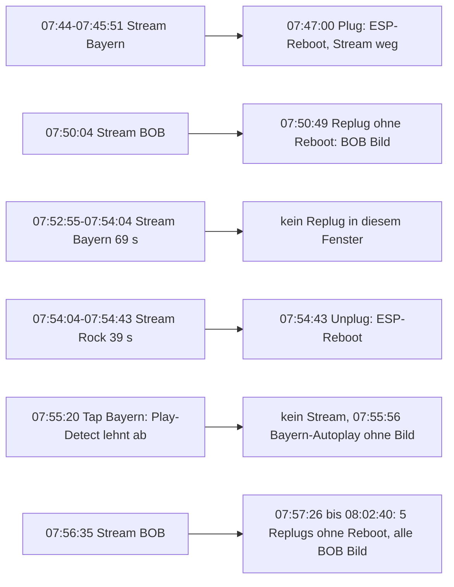
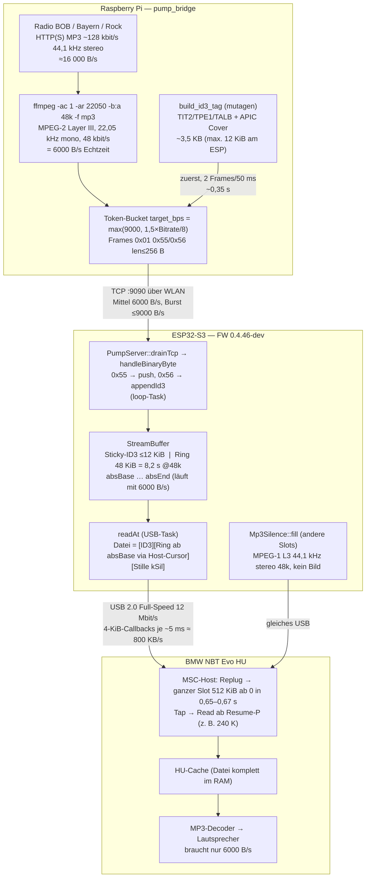
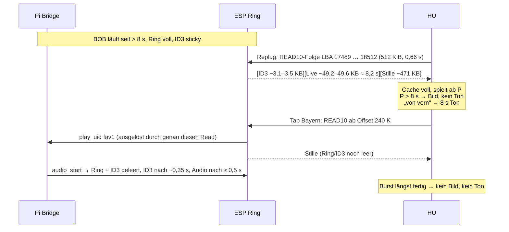
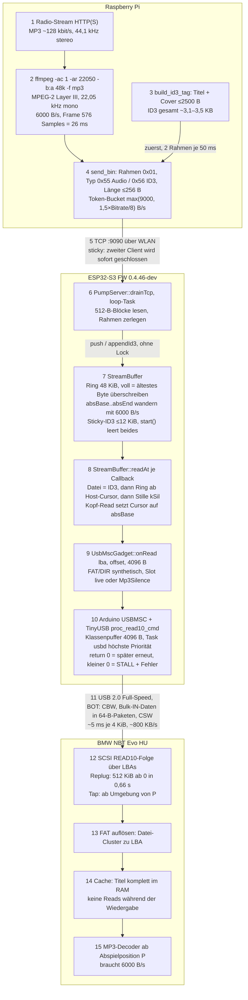
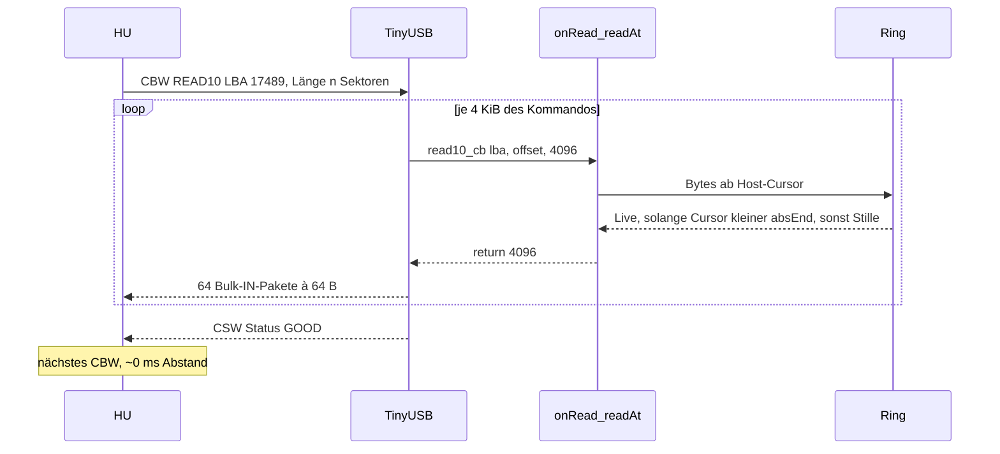
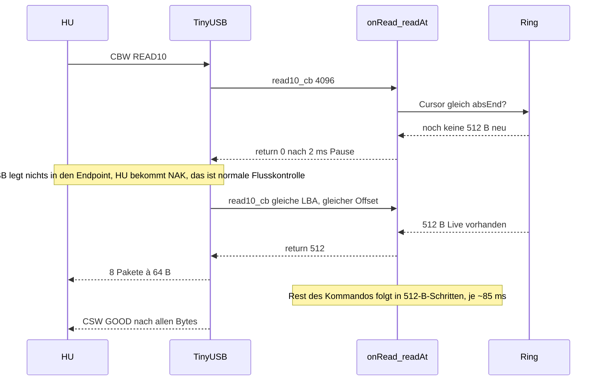

# Analyse s3 — Tonfenster (2026-10-08 Morgen, Feld .89, FW 0.4.46-dev, L3)

Run: `feld-s3-prep/s3-20261008-074403/` (status-poll 1155 Zeilen, trace 8221 Zeilen, marks).
Werkzeug: `tools/feld_live_window.py --run <RUN>` (Modell von `StreamBuffer::readAt`, Self-Test `--self-test`).
Folgedokumente: [`FELDPROTOKOLL-S4-TONFENSTER.md`](FELDPROTOKOLL-S4-TONFENSTER.md) · [`ESP-REVIEW-UND-STELLSCHRAUBEN-2026-10-08.md`](ESP-REVIEW-UND-STELLSCHRAUBEN-2026-10-08.md)

## Kurzantwort

| Frage | Antwort |
|-------|---------|
| Warum Ton? | Beim Replug liest die HU den **ganzen BOB-Slot (512 KiB) sequentiell ab Offset 0** in < 1 s. Der BOB-Producer lief zu diesem Zeitpunkt schon > 8 s, der 48-KiB-Ring war voll, die ID3 (Cover) lag als Sticky-Header vorne. Die HU bekommt also: ID3 + **~49 KB echtes Live-MP3** + Rest Stille. |
| Warum nur BOB? | **Nicht BOB-spezifisch.** Bild und Ton nach Replug brauchen drei Bedingungen zugleich: Stream genau dieses Slots läuft (mit ID3), **kein ESP-Reboot** beim Plug, HU spielt genau diesen Slot. In s3 traf das nur BOB: Bayern (2,5 min und 69 s Stream) und Rock (39 s) hatten auch volle Ringe, aber zwei Plug-Reboots, ein Replug außerhalb des Stream-Fensters und ein abgelehnter Play-Detect kamen dazwischen (Abschnitt „Warum Bild nur bei BOB“). Ein Tap allein liefert nie Bild/Ton (B5). *Korrektur 08.10. nachmittags: „nur für BOB lief der Producer“ war falsch.* |
| Warum 5–6 s? | Rechnerisch landen **~49–50 KB ≈ 8,2–8,4 s** Live-Audio (48 kbit/s = 6000 B/s) in der Datei — begrenzt durch den **Ring kCapacity = 48 KiB**. Die gehörten 5–6 s sind ≤ Rechenwert; Rest-Hypothese: Decoder-Flush beim Formatwechsel Live (MPEG-2 22,05 kHz mono) → Stille (MPEG-1 44,1 kHz stereo) und/oder Anlauf/Fade der HU. Messung in s4 mit Marker. |
| Liegt die Lösung für Dauerstrom in den Logs? | **Ja, das Prinzip:** Die HU liest nach Remount sequentiell ab 0 und spielt aus ihrem Cache. Dauerstrom geht nur, wenn (a) der ESP die READ10 auf Producer-Takt **bremst (Stall)** oder (b) ein **Zeitversatz-Puffer ≥ 512 KiB** pro Slot (PSRAM) bereitsteht. Beides braucht ein FW-Go. Ein größerer Ring (c) verlängert nur das Fenster. |

## Befunde B1–B6

**B1 — Replug = Vollread ab 0.** Jede BOB-Replug-Episode: 128 Callbacks à 4 KiB, LBA 17489→18512, **651–665 ms** (788–805 KB/s), streng sequentiell (Messtabelle M1 unten). `readCount` steigt danach nicht mehr, während die HU hörbar „spielt“ → Wiedergabe aus HU-Cache.

**B2 — „Resume“ ist nur Abspielposition P.** Die HU merkt sich P über Mediumwechsel (s2 F1 bestätigt), liest aber trotzdem ab 0. Steht P > ~8 s, spielt sie die Stille-Region → „Bild ja, Ton nein“. „Datei von vorn“ → die ~8 s Live-Audio am Dateianfang → Ton.

**B3 — Fensterlänge = Ringinhalt.** Pro Episode: `underruns Δ ≈ 471 640` von 524 288 Bytes → nicht-Stille = 52 648 B = ID3 + Live. Live = 49 152 B (voller Ring) + wenige hundert Byte Producer-Zuwachs bis zum Überholen (Mengenbilanz M2) → ID3 ≈ 3 100–3 500 B (in s3 nicht geloggt). 49 152 B / 6000 B/s = **8,2 s**.

**B4 — Gleicher Abschnitt nach Senderwechsel = HU-Cache.** Bayern/Rock-Tap und zurück zu BOB ohne Replug → kein neuer Read des BOB-Slots → gleiche 8 s.

**B5 — Tap liefert nie Bild/Ton (Henne-Ei).** Taps auf Bayern (07:52:54) und Rock (07:54:03) beginnen bei Offset 240 K (Resume-P), und der Read selbst löst `play_uid` → Bridge `audio_start` → `StreamBuffer::start()` + `clearId3()` aus. Die HU hat ihren Burst gelesen, bevor ID3 (≥ 0,35 s Sendedauer) und ffmpeg-Audio (≥ 0,5 s + Anlauf) ankommen.

**B6 — Producer lief (Korrektur).** Die Capture-Bridge `--no-audio` starb sofort (BrokenPipe): Der ESP hält einen gesunden TCP-Client „sticky“ (`PumpServer::acceptTcp`, neue Verbindungen werden sofort geschlossen). Der **reguläre Bridge-Service** war verbunden und lieferte Audio: `absEnd` wächst mit ~6000 B/s. Die Aussage „Capture ohne Live-Audio“ in ERGEBNIS/GESAMTBERICHT ist falsch. Folge: `msc_reads.jsonl` leer, deshalb Auswertung über status-poll + trace.

Zusatz: Einige Plugs **rebooten den ESP** (Uptime-Reset 07:47:00 beim Plug, 07:54:43 beim Unplug). Danach läuft kein Stream → Autoplay ohne Bild/Ton (07:54:50 BOB, 07:55:56 Bayern). Ton gibt es nur bei Replug **ohne** ESP-Reboot. Genau diese zwei Reboots haben die Bayern- (Stream seit Run-Start) und die Rock-Chance (Stream 39 s) vernichtet — siehe nächsten Abschnitt. Ursache offen (FW meldet keinen Reset-Grund).

## Warum Bild nur bei BOB (Neu-Auswertung 08.10. nachmittags)

Quelle: `status-poll.jsonl` (`playingUid`, `stream_active`, `esp_uptime`, `rej`/`guess`) und `trace.jsonl` (`tag`, LBA). Hinweis: Der Trace-`tag` ist auf 11 Zeichen gekürzt; „Rock Antenn“ steht für fav0 **und** fav1 (Bayern), unterscheidbar nur über die LBA (fav1 ab 16465).

**Mechanismus [B]:** Das Cover steckt **nur** im Sticky-ID3 des **einen** aktiven Streams (`StreamBuffer`, `readAt` für `streamSlot_`). Alle anderen Slots liefern `Mp3Silence` mit Minimal-ID3 (44 B, ohne APIC). Jedes neue `audio_start` löscht das ID3 (`clearId3`). Die Bridge hat für jeden Sender ein Cover (APIC → `stations/*.jpg` → `default.jpg`) — am Sender liegt es nicht.

**Drei Bedingungen für Bild (und Ton) nach Replug:**

1. Der Stream für genau diesen Slot läuft, das ID3 ist beim ESP, bevor die HU den Kopf liest.
2. Beim Plug startet der ESP **nicht** neu (Reboot = Stream, Ring und ID3 weg).
3. Die HU spielt nach dem Replug genau diesen Slot (Autoplay-Wahl der HU, [S]).

| Sender / Versuch | Stream | Was fehlte | Beleg |
|---|---|---|---|
| Bayern 1 | ab Run-Start, `absEnd` ~912 KB (2,5 min) beim Unplug 07:45:51 | Bedingung 2: ESP-Reboot beim Plug (Uptime 3 s um 07:47:00) | Poll |
| Bayern 2 | 07:52:55–07:54:04 (69 s, Ring voll) | Kein Replug in diesem Fenster. BOB-Tap 07:53:37 kam aus dem HU-Cache (keine Reads, Stream blieb Bayern, B4) | Poll `playingUid=fav1` bis 07:54:04 |
| Rock | 07:54:04–07:54:43 (39 s, Ring voll) | Bedingung 2: ESP-Reboot beim Unplug (Uptime 2 s um 07:54:43) | Poll |
| Bayern 3 | keiner | Bedingung 1: Tap 07:55:20 mit 43 Reads, `rej` +43, `guess` 0, `playingUid` leer → Play-Detect lehnte ab; Autoplay Bayern 07:55:56 (128 Reads Vollread) bekam nur Stille | Poll + Trace |
| BOB | 07:50:04 und ab 07:56:35 | nichts — 6 Replugs ohne Reboot, HU spielte BOB | Episoden-Tabelle |

**Schluss:** „Gerade jetzt BOB“ ist Zufall der Bedienreihenfolge plus die zwei Reboots, die Bayern und Rock getroffen haben. Gegenbeleg aus früheren Feldtagen: Nach Replug zeigten auch Bayern und Rock Bild + kurzen Ton ([`SESSION-1548-VERDICT.md`](../artifacts-2026-10-02-60s/SESSION-1548-VERDICT.md), [`FELDTEST-ESP-MSC-BMW-2026-09-28.md`](../FELDTEST-ESP-MSC-BMW-2026-09-28.md) Zeilen 873, 901). Gegenprobe im Feld: s4 S3/S9.

**Offen:** (a) Ursache der Plug-Reboots (kein `esp_reset_reason` im Status → Punkt fürs nächste FW-Go). Wahrscheinlichste Ursache: Versorgung — das DevKitC-1 führt Netzteil (UART-Buchse) und HU-Port (OTG) über Dioden zusammen; beim Ziehen/Stecken wechselt die Speisung, ein Einbruch mit WLAN-Spitze kann einen Brownout auslösen. Gegenhypothese Software-Panic. Test ohne FW (Laptop-Bootlog, Netzteil-A/B, VBUS-Blocker): HU-Facts Q11, Feldprotokoll s4 „Reboot-Diagnose“. (b) Warum Play-Detect 07:55:20 ablehnte — ESP ~40 s nach Reboot, Tap liest ab Resume-P statt ab Kopf; `playMinSeqBytes`/Kopf-Regel prüfen.

## Tabelle je Episode (BOB-Slot LBA 17489–18512, Größe 524 288 B)

Ring-Füllung zum Read-Zeitpunkt aus status-poll (`absEnd − absBase`), undΔ = Differenz `underruns` vor/nach dem Read. Live ≈ 524 288 − ~3 500 (ID3) − undΔ.

| Zeit (Trace) | Anlass | Serial | Producer-Alter | undΔ | Live (B) | Live (s) | Operator | Passt? |
|---|---|---|---|---|---|---|---|---|
| 07:50:03.7 | Tap BOB | — | 0 (Start) | 458 752 | 0 | 0 | kein Ton | ✓ (B5) |
| 07:50:49.7 | Replug C3 | PD0099 | ~45 s | 471 640 | ~49 150 | 8,2 | Autoplay Bild, ohne Ton; von vorn 5–6 s Ton | ✓ |
| 07:52:54.5 | Tap Bayern | — | 0 | (Start bei 240 K) | 0 | 0 | kein Bild/Ton | ✓ (B5) |
| 07:54:03.7 | Tap Rock | — | 0 | 7 221 248 (1975 Reads) | ≈0 | ≈0 | kein Bild/Ton | ✓ (B5) |
| 07:54:50.2 | Plug C4 (ESP-Reboot) | PD0100 | kein Stream | alles Stille | 0 | 0 | Autoplay BOB ohne Bild/Ton | ✓ |
| 07:55:56.2 | Plug C5 (Bayern) | — | kein Stream | alles Stille | 0 | 0 | ohne Bild/Ton | ✓ |
| 07:56:35.3 | Tap BOB | — | 0 (Start) | 454 656 | 0 | 0 | kein Bild/Ton | ✓ (B5) |
| 07:57:26.6 | Replug C6 | PD0102 | ~50 s | 450 560* | ≥49 000 | ≈8 | Bild; Mitte still; von vorn Ton | ✓ |
| 07:59:15.7 | Replug C7 | PD0103 | > 2 min | 471 640 | ~49 150 | 8,2 | REPRO: Mitte Bild/kein Ton; von vorn Ton | ✓ |
| 08:00:36.2 | Replug | PD0104 | > 3 min | 470 616 | ~50 170 | 8,4 | wie oben | ✓ |
| 08:01:28.6 | Replug | PD0105 | > 4 min | 401 408* | ≥49 000 | ≈8 | wie oben | ✓ |
| 08:02:40.2 | Replug | PD0106 | > 5 min | 471 567 | ~49 220 | 8,2 | hinten Bild/kein Ton; von vorn wenige s | ✓ |

`*` status-Zeile „vor“ lag mitten im Read → undΔ unvollständig, Wert nur Untergrenze.

Die Bridge-Zeitstempel (marks) und Trace-Zeiten weichen um einige Sekunden ab (Trace `wall_est` aus bootMs). Für die Zuordnung zählt die LBA, nicht die Uhr.

## Operator-Notizen gegen Rechenfenster

- „5–6 s Ton am Anfang“ ↔ Rechnung 8,2 s: Differenz 2–3 s. Kandidaten: (1) Formatwechsel am Fensterende → Decoder verwirft den letzten Puffer, (2) HU-Fade-In/Anlauf ~1 s, (3) Schätzung nach Gehör. s4 misst mit Sekundenmarker (siehe FELDPROTOKOLL-S4).
- „Immer aktuellere 5–6 s“ ↔ Ring enthält stets die **letzten** 8 s vor dem Replug → passt.
- „Bild bleibt, Ton weg“ ↔ ID3 liegt bei 0, Stille-Frames danach haben keine Tags → Cover bleibt.

## Flussdiagramm Pi → HU (Dauerstrom-Sicht)

### Stream-Qualität je Stufe

| Stufe | Format | Rate | Bemerkung |
|---|---|---|---|
| Radio-Quelle | MP3/AAC 128 kbit/s, 44,1 kHz stereo | ~16 KB/s | volle Qualität |
| ffmpeg-Ausgang | MPEG-2 L3, 22,05 kHz **mono**, 48 kbit/s | 6 KB/s | Bandbreite bis ~10 kHz, UKW-ähnlich |
| WLAN/TCP | 256-B-Frames + 4 B Header | Ø 6 KB/s, Spitze 9 KB/s | ~1,5 % Overhead |
| ESP-Ring | 48 KiB | 8,2 s Vorrat | ältestes Byte fällt raus (`absBase` wandert) |
| USB-MSC | Bulk, 4-KiB-Callbacks (TinyUSB-Puffer) | ~800 KB/s | 132× schneller als Producer |
| Datei in der HU | ID3 + 8 s Live + ~79 s Stille | 512 KiB | Stille-Frames MPEG-1 44,1 kHz stereo |

### Ablauf Replug vs. Tap

**Das Kernproblem in Zahlen:** Die HU zieht ~800 KB/s, der Producer liefert 6 KB/s → Faktor ~132. Die ~49 KB Live lagen **schon vor** dem Read im Ring. Während der 0,66 s Lesezeit entstehen ~4 KB neu, davon kommen aber nur die ersten ~75 ms (≤ ~450 B) an: Danach hat der Cursor `absEnd` überholt, der Rest der 512-KiB-Datei ist Stille. Dauerstrom heißt: Lesetakt der HU an 6 KB/s binden (Stall) oder die Datei vorher mit Vergangenheit füllen (Zeitversatz).

## Wege zum Dauerstrom (alle FW-Go-pflichtig)

| Option | Idee | Aufwand / Risiko | Erwartung |
|---|---|---|---|
| a) Stall (= Busy-Retry, siehe Teil V) | Callback im Live-Slot erst beantworten, wenn Daten da sind (`return 0` + 2 ms Pause, Teilantworten in 512-B-Schritten) | mittel; Risiko HU-Zeitlimit **je Kommando** (R1): 0,68 s bei 4-KiB-Kommandos, 10,9 s bei 64-KiB-Kommandos | Echter Dauerstrom, wenn HU geduldig ist. F1-Stick zeigte inkrementelles Abspielen. |
| b) Zeitversatz + Datei-Kette | Slot mit 512 KiB echter Vergangenheit füllen (≈ 87 s @48k), periodisch Remount/nächste Datei | hoch; braucht PSRAM (Board devkitc-1, im Code ungenutzt) | Je Remount ~87 s Ton, Lücke beim Wechsel. |
| c) Ring größer | kCapacity 48 KiB → z. B. 160 KiB (SRAM-Grenze) | klein | Nur längeres Fenster (~27 s), kein Dauerstrom. |
| d) Bitrate runter (ohne FW) | Bridge `--bitrate 32k/24k` | keiner | Fenster 12,3 s bzw. 16,4 s bei gleicher Ringgröße — **Test des Modells in s4**. |

---

# Teil 2 — Vollständiges Bild „Wie der Ton vom Pi zur HU kommt“ (Stand 08.10. Mittag)

Zusammengeführt aus: s3-Rohdaten (`trace.jsonl` Einzel-Callbacks, `status-poll.jsonl`), Code (`pump_bridge.py`, `PumpServer.cpp`, `StreamBuffer.h`, `UsbMscGadget.cpp`), [SPIKE-TINYUSB-READ10](../artifacts-2026-10-06-lab/SPIKE-TINYUSB-READ10-2026-10-06.md) (TinyUSB-Quelltext) und [Lab C1–C7](../artifacts-2026-10-07-lab/C1-C7-ERGEBNIS.md) (C3 Callback-Größe, N1 Takt). Geprüft wurde dabei eine externe Erklärung (GPT), Ergebnis in Abschnitt IV.

## I. Schichtenbild

Die Zahlen an jeder Stufe (Herkunft):

| Stufe | Wert | Beleg |
|---|---|---|
| 2 ffmpeg | 48 kbit/s = 6000 B/s | Producer-Rate aus `absEnd` je 10 s: 5985–6087 B/s (M1) |
| 4 Bridge | Rahmen ≤ 256 B, Burst ≤ 9000 B/s | `FRAME_MAX = 256`, `AUDIO_TARGET_BPS_MIN = 9000` |
| 5 TCP | sticky | `PumpServer::acceptTcp`; s3: Capture-Bridge BrokenPipe |
| 7 Ring | 49 152 B = 8,19 s | `kCapacity`; s3: `absEnd − absBase` = 49 152 in jeder Zeile mit laufendem Stream |
| 10 TinyUSB | 4096 B je Callback | Lab C3: 16-KiB-Kommando → 4 Callbacks, 64 KiB → 16 |
| 11 USB | 5,02–5,13 ms je 4 KiB (armed), 3,75 ms (nicht armed) | M1; Lab N1: idle 4,0 / armed 5,0 ms (R15) |
| 12 HU | 524 288 B in 651–665 ms | M1 |
| 15 Decoder | Datei = 87,4 s Spielzeit, davon 8,2 s live | 524 288 / 6000; R6 HU-Facts (Track-Ende = Datei-Ende) |

## II. Ein Lesevorgang auf Protokollebene (heute)

Die HU schickt ein SCSI-Kommando READ(10) — „10“ steht für den 10-Byte-Kommandoblock (CDB), nicht für 10 Bytes Daten. Im Bulk-Only Transport läuft jedes Kommando in drei Phasen: **CBW** (Kommando, Bulk-OUT) → **Daten** (Bulk-IN) → **CSW** (Status, Bulk-IN). TinyUSB holt die Daten in **4-KiB-Scheiben** über unseren Callback; ein Kommando über 4 KiB erzeugt mehrere Callbacks.

Wichtig für die Lösung: `readAt` wird **pro 4-KiB-Callback** neu ausgewertet und liest den Ring in diesem Moment. Die Antwort auf ein Kommando wird also nicht vorab gebaut — das Bremsen kann genau hier ansetzen.

## III. Derselbe Vorgang mit Bremsen (Option a, nur mit FW-Go)

Rechenwerte bei 48k (6000 B/s):

| Größe | Wartezeit bis vollständig |
|---|---|
| 512 B (Teilantwort) | 85 ms |
| 4-KiB-Kommando | 0,68 s |
| 64-KiB-Kommando | 10,9 s |
| ganzer 512-KiB-Titel | 87,4 s (= Spielzeit, also Echtzeit) |

Geräteseitig hat TinyUSB **kein** Zeitlimit. Die einzige Grenze ist das Zeitlimit der HU **je Kommando** (R1, unbekannt). Gibt die HU auf, folgt typischerweise ein BOT-Reset oder USB-Bus-Reset.

## M1. Messtabelle je Lese-Episode des BOB-Slots (aus `trace.jsonl` + `status-poll.jsonl`)

Callback-Abstände in ms (`gap` aus dem Trace, Auflösung 1 ms). „vor“/„nach“ = nächstliegende Status-Zeilen (1 Hz) vor dem ersten bzw. ≥ 0,7 s nach dem letzten Callback. Trace- und Poll-Uhr weichen um ~0,2–0,5 s voneinander ab.

| Start (Trace) | Anlass | Dauer ms | KB/s | 1. Abstand | Ø Abstand | Ring vor | undΔ | ID3+Live | `hostAbs` nach | Producer B/s (10 s) | Uptime |
|---|---|---|---|---|---|---|---|---|---|---|---|
| 07:50:03.721 | Tap BOB | 652 | 804 | 17 | 5,04 | leer (Stream startet im Read) | 458 752 | — | 458 752 | 0 | 3 min |
| 07:50:49.767 | Replug | 654 | 802 | 19 | 5,04 | 49 152 | 471 640 | 52 648 | 822 195 | 6087 | 3 min 52 s |
| 07:54:50.233 | Plug nach ESP-Reboot | 550 | 953 | 3 | **3,75** | kein Stream | 0 | — | 0 | — | **5 s** |
| 07:56:35.347 | Tap BOB | 656 | 799 | 18 | 5,06 | leer | 454 656 | — | 454 656 | 0 | 1 min 50 s |
| 07:57:26.644 | Replug | 660 | 794 | 19 | 5,09 | 49 152 | 450 560* | * | 855 820 | 6034 | 2 min 42 s |
| 07:59:15.721 | Replug | 651 | 805 | 19 | 5,02 | 49 152 | 471 640 | 52 648 | 1 511 044 | 5985 | 4 min 31 s |
| 08:00:36.264 | Replug | 661 | 793 | 19 | 5,10 | 49 152 | 470 616 | 53 672 | 1 993 316 | 5986 | 5 min 51 s |
| 08:01:28.604 | Replug | 665 | 788 | 19 | 5,13 | 49 152 | 401 408* | * | 2 307 099 | 6033 | 6 min 44 s |
| 08:02:40.264 | Replug | 663 | 791 | 19 | 5,11 | 49 152 | 471 567 | 52 721 | 2 737 890 | 5986 | 7 min 55 s |

`*` Status-Zeile „vor“ lag wegen Uhrversatz schon im Read → undΔ unvollständig.

Ablesbar:
- **Replug-Muster** [B], 6/6: 1 Callback (Kopf), dann **19 ms Pause**, dann 127 Callbacks im 5-ms-Takt. Die 6-ms-Abstände (10–15 je Episode) liegen unregelmäßig, **kein** Muster „alle 16 Callbacks“.
- Die 19-ms-Pause fehlt nach dem ESP-Reboot (3 ms) und ist bei Taps 17–18 ms. Ob sie von der HU (Kopf prüfen) oder vom ESP (erste Kopf-Erkennung, Events) stammt, ist offen [?].
- **Takt hängt am ESP-Zustand** [B]: 3,75 ms ohne laufenden Stream, 5,0–5,1 ms mit laufendem Stream — bestätigt R15 im Feld zum zweiten Mal.
- Taps: Die ersten 16 bzw. 17 Callbacks (64–68 KiB) liefen **vor** dem Stream-Start (keine Underruns gezählt), danach war der Ring leer → komplette Stille.

## M2. Mengenbilanz je Replug

Für jedes Byte hinter dem ID3 erhöht `readAt` den Host-Cursor um 1. Damit gilt bytegenau:

- Cursor-Weg = Datei − ID3 = Live + Stille → `hostAbs_nach − Snap-Basis = 524 288 − id3Len`
- Stille = undΔ
- Der Live-Teil endet, wo der Cursor `absEnd` überholt: **`absEnd(t_Überholen) = hostAbs_nach − undΔ`**

| Replug | `hostAbs` nach − undΔ = `absEnd` beim Überholen | `absEnd` in Status-Zeile vor | Zuwachs bis Überholen |
|---|---|---|---|
| 07:50:49 | 822 195 − 471 640 = 350 555 | 350 555 | 0 B |
| 07:59:15 | 1 511 044 − 471 640 = 1 039 404 | 1 037 836 | 1 568 B |
| 08:00:36 | 1 993 316 − 470 616 = 1 522 700 | 1 518 698 | 4 002 B |
| 08:02:40 | 2 737 890 − 471 567 = 2 266 323 | 2 263 188 | 3 135 B |

Der Zuwachs entspricht 0–0,67 s Producer — genau der Abstand zwischen Status-Zeile und Read inkl. Uhrversatz. Die Bilanz schließt also ohne Rest.

Wann überholt der Cursor? ID3 + Live ≈ 52,6 KB = **13 Callbacks**: Callback 1, 19 ms Pause, 12 × 5 ms → **~75 ms** nach Read-Beginn. Bis dahin kommen höchstens 6000 × 0,075 ≈ **450 B** Producer-Zuwachs dazu. Also:

- Live = 49 152 B (Ring war voll) + 0…450 B ≈ **49,2–49,6 KB ≈ 8,2–8,3 s**
- ID3 = 52 648 − Live ≈ **3 100–3 500 B** (08:00:36: 53 672 → Producer-Burst des Token-Buckets oder etwas größere Live-Menge)
- Die übrigen ~3,5 KB, die während der restlichen ~0,59 s entstehen, landen **nicht** in der Datei: Der Cursor ist schon vorbei und läuft in der Stille weiter (Review #2).

## IV. Prüfung der externen Erklärung (GPT)

| # | Aussage | Bewertung | Beleg / Korrektur |
|---|---|---|---|
| 1 | HU spricht SCSI über USB-MSC (BOT: CBW → Daten → CSW), verlangt LBAs statt „Sekunden“ | **richtig** | TinyUSB `msc_device.c`, Spike |
| 2 | READ(10) = 10-Byte-CDB mit LBA + Länge | **richtig** | SCSI-Standard |
| 3 | „Die HU schickt ein READ10 über 512 KiB (1024 Sektoren)“ | **nicht belegt, wahrscheinlich falsch** | Wir sehen 4-KiB-**Callbacks** (TinyUSB-Puffer 4096 B, C3). Die Kommandogröße der HU ist unsichtbar. Indizien für 4-KiB-Kommandos [S]: Feldtakt 5,02–5,13 ms je 4 KiB liegt beim Lab-Wert für 4-KiB-Kommandos (5,0–5,14 ms), nicht bei 64-KiB-Kommandos (4,79 ms je 4 KiB); keine Grenzlücke alle 16 Callbacks; Kopf wird einzeln gelesen (19 ms Pause) |
| 4 | Lesen und Abspielen sind entkoppelt, HU spielt aus dem Cache | **richtig** | R5, R9, M1 (keine Reads während der Wiedergabe) |
| 5 | Zwei Positionen: Leseposition und Abspielposition P | **richtig** | R24; Replug liest ab 0, Wiedergabe ab P |
| 6 | „`r16_resume_like` war problematisch“ | **präzisieren** | R16 gilt beim **Tap** (Read um P, s3 ab 240 K); beim **Replug** wird ab 0 gelesen. Beides existiert |
| 7 | Stall ist nicht einfach „USB-STALL“ | **richtig, und wichtig** | `return <0` = Endpoint-STALL + Sense „medium not present“ → Medienfehler. Unser „Stall“ = `return 0` = Busy-Retry, auf dem Bus NAK |
| 8 | „Ein READ10 müsste ~87 s offen bleiben“ | **trifft so nicht zu** | 87 s ist die Dauer für den **ganzen Titel**. Das Zeitlimit gilt je Kommando: 0,68 s (4 KiB) bzw. 10,9 s (64 KiB); mit 512-B-Teilantworten fließen alle 85 ms Daten |
| 9 | „Wird ein READ10 als Ganzes vorbereitet oder pro Transfer?“ | **geklärt** | pro 4-KiB-Callback, `readAt` liest den Ring jeweils live |
| 10 | „Prefill 48 KiB“ | **präzisieren** | aktuell `kOverlayWarmupBytes = 0`; der Ring füllt sich nur, weil der Producer vorher läuft |
| 11 | Ring voll → „Producer muss warten / überschreiben“ | **präzisieren** | bei uns immer überschreiben (`absBase` wandert), Producer wartet nie |
| 12 | Lesedauer 0,6–0,85 s, Faktor 100–150 | **präzisieren** | gemessen 651–665 ms, 788–805 KB/s, Faktor **≈ 132** (bei 6000 B/s) |
| 13 | „~4,2 KiB entstehen während des Reads“ (Korrekturvorschlag) | **richtig gerechnet, aber kommen nicht an** | nur die ersten ~75 ms (≤ 450 B) zählen, M2 |
| 14 | „49 152 vs. 49 148 B — 4 B Abweichung“ | **Zufall** | die 3 500 B ID3 waren eine Schätzung; belegt ist nur ID3 + Live = 52 648 B |
| 15 | Datei = 8,2 s live + 79,2 s Stille, P > 8,2 s → nur Stille | **richtig** | M2; Prüfung P < 8 s in s4 (S2) |
| 16 | 5–6 s gegen 8,2 s nicht vorschnell als Decoder-Flush verbuchen | **richtig** | bleibt Hypothese; Marker-Test s4 S7 + PC-Abspielen der Slot-Datei (Lab) |
| 17 | Zeitlimit-Leiter 1 … 90 s | **sinnvoll, aber anders skalieren** | relevant ist die Wartezeit **je Kommando**: Leiter 0,1 / 0,25 / 0,5 / 0,7 / 1 / 2 / 5 / 11 s reicht (Stufenplan Stufe 5) |
| 18 | PSRAM-Zeitversatz unabhängig vom HU-Zeitlimit | **richtig** | Option b; PSRAM-Größe offen |

## V. Begriffe (mit Bedeutung bei uns)

| Begriff | Bedeutung bei PiDrive | Stelle |
|---|---|---|
| LBA | 512-B-Block der virtuellen Platte; BOB-Slot = LBA 17489–18512 | `UsbMscGadget::fileForLba` |
| READ(10) | SCSI-Lesekommando: Start-LBA + Anzahl Sektoren | HU → TinyUSB |
| CBW / CSW | Kommando-Hülle / Status-Hülle im Bulk-Only Transport | TinyUSB |
| Callback | eine 4-KiB-Scheibe eines Kommandos; das, was `trace.jsonl` zeigt | `tud_msc_read10_cb` → `onRead` |
| Bulk-IN / -OUT | Daten ESP → HU / Kommandos HU → ESP, 64-B-Pakete (Full-Speed) | USB |
| NAK | „noch keine Daten“, normale Flusskontrolle, kein Fehler | Folge von `return 0` |
| STALL | Endpoint gesperrt, Kommando FAILED → Medienfehler bei der HU | Folge von `return <0` — für Live-Lücken verboten |
| Sense Data | Fehlergrund nach FAILED (z. B. „medium not present“) | TinyUSB `set_sense_medium_not_present` |
| Busy-Retry („Stall“ bei uns) | `return 0` + 2 ms Pause; TinyUSB ruft dieselbe LBA erneut auf | Stufenplan 3.3, Spike |
| Teilantwort | weniger als 4 KiB liefern (Vielfache von 512 B), Rest wird nachgefordert | Spike, Falle 2 |
| Pacing | Lesetempo an den Producer koppeln — Ergebnis von Busy-Retry + Teilantwort | Option a |
| Prefill / Warmup | Ring vor dem ersten Ausliefern füllen; aktuell 0 | `kOverlayWarmupBytes` |
| Producer / Consumer | Pi-Bridge → Ring / HU ← Ring | `push` / `readAt` |
| `absBase` / `absEnd` | ältestes / nächstes Byte des Stroms im Ring (absolut gezählt) | `StreamBuffer` |
| Host-Cursor | Stromposition, die der nächste sequentielle Read bekommt | `hostAbsCursor_` |
| Snap | Kopf-Read setzt den Cursor auf `absBase` | `readAt`, `headResyncs` |
| Underrun | Byte, für das kein Live-Byte da war → Stille | `underruns_` |
| Burst | schnelle Folge von Callbacks (hier 128 in 0,66 s) | M1 |
| Cache | HU hält den gelesenen Titel im RAM, liest während der Wiedergabe nicht | R5, R9 |
| Abspielposition P | Wiedergabestelle im Titel, über Remount gemerkt | R23 |
| Leseposition | LBA/Dateioffset des aktuellen Callbacks | Trace |

## VI. Was für das vollständige Bild noch fehlt (nach Priorität)

| # | Messgröße | Warum entscheidend | Wie | FW-Go? |
|---|---|---|---|---|
| 1 | **Kommandogröße der HU** (Sektoren je READ10) | bestimmt die Wartezeit je Kommando beim Bremsen: 0,68 s oder 10,9 s | USB-Sniffer zwischen HU und ESP (z. B. Cynthion, Beagle 12) — oder Diagnose-Hook im TinyUSB-Fork, der `total_bytes` der CBW mitloggt | Sniffer: nein · Hook: ja |
| 2 | **Zeitlimit der HU je Kommando** (R1) | entscheidet, ob Bremsen überhaupt geht | Lab-Build mit `stall_ms` (Spike „Lab-Nachweis“), dann Leiter im Auto (Stufe 5) | ja |
| 3 | 8,2 s gerechnet gegen 5–6 s gehört | trennt Ring/MSC von Decoder/Formatwechsel | s4 S1/S5/S6/S7 + Lab: Slot per `overlay_read` lesen und am PC abspielen | nein |
| 4 | `id3Len` exakt | schließt die Mengenbilanz ohne Spanne | s4-Poll (`id3Len` jetzt mitgeloggt) | nein |
| 5 | Herkunft der 19-ms-Pause | zeigt, ob die HU den Kopf erst prüft | Sniffer (Abstand CSW → nächstes CBW) | nein |
| 6 | PSRAM-Größe | Voraussetzung für Option b | Modulaufdruck (s4 Vorbereitung) | nein |
| 7 | Liest die HU beim Bremsen weiter oder springt sie? | Dauerstrom setzt voraus, dass sie geduldig sequentiell weiterliest | erst nach 2 möglich | ja |

## VII. Schluss

Das Modell ist für die Strecke Pi → Ring → Datei **bytegenau geschlossen** (M1, M2): 49 152 B Ring = 8,2 s Ton, Rest Stille, Lesen in 0,66 s, Faktor 132. Es gibt keinen versteckten Fehler in der Kette — der Ton kommt genau so an, wie Code und Zahlen es vorhersagen.

Der Weg zum Dauerstrom ist **Bremsen pro 4-KiB-Callback** (Busy-Retry + 512-B-Teilantworten). Er ist mit TinyUSB ohne Eingriff in den Stack machbar (Spike), weil `readAt` je Callback live ausgewertet wird. Ob er im Auto funktioniert, hängt an genau zwei Zahlen: **Kommandogröße** und **Zeitlimit je Kommando** der HU. Liegen die bei 4 KiB und ≥ 0,7 s, ist Dauerton realistisch. Sonst bleibt der Zeitversatz im PSRAM (Option b), der vom HU-Zeitlimit unabhängig ist.
