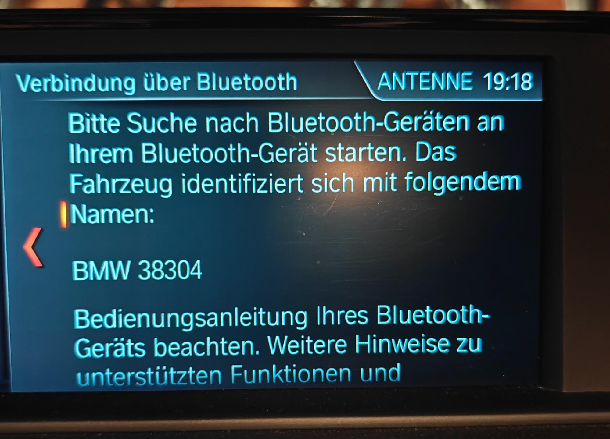
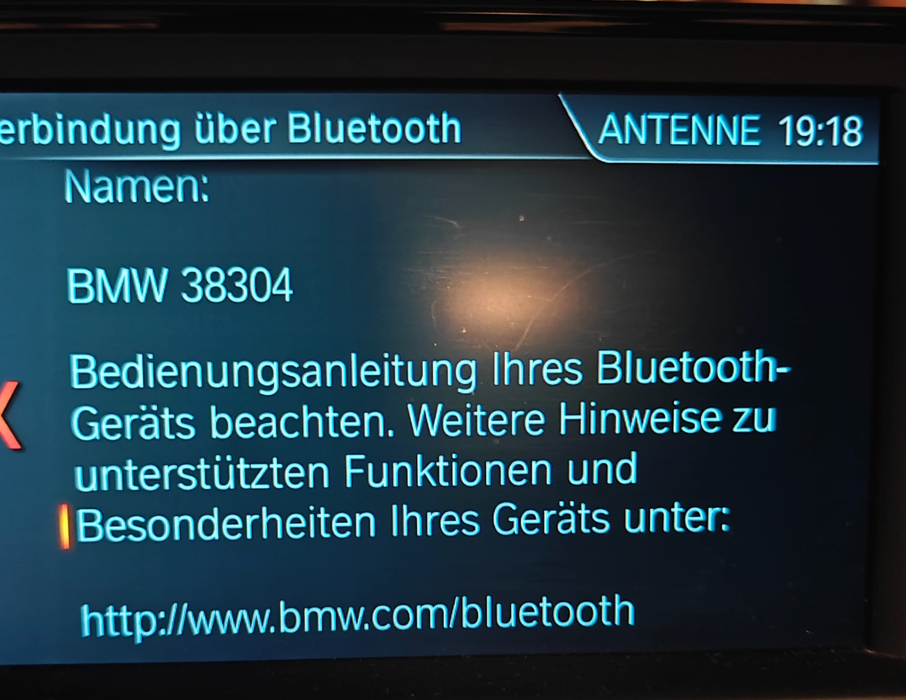
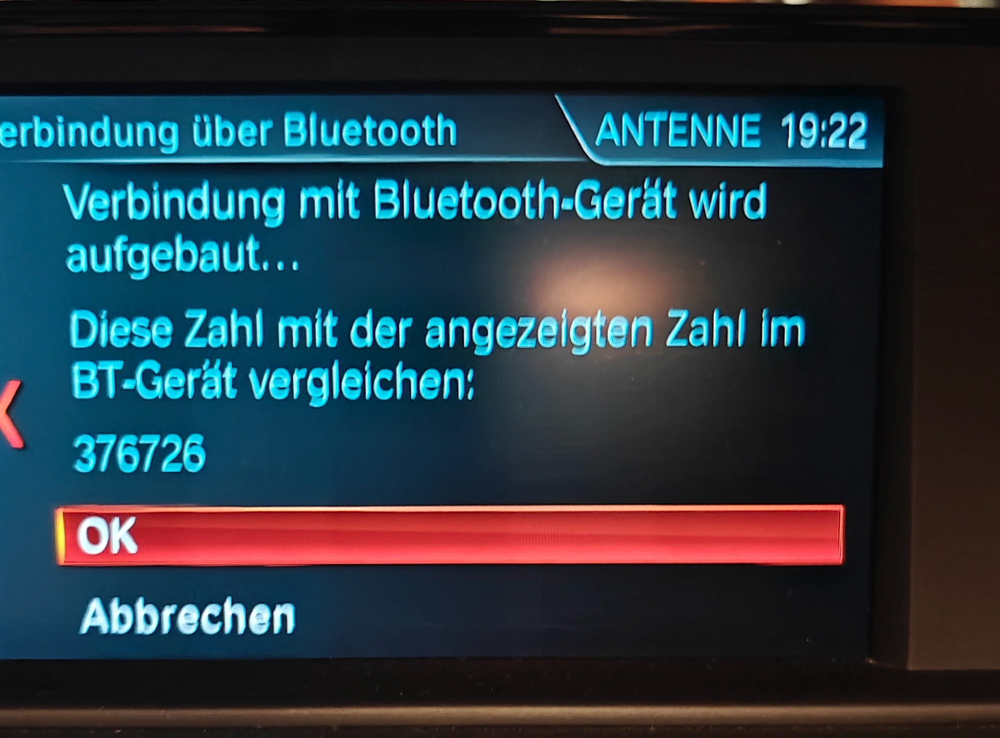
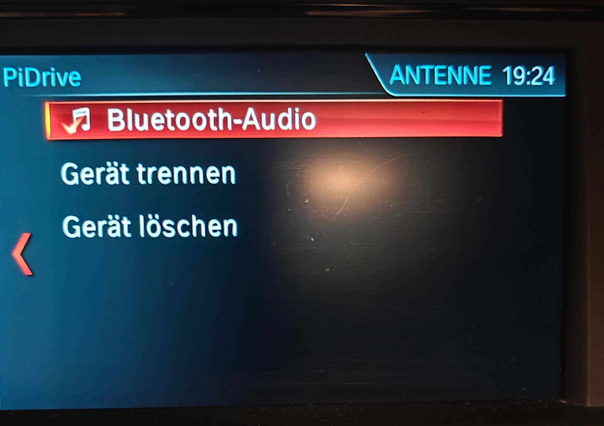
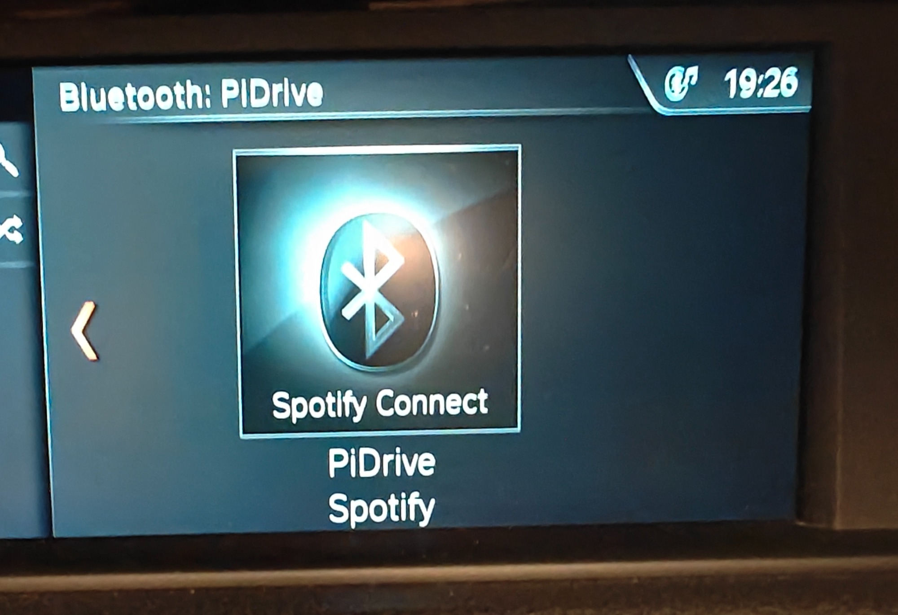
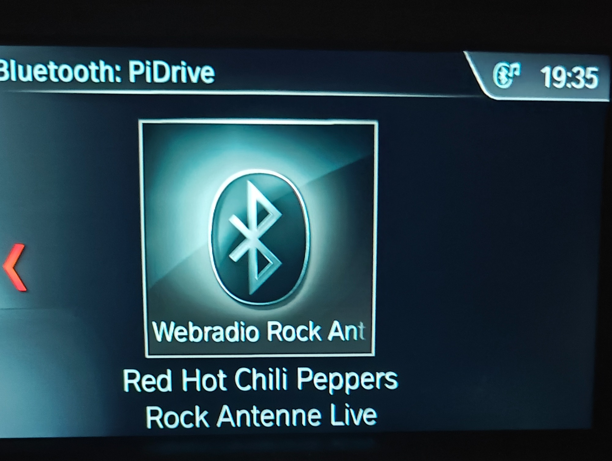
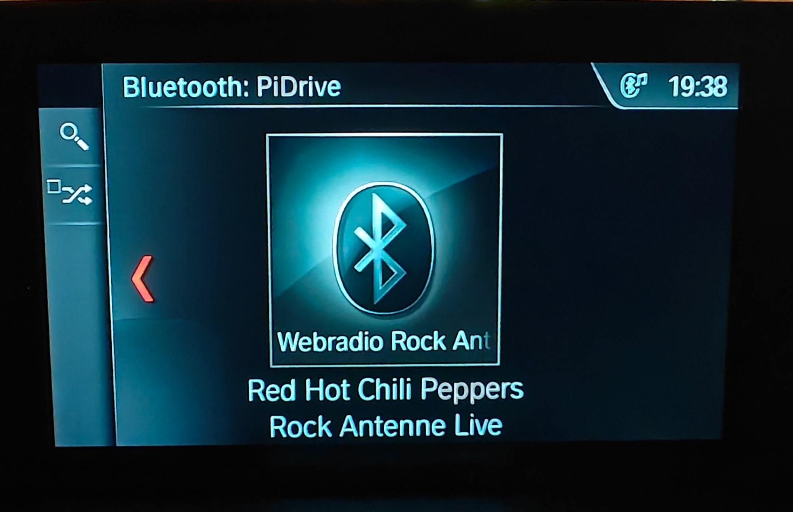
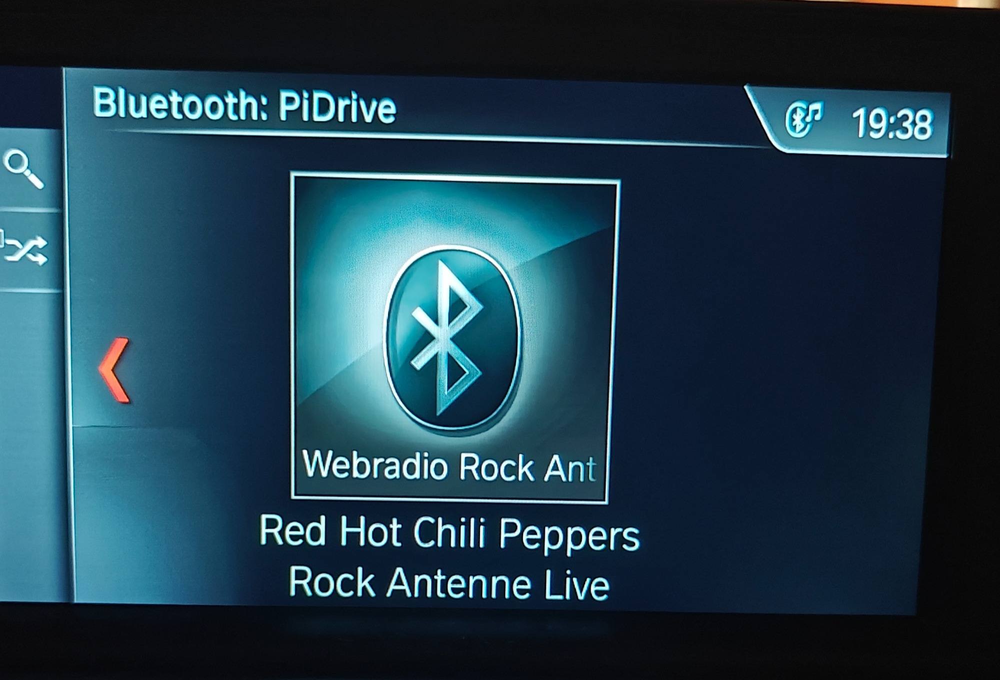

# BMW iDrive — erster Bluetooth-Feldtest

**Stand:** 2026-09-16 · BMW 118d F20/F21 LCI 2017 · NBT Evo  
**Fahrzeug-BT-Name:** `BMW 38304`  
**Gerät im iDrive:** `PiDrive`

Fotos liegen in [`bt-idrive-test-2026-09-16/`](bt-idrive-test-2026-09-16/).  
Referenz: [`iDriveBt.md`](iDriveBt.md) (Pairing §8, MPRIS2 §7), [`RUNTIME_FLOWS.md`](../architektur/RUNTIME_FLOWS.md) Abschnitt I.3.

Das ist **kein** vollständiges G2 (`display-probe` / Tasten-Ingress). Belegt ist Pairing plus Now-Playing-Metadaten für Spotify und Webradio.

---

## Ablauf (CID-Uhr)

| Uhr | Schritt | Foto |
|-----|---------|------|
| 19:18 | BMW fordert Suche am Gegenstück; Fahrzeugname `BMW 38304` | 01, 02 |
| 19:22 | SSP-Zahlenvergleich `376726` — OK / Abbrechen | 03 |
| 19:24 | PiDrive gekoppelt, Quelle Bluetooth-Audio | 04 |
| 19:26 | Now Playing: Spotify Connect | 05 |
| 19:35–19:38 | Now Playing: Webradio Rock Antenne, ICY-Titel | 06–08 |

---

## 1. Pairing

BMW startet „Verbindung über Bluetooth“ und bittet, die Suche **am Bluetooth-Gerät** zu starten. Das Fahrzeug identifiziert sich als **BMW 38304**.

Fortsetzung derselben Ansicht mit Hinweis auf `http://www.bmw.com/bluetooth`:

Vier Minuten später Zahlenvergleich (nicht Just Works):

**Beobachtung:** NBT Evo nutzt hier **SSP Numeric Comparison**. Der PiDrive-Agent muss `DisplayYesNo` / `Request confirmation` mit `yes` beantworten — siehe [`KontextPiDrive.md`](../KontextPiDrive.md) (Agent `DisplayYesNo`).

Nach Bestätigung erscheint PiDrive als Audio-Gerät:

Kopfzeile **PiDrive**, aktiver Eintrag **Bluetooth-Audio**, plus **Gerät trennen** / **Gerät löschen**.

---

## 2. Now Playing — Spotify

| Slot auf dem CID | Text |
|------------------|------|
| Kopfzeile | `Bluetooth: PiDrive` |
| Cover-Overlay | `Spotify Connect` |
| Zeile 1 | `PiDrive` |
| Zeile 2 | `Spotify` |

Passt zu den MPRIS2-Fallbacks in `mpris2.py`, wenn noch kein Track da ist: `title=Spotify`, `artist=PiDrive`, `album=Spotify Connect`. Cover-Overlay ≈ Album, die zwei Zeilen darunter ≈ Artist + Title. Cover-Grafik ist das **BMW-eigene Bluetooth-Icon** (kein PiDrive-`artUrl`) — erwartet bei AVRCP 1.4/1.5.

---

## 3. Now Playing — Webradio Rock Antenne

Drei Aufnahmen derselben Ansicht (19:35 und 19:38). ICY-Metadaten sind sichtbar.

| Slot auf dem CID | Text |
|------------------|------|
| Kopfzeile | `Bluetooth: PiDrive` |
| Cover-Overlay | `Webradio Rock Ant` (abgeschnitten, Station/Genre) |
| Zeile 1 | `Red Hot Chili Peppers` |
| Zeile 2 | `Rock Antenne Live` |

`mpris2.py` splittet ICY `Interpret - Titel` und setzt `album` auf den Sendernamen. Cover-Overlay ist auf dem CID kürzer als die Album-Zeile.

---

## 4. Was dieser Test belegt — und was nicht

| Punkt | Ergebnis |
|-------|----------|
| Pairing BMW ↔ PiDrive | ✅ SSP-Zahl, Gerät erscheint als Bluetooth-Audio |
| A2DP Now Playing | ✅ Kopfzeile `Bluetooth: PiDrive` |
| Metadaten Spotify | ✅ drei Textslots sichtbar |
| Metadaten Webradio / ICY | ✅ Interpret + Sender sichtbar |
| Cover Art von PiDrive | ❌ generisches BT-Icon (AVRCP 1.4) |
| PiDrive-Menü auf dem CID | ⬜ nicht fotografiert |
| Lenkrad-/AVRCP-Tasten, Ingress-Pfad | ⬜ nicht protokolliert |
| `display-probe` (G2, Zeichen/Rate) | ⬜ ausstehend |

Nächster Schritt für G2: `docs/fahrzeug/BMW-DISPLAY-PROBE.md` mit `pidrivectl idrive display-probe` plus Tasten-Log (`AVRCP_INGRESS`).
