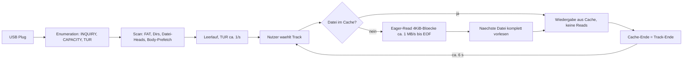
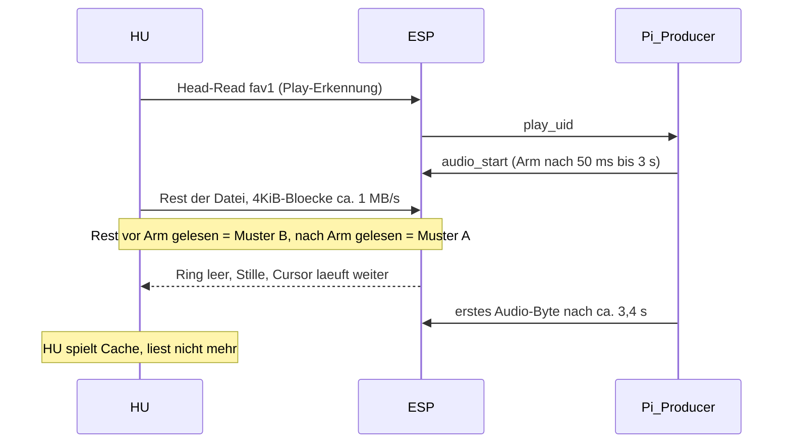

# HU Technical Facts — BMW NBT Evo als USB-Massenspeicher-Host

**Stand:** 2026-10-07 (R13 korrigiert, R15–R22, F7/F8, Q8/Q9 neu) · **Fahrzeug:** BMW 118d F20 LCI (2017), NBT Evo · **Gerät:** ESP32-S3 `esp32.pidrive` (USB-MSC Full-Speed, virtuelles FAT)
**Zweck:** Sammlung dessen, was über das Verhalten der Head Unit (HU) am USB-Port **bekannt und belegt** ist. Jede Aussage trägt einen Belegstatus und eine Quelle. Neue Feldtests sollen hier nachgetragen werden.

| Status | Bedeutung |
|--------|-----------|
| **[B]** bewiesen | direkt in Rohdaten gemessen, mehrfach oder byte-genau nachgerechnet |
| **[S]** stark belegt | konsistent in mehreren Läufen, aber nicht unter allen Bedingungen geprüft |
| **[H]** Hypothese | plausibel, noch nicht gemessen |
| **[?]** offen | unbekannt, Test nötig |

Begleitdokumente: [`../betrieb/artifacts-2026-10-06-feld/ANALYSE-HU-FILE-CACHE-BACKPRESSURE-2026-10-06.md`](../betrieb/artifacts-2026-10-06-feld/ANALYSE-HU-FILE-CACHE-BACKPRESSURE-2026-10-06.md) · [`../betrieb/artifacts-2026-10-06-lab/KONZEPT-HU-SIM-NBT-2026-10-06.md`](../betrieb/artifacts-2026-10-06-lab/KONZEPT-HU-SIM-NBT-2026-10-06.md) · [`../betrieb/FELDTEST-ESP-MSC-BMW-2026-09-28.md`](../betrieb/FELDTEST-ESP-MSC-BMW-2026-09-28.md)

---

## 1. Gesamtbild in einem Satz

Die NBT-Evo-HU behandelt USB-Medien wie eine Festplatte mit fertigen Dateien: Sie liest eine gewählte Datei **so schnell der Bus erlaubt bis zum Ende**, liest die **nächste Datei rund 15 s vor Track-Ende vor** (R21), spielt **aus ihrem Cache** und fordert erst beim nächsten Track wieder Daten an.



---

## 2. Enumeration und SCSI-Verhalten

| # | Fakt | Status | Wert / Beleg |
|---|------|--------|--------------|
| E1 | INQUIRY ca. 1 s nach Plug | [B] | `msToInquiry=997`, `msPlugToFirstRead=1004` (`status-0758-bayern-1.json`); identisch 01.10. (`msToInquiry` ≈ 1000) |
| E2 | Kommandomix | [B] | `inquiry=1`, `capacity=3`, `prevent=7`, `startStop=0`, `otherScsi=0`; Firmware-Fingerprint `hint=hu-like` |
| E3 | TEST UNIT READY periodisch | [S] | `tur=73` bei ~93 s Uptime → ca. 0,8/s; 01.10.: `tur=101` in ~160 s |
| E4 | Keine Schreibzugriffe | [B] | `writeCount=0`, `writeReject=0` in allen Snapshots |
| E5 | Transfergröße fast ausschließlich 4 KiB | [B] | `xfer: n512=3, n2k=0, n4k=1536, n8kPlus=0` (07:58); `n4k=2293, n8kPlus=0` (st-55) |
| E6 | Queue-Tiefe 1, ein Kommando nach dem anderen | [S] | `mscTrace`: streng monotone LBAs, Abstand 3–5 ms, keine überlappenden Kommandos |
| E7 | Toleranz gegenüber langsamen READ10 | [?] | nie getestet; Voraussetzung für Backpressure |

---

## 3. Dateisystem und Medienliste

| # | Fakt | Status | Beleg |
|---|------|--------|-------|
| F1 | FAT12 und FAT16 werden gelesen; Dateien mit LFN-Namen werden in der Medienliste angezeigt | [B] | Geometrien Legacy (FAT12 2 MiB), L0 (FAT12 4 MiB), L3 (FAT16 16 MiB) im Feld gelistet |
| F2 | Falsch gepatchte FAT/Root → leere Liste | [B] | Bug 0.4.19 (FELDTEST §4.2) |
| F3 | Dateien mit ungültigem Inhalt (0xFF) → Decoder überspringt, Playlist „rauscht durch“ | [B] | FELDTEST §4.3 |
| F4 | Volle Slot-Länge mit gültigen CBR-Stille-Frames + Xing → Datei bleibt stabil in der Liste | [S] | seit B2 (`Mp3Silence::fill`) |
| F5 | HU-Listenreihenfolge ≠ Slot-Reihenfolge des ESP | [S] | L0-Test 03.10.: BOB oben, Rock unten (Slots fav0=Rock, fav1=Bayern, fav2=BOB) |
| F6 | Volume-Label / Serial (`PDnnnn`) wechselt bei Remount | [B] | PD0082 → PD0084 (06.10.), PD0004 → PD0005 (01.10.). **Aber:** über ESP-RST bleibt sie gleich (PD0089, 7 Boots s1-morgen) |
| F7 | Diese HU zeigt beim Abspielen nur einen **Fortschrittsbalken**, keinen Sekundenzähler | [B] | s1-morgen `f1-events.jsonl` 07:46:43 |
| F8 | Autoplay-Reihenfolge BOB → Bayern → Rock (`fav2 → fav1 → fav0`) | [B] | s1-morgen, mehrfach |

---

## 4. Metadaten: ID3 und Cover

| # | Fakt | Status | Beleg |
|---|------|--------|-------|
| M1 | ID3v2-Tag am Dateianfang wird gelesen, Cover (APIC, JPEG) wird angezeigt | [B] | 01.10. Heimabend, 02.10. 60-s-Test: „Cover + kurze Sekunden Ton“ |
| M2 | Cover-Format, das funktioniert | [B] | JPEG 320×320, ≤ 8 KiB (`assets/usb-msc-covers`), sticky ID3 `id3Len=3044`/`3496` |
| M3 | Cover wird auch angezeigt, wenn danach nur Stille folgt | [S] | 02.10./03.10.: Cover ohne Ton in mehreren Fällen |

---

## 5. Leseverhalten beim Abspielen (Kern)

### 5.1 Fakten

| # | Fakt | Status | Rechnung / Beleg |
|---|------|--------|------------------|
| R1 | Leserate ≈ USB-Full-Speed-Grenze | [B] | `mscTrace`: 4096 B alle 4 ms ≈ 1 MB/s; netto 665–816 KB/s (Runde 08:10), 774 KB/s (Replug 08:05) |
| R2 | Gewählte Datei wird bis EOF gelesen (oder bis zur Abwahl) | [B] | 86.016 + 438.272 = **524.288** (07:58); 163.840 + 360.448 = **524.288** (08:12:35); `fav0` 8 MiB: `bytes=8.421.376` (`status-pre-rst-0755`) |
| R3 | Bei Abwahl während des Reads bricht die HU ab | [S] | st-55: `fav0 maxSeq=5.971.968` von 8.388.608 nach Senderwechsel |
| R4 | Nächste Datei wird komplett vorgelesen | [B] | st-52 → st-55: `fav1` fertig, dann `fav2` +128 Reads = 524.288 B, während `fav1` spielt |
| R5 | Nach dem Vorlesen keine Reads während der Wiedergabe | [B] | `readCount=1539` konstant von 07:58:31 bis 07:59:34; B7-A (03.10.): ≥ 150 s keine Reads |
| R6 | Track-Ende = Datei-Ende, dann automatischer Wechsel | [B] | 512 KiB bei 48 kbit/s: (524.288 − 3.044) / 5.973 B/s = **87,3 s**; Wechsel nach **93,2 s** (`switch fav1 → fav2 (age=93.2s)`) |
| R7 | Pause zwischen Tracks | [S] | 93,2 − 87,3 ≈ **6 s** |
| R8 | Body-Reads können **vor** dem Head-Read kommen (Prefetch) | [B] | 08:04:00 `cold_body_burst … ev=not_from_head`, Head-Read erst 08:04:01 |
| R9 | Cache-Treffer erzeugt keine Reads (Muster B) | [B] | 08:00 BOB, 08:04 Bayern, 08:06 BOB: `hostAbs=0`, Datei vorher `bytes=524288` |
| R10 | Beim Scan nach Plug/RST wird groß vorgelesen | [B] | post-RST nach 5–14 s: `fav0` 3,8–5,6 MiB gelesen |
| R11 | Erneute Auswahl einer gecachten Datei spielt denselben Inhalt nochmal | [B] | 01.10.: „erneute Wahl = dieselben ~6 s“ |
| R12 | Ab wann die HU abspielt (sofort vs. nach Read-Ende) | [?] / Indiz [S] inkrementell | **F1 formal offen** (HU zeigt nur Balken, s1-morgen). Indiz: R16/R17 — die HU holt zuerst Daten um die Wiedergabeposition und füllt dann im Hintergrund; bei Batch-then-Play wäre diese Priorisierung unnötig |
| R13 | Überlebt der Cache einen ESP-RST (gleiche Serial)? | **[B] nein** | s1-morgen 07.10.: in **6/6** RSTs ist im ersten Poll (Uptime 2–3 s) eine Datei vollständig frisch gelesen (`maxSeq` = Dateigröße, `rc=167`). Frühere Lesart „BOB cache_hit_like nach RST“ war ein Poll-Artefakt ([`KORREKTUR-F2C-RST-ARTEFAKT.md`](../betrieb/artifacts-2026-10-07-feld/feld-s1-morgen/KORREKTUR-F2C-RST-ARTEFAKT.md)). Neue Serial: nicht getestet |
| R14 | LED-Blinken korreliert mit Cold-Body-/MSC-Aktivität | [S] | s1-1700: erster Autoplay (Bayern) ohne Blink; BOB/Rock cold mit Blink; frühere Läufe `cold_body_burst`. **Nicht** alleiniger Cache-Orakelzustand — operativ: Blink ≈ Body-Read/MSC-Aktivität |
| R15 | Lesetakt: **4,0 ms pro 4 KiB** (≈ 250 Reads/s, 1,02 MB/s) = Bulk-Grenze USB Full-Speed (~1,2 KB/ms + CBW/CSW). Mit ESP-Play-Erkennung **5,1 ms** (≈ 195/s, 0,80 MB/s) | [B] Takt / [S] Ursache | s1-morgen: 250/s in Boot 0, 2, 5 (`playingUid` leer), 195/s in Boot 1, 3, 4, 6 jeweils ~1–2 s nach `playingUid=fav0`; `msc.reads` 03./04.10.: Segmente 1,04–1,07 MB/s. Ursache (ESP-Servicezeit im Zustand Play) → Lab-Test C2 |
| R16 | Lesen **außer der Reihe** bei Wiederaufnahme an Position P: vorwärts 8, rückwärts 120, rückwärts 120, vorwärts 360, rückwärts 360, vorwärts 968 KiB (Summe **1.982.464 B**), dann **5,1 s Pause**, dann sequenziell ab P + 1336 KiB bis EOF (6.057.984 B) | [B] Summen / [S] Reihenfolge | `msc.reads` p1-run-a ms 364034–365907 und p1-run-b ms 171378–173250: beide exakt 1.982.464 B ab LBA 1953 (P = Dateioffset 958.464), danach Lauf ab LBA 4625 (= P + 1336 KiB). m3seq 03.10. Ep. 7 ab LBA 1953 größer (4.407.296 B) |
| R17 | Frische Auswahl: erster sequenzieller Lauf **immer 368.640 B** (360 KiB) ab Kopf, danach 2–3 s Fragmente, dann ein Lauf bis EOF | [B] | s1-morgen 5/5 (`slotMap.fav0.maxSeq`); Endlauf 5.201.920 B in 3/4 angetippten Fällen. Keine Meta-Reads dazwischen (Δ`readCount`·4096 = Δ`bytes`) |
| R18 | 51 Blöcke (208.896 B) von fav0 werden in der Rampe nach RST nie gelesen | [B] Zahl / [?] Ursache | s1-morgen: Summe 4× exakt **8.179.712** B; welche Blöcke → LBA-Trace (`msc.reads`) |
| R19 | Autoplay-Wechsel: Rampe pausiert nach ~4 MiB für 2–3 s, angetippte Auswahl nicht | [S] | s1-morgen Boot 0 (bei 4.194.304 B, 07:44:12–14), Boot 1 (3.985.408 B, 07:49:43–44) |
| R20 | Wiederanlauf nach RST: aktueller Titel in ≤ 3 s komplett neu gelesen (ein Lauf), dazu **8 verstreute 4-KiB-Reads** auf fav0 (`maxSeq` 4096); gesamt `rc=167` | [B] | s1-morgen 4/4 bei 512-KiB-Titel; bei Rock als aktuellem Titel startet direkt die Rampe (2/2) |
| R21 | Next-Track-Prefetch hängt an der **Wiedergabezeit**: ~15 s vor Wiedergabe-Ende, nicht direkt nach Read-EOF | [S] | s1-morgen: Bayern 07:48:10 vs. BOB-Ende 07:48:25; Rock 07:49:38 vs. Bayern-Ende ~07:49:52; Ausreißer Boot 0 ~7 s. Nach Rock-Read-EOF nie Prefetch |
| R22 | Scan nach Plug: erster Lese-Burst ab LBA 0 ist **1.374.720 B** (3× identisch), danach ein Burst von 176.128 B auf einem Datei-Kopf | [B] | `msc.reads` p1-run-a/-b ms 217113–218891, m3seq Ep. 6 ms 148817; 176.128 B: p1 ab LBA 17377, m3seq Ep. 9 ab LBA 18161. Lab-Signatur für C7 |

### 5.2 Log-Beleg: Burst bei leerem Ring (07:58, Correlate-Watch)

```text
07:58:02.3 act=1 arm=1 base=0 end=0     host=294912 sB=294912 und=294912 live=0 ring=0
07:58:02.9 act=1 arm=1 base=0 end=0     host=438272 sB=438272 und=438272 live=0 ring=0
07:58:05.4 act=1 arm=1 base=0 end=4096  host=438272 ...   <- erstes Producer-Byte
07:58:10.6 act=1 arm=1 base=968 end=50120 host=438272 ... ring=49152 (voll)
07:59:29.3 act=1 arm=1 base=624457 end=673609 host=438272 ...   <- keine weiteren Reads
```

Quelle: `betrieb/artifacts-2026-10-06-feld/feld-av-0723/correlate-run-post-rst/correlate-watch.jsonl`

### 5.3 Log-Beleg: Play-Erkennung und Track-Wechsel (Bridge)

```text
07:58:01 [msc] play.reject seq_short uid=fav1 from=16465 +4096B age=64272ms
07:58:01 [trace] t=0ms play_uid=fav1
07:58:01 [trace] t=50ms audio.start fav fav1
07:58:02 [msc] play.reject cooldown uid=fav1 from=16465 +12288B
07:58:03 [msc] cold_body_burst s=1 lba=16481..16537 n=8 B=32768 ev=not_from_head
07:58:03 [audio_ack] {'op': 'start', 'uid': 'fav1', 'id3': True, 'warmup': 0}
07:59:35 [msc] play.reject seq_short uid=fav2 from=17489 +4096B
07:59:35 [audio] switch fav1 → fav2 (age=93.2s)        <- Track-Ende nach 87,3 s + ~6 s
```

Quelle: `bridge-0758-bayern.txt`, `bridge-0759-switch.txt`

### 5.4 Log-Beleg: Next-Track-Prefetch (st-55, `mscTrace`-Ausschnitt)

```text
ms=16230 gap=4 lba=17745 n=4096 kind=file tag="Radio BOB!"
ms=16234 gap=4 lba=17753 n=4096 kind=file tag="Radio BOB!"
ms=16238 gap=4 lba=17761 n=4096 kind=file tag="Radio BOB!"
...  (96 Einträge, durchgehend 3–5 ms, +8 LBA pro Read)
```

Zu diesem Zeitpunkt ist `playingUid=fav1` (Bayern). Quelle: `runde-0810/status/st-55.json`

---

## 6. Zusammenspiel mit dem ESP-Live-Pfad

### 6.1 Warum Muster A und B derselbe Mechanismus sind



| Muster | Bedingung | Beobachtung |
|--------|-----------|-------------|
| A | Arm, bevor die HU die Datei fertig gelesen hat | Rest der Datei läuft über den Live-Pfad, Ring leer → nur Underruns (`und = hostAbs`) |
| B | Datei vor dem Arm fertig gelesen (Scan, Body-Prefetch, Next-Track-Prefetch) | `hostAbs = 0`, `armed = false`, HU spielt Cache |

### 6.2 Zeitkonstanten

| Größe | Wert | Status | Beleg |
|-------|------|--------|-------|
| HU liest 512 KiB | ≈ 0,6 s | [B] | R1 |
| HU liest 8 MiB | ≈ 10 s | [S] | R1, R10 |
| Arm-Latenz `play_uid` → Stream aktiv | 50 ms (direkt) bis 2–3 s (bei Senderwechsel mit `audio_stop`) | [B] | `bridge-0758`, `bridge-0759-switch`, `bridge-0804` |
| Producer-Startlatenz | ≈ 3,4 s nach `audio_start` | [B] | Correlate 07:58 |
| Producer-Rate | ≈ 8,7 KB/s für ~60 s, dann 6,0 KB/s (48 kbit/s) | [B] | drei Läufe identisch |
| Golden Reference 01.10. | `live` = 49.152 B = eine Ringfüllung ≈ 8,2 s | [B] | `esp89-after-6s-loop-174626.json` |

### 6.3 Konsequenz

Mit Stille-bei-Miss sind pro Auswahl höchstens **Ringinhalt beim Arm + R_prod × 0,6 s ≈ 9 s** Ton möglich. Live-Betrieb verlangt, dass der ESP Reads **verzögert**, statt Stille zu liefern (siehe Analyse-Dokument, Abschnitt 5).

---

## 7. Abspielen und Decoder

| # | Fakt | Status | Beleg |
|---|------|--------|-------|
| D1 | Layer III CBR 48 kbit/s aus der Bridge wird dekodiert, hörbar. Die Bridge kodiert mono 22,05 kHz = **MPEG-2** (`pump_bridge.py`: `-ac 1 -ar 22050`) | [B] Ton / [S] Format | 01.10., 02.10. (Kurzton) |
| D2 | Stille-Frames (`kSil`, 156 B, 48 kbit/s / 44,1 kHz, LAME-Tag) werden ohne Fehler „gespielt“ | [B] | 07:58: ~87 s Stille aus dem Cache ohne Abbruch, danach regulärer Track-Wechsel |
| D3 | Spieldauer ergibt sich aus Dateigröße und Bitrate | [S] | R6 |
| D4 | Format-Wechsel in der Datei (Live MPEG-2 22,05 kHz mono ↔ `kSil` MPEG-1 44,1 kHz) bei jedem Underrun | [?] | nicht isoliert getestet (Stufenplan R7) |
| D5 | Andere Bitraten (96k/128k) | [?] | nicht im Feld getestet |

---

## 8. Offene Fragen (Testkatalog)

| ID | Frage | Vorgeschlagener Test |
|----|-------|---------------------|
| Q1 | Wie lange darf ein READ10 dauern, ohne dass die HU resettet? | Stall-Leiter 300/700/1500/3000 ms bei 128k; `inquiry`/`plugCount`/`remountGen` beobachten |
| Q2 | Spielt die HU während des Lesens oder erst nach Read-Ende? | s1-1700 **nicht entschieden** (kein Video/Timer). Nächster Termin: Spielzeit-Zähler + Video gegen `slotMap.fav0.b` / EOF (Stufenplan 1.2) |
| Q3 | Invalidiert Remount / neue Serial / geänderte Dateigröße den Cache? | **ESP-RST: ja** (R13, 6/6). Offen: In-Session-Abwahl fav1→fav2→fav1 mit `msc.reads`, Serial-Wechsel (F2d) |
| Q8 | Welche Blöcke liest die HU bei frischer Auswahl ab Kopf, in welcher Reihenfolge, wie weit voraus? | Bridge `--no-audio` + `msc.reads` im Feld ([`FELDPROTOKOLL-NAECHSTER-TERMIN.md`](../betrieb/artifacts-2026-10-07-feld/FELDPROTOKOLL-NAECHSTER-TERMIN.md)). **Entscheidend für Stall** (Risiko R10 im Stufenplan) |
| Q9 | Warum 5,1 statt 4,0 ms pro Read bei ESP-Play? | Lab-Test C2 ([`AUFTRAG-LAB-CURSOR-C1-C7.md`](../betrieb/artifacts-2026-10-07-lab/AUFTRAG-LAB-CURSOR-C1-C7.md)) |
| Q4 | Wie groß ist der HU-Cache / Read-Ahead? | **Aufteilen** — siehe Katalog [`EXPERIMENTKATALOG-Q4-CACHE-MARKER-2026-10-07.md`](../betrieb/artifacts-2026-10-06-feld/EXPERIMENTKATALOG-Q4-CACHE-MARKER-2026-10-07.md) |
| Q4a | Max. Eager-Read **einer** Datei? | Größenleiter 512 KiB…64 MiB Silence; `maxSeq`/`bytes` ohne Abwahl |
| Q4b | Max. Bytes/Anzahl **mehrerer** gecachter Dateien? | N=1…64 × 512 KiB; Re-Select → Hit (keine Body-Reads) vs Miss |
| Q4c | Eviction-Strategie? | Sequenz dann frühe Datei erneut; optional Rückwärtslauf — FIFO/LRU/? |
| Q5 | In welcher Reihenfolge werden Tracks gewechselt / vorgelesen? | Mehrere Dateien mit eindeutigen Namen; Wechselfolge protokollieren (beobachtet: Bayern → BOB, zweimal) |
| Q6 | Wie reagiert die HU auf gültiges, kontinuierlich nachgeliefertes MP3? | ergibt sich aus dem ersten erfolgreichen Stall-Lauf |
| Q7 | Bekannte Prefill bis Offset X, dann Backpressure — wo stoppt/wartet die HU? | **nur nach Stall-Go**; Silence hinter X verbieten (sonst Cursor-Versatz). Marker-Blöcke zur Offset-Diagnose |

---

## 9. Pflegeregel

- Neue Feldbefunde mit Datum, FW-Version, Geometrie (`kReadyDetail`) und Quelle eintragen.
- Status nur auf **[B]** heben, wenn Rohdaten (Status-JSON, Correlate-Watch, Bridge-Log) verlinkt sind.
- Zählerwerte aus verschiedenen Snapshots nicht mischen. `liveBytes = streamBytes − underruns` ist nach einem Senderwechsel ungültig, solange `streamBytesServed_` nicht in `startStream()` zurückgesetzt wird.
