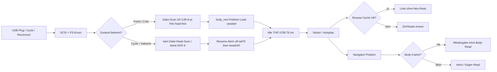
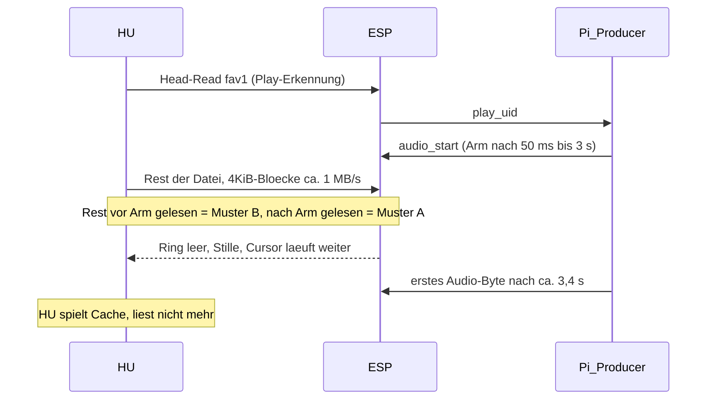

# HU Technical Facts — BMW NBT Evo als USB-Massenspeicher-Host

**Stand:** 2026-10-23 (Identity/Remount + Detach/Browse: Serial/Label/Vol **kein** Resume-Key; Soft-Remount wirkungslos; kurzer Cycle = FS-Enum **ohne** Datei-Head-Scan; Fresh = **32+128+6** EOF; Drei Schichten Navigator≠Browse≠Body; Detach ≤30 s / ESP-RST / OTG ~99 s → Resume — Fresh ≠ Zeit-Timeout) · **Fahrzeug:** BMW 118d F20 LCI (2017), NBT Evo · **Gerät:** ESP32-S3 `esp32.pidrive` 0.4.54+ / `hu-probe` 0.3.19  
**Maßnahmen:** [`../planung/MASSNAHMEN-HU-PROBE-2026-10-23.md`](../planung/MASSNAHMEN-HU-PROBE-2026-10-23.md) · [`MASSNAHMEN-HU-PROBE-2026-10-22.md`](../planung/MASSNAHMEN-HU-PROBE-2026-10-22.md) · hu-probe: [`identity-multireview`](../../../hu-probe/docs/feld/2026-10-23-gesamtbericht-identity-remount-multireview.md) · [`wire-074319/455`](../../../hu-probe/docs/feld/2026-10-23-wire-nachtrag-074319-074455.md) · [`detach-browse`](../../../hu-probe/docs/feld/2026-10-23-wire-nachtrag-detach-browse.md)  
**Zweck:** Sammlung dessen, was über das Verhalten der Head Unit (HU) am USB-Port **bekannt und belegt** ist. Jede Aussage trägt einen Belegstatus und eine Quelle. Neue Feldtests sollen hier nachgetragen werden.

**Scope:** Belegte Plattform = **diese** NBT Evo am MSC-Port. Keine gemessenen Fakten zu CAN, MOST, CarPlay, Android Auto oder HU-WLAN/Ethernet-APIs. Andere BMW-Generationen = kein stiller Transfer. Lab-AV ≠ Feld-Ohr.

| Status | Bedeutung |
|--------|-----------|
| **[B]** bewiesen | direkt in Rohdaten gemessen, mehrfach oder byte-genau nachgerechnet |
| **[S]** stark belegt | konsistent in mehreren Läufen, aber nicht unter allen Bedingungen geprüft |
| **[D]** Desk-Fakt | an gepinntem Fremdcode/-artefakt belegt; keine Messung an dieser HU |
| **[H]** Hypothese | plausibel, noch nicht gemessen |
| **[?]** offen | unbekannt, Test nötig |

Begleitdokumente: [`../betrieb/artifacts-2026-10-06-feld/ANALYSE-HU-FILE-CACHE-BACKPRESSURE-2026-10-06.md`](../betrieb/artifacts-2026-10-06-feld/ANALYSE-HU-FILE-CACHE-BACKPRESSURE-2026-10-06.md) · [`../betrieb/artifacts-2026-10-06-lab/KONZEPT-HU-SIM-NBT-2026-10-06.md`](../betrieb/artifacts-2026-10-06-lab/KONZEPT-HU-SIM-NBT-2026-10-06.md) · [`../betrieb/FELDTEST-ESP-MSC-BMW-2026-09-28.md`](../betrieb/FELDTEST-ESP-MSC-BMW-2026-09-28.md) · Audit: [`bmw-nbt-evo` Sheet](../../../technology-audit/technologies/bmw-nbt-evo/SHEET.md) · [`pidrive-2026-bmw-hu` Evidence](../../../technology-audit/audits/pidrive-2026-bmw-hu/evidence.md) · [`hu-probe-bmw-s0s2-field-2026`](../../../technology-audit/audits/hu-probe-bmw-s0s2-field-2026/) · Report [`2026-10-15-hu-probe-bmw-s0s2-field`](../../../technology-audit/docs/reports/2026-10-15-hu-probe-bmw-s0s2-field.md) · Application C [`bmw-nbt-evo.md`](../../../technology-audit/projects/pidrive/applications/bmw-nbt-evo.md) · Foreign-Desk: [`bmw-nbt-media-index`](../../../technology-audit/audits/bmw-nbt-media-index-2026-foreign/evidence.md) · [`usb-bot-observation`](../../../technology-audit/audits/usb-bot-observation-2026-foreign/evidence.md) · hu-probe: [`bmw-s0-0.2.11`](../../../hu-probe/docs/feld/2026-10-14-bmw-s0-0.2.11-auswertung.md) · [`bmw-s0-0.2.2`](../../../hu-probe/docs/feld/2026-10-14-bmw-s0-auswertung.md) · Pin `@5dbec43` · [`profile`](../../../hu-probe/profiles/bmw_nbt_evo.json) (P1c noch offen)

---

## 1. Gesamtbild in einem Satz

Die NBT-Evo-HU behandelt USB-Medien wie eine Festplatte mit fertigen Dateien, hält aber **mindestens drei getrennte Zustände**: (1) **Navigator/Playlist-Position**, (2) **Browse-/Titel-/Bibliotheks-Cache**, (3) **Audio-Body-Cache**. USB-Cycle, FS-Re-Enum und Resume sind **nicht dasselbe Ereignis**. Fresh-Scan liest Dateiköpfe als **32+128+EOF-Probe** (≈80 KiB Head; EOF-Blöcke größenabhängig, z. B. 6 @ ~158 KiB / 2 @ ~120 KiB); nach bekanntem Zustand reicht oft FS-Enum + Vollatom am Resume-Track. Idle: **TUR ~2239 ms**. Prefetch-Lead medien-/pfadabhängig (VARIABLE; ~7,8 s body_rest nach Fresh auf ~158 KiB-SynthFat — relativ, Audible offen).


```mermaid
flowchart LR
  Plug["USB Plug / Cycle / Reconnect"] --> Enum["SCSI + FS-Enum"]
  Enum --> Path{Zustand bekannt?}
  Path -->|Fresh / Cold| Scan["Datei-Scan 32+128+6 je File head-first"]
  Path -->|Cycle + bekannt| Res["kein Datei-Head-Scan / keine EOF-6"]
  Scan --> BodyR["body_rest Prefetch Lead variabel"]
  Res --> Atom["Resume-Atom oft tail70 then head240"]
  BodyR --> Wait["Idle TUR 2238.78 ms"]
  Atom --> Wait
  Wait --> Sel["Nutzer / Autoplay"]
  Sel --> Nav["Navigator-Position"]
  Sel --> Browse{"Browse-Cache Hit?"}
  Browse -->|ja| UI["Liste ohne Neu-Read"]
  Browse -->|nein| DirRead["Dir/Heads erneut"]
  Nav --> Play{"Body-Cache?"}
  Play -->|Hit| PlayCache["Wiedergabe ohne Body-Read"]
  Play -->|Miss| Eager["Atom / Eager-Read"]
```

**PiDrive-Vertrag:** stabiles Directory/FAT + gültiger Dateikopf (~80 KiB + konsistente Size/EOF); Body darf dynamisch entstehen. Browse-UI aus Dir (8.3), Player-ID3 aus Head. **Nicht annehmen:** Remount ⇒ Position weg; Serial/Label/Vol ⇒ Resume-Key; Soft-Remount (NOT READY) ⇒ HU-Reset; „länger weg“ ≤~99 s ⇒ Fresh.

---

## 2. Enumeration und SCSI-Verhalten

| # | Fakt | Status | Wert / Beleg |
|---|------|--------|--------------|
| E1 | INQUIRY ca. 1 s nach Plug | [B] | `msToInquiry=997`, `msPlugToFirstRead=1004` (`status-0758-bayern-1.json`); identisch 01.10. (`msToInquiry` ≈ 1000) |
| E2 | Kommandomix | [B] | PiDrive: `inquiry=1`, `capacity=3`, `prevent=7`, `startStop=0`, `otherScsi=0`; Firmware-Fingerprint `hint=hu-like`. **hu-probe:** `tur` ≫ `read10`, dazu `prevent_allow`, `mode_sense6`, `read_capacity10`, `inquiry`. **MODE_SENSE6 / READ_CAPACITY = 2,0** (S2 Kern 60/30; auch vor Stall-Fix) = Host-Muster, kein Stall-Indiz (`EVID-HUPROBE-2026-10-15-005`). [`bmw-s0-0.2.11`](../../../hu-probe/docs/feld/2026-10-14-bmw-s0-0.2.11-auswertung.md), Audit S0/S2 |
| E3 | TEST UNIT READY periodisch, **Leerlauf-Periode 2,239 s**, phasenstarr | **[B]** (korr. 19.10.) | hu-probe: alle TUR-Abstände außerhalb von Mount-Bursts, 19 BMW-Sessions, **n = 382**: p10/Median/p90 = **2238/2239/2239 ms**. Der Timer läuft über Reads hinweg weiter, unabhängig von der Leseaktivität. **REJECTED:** „~0,8/s“, „Golden ≈ 1/s“ (Mittel über Uptime inkl. Mount-Bursts und Pausen) und Session-TUR-Hz ~2,06 als Leerlauf-Rate (`EVID-HUPROBE-2026-10-15-012` war ein Fenstermittel). [`unabhängige Auswertung`](../../../hu-probe/docs/feld/2026-10-19-unabhaengige-auswertung.md) P-TUR |
| E4 | Keine Schreibzugriffe | [B] | `writeCount=0`, `writeReject=0` in allen Snapshots; Golden `writes_expected: false`; hu-probe S0/S2: keine Writes in ausgewerteten CBWs (`001`/`003`) |
| E5 | Transfergröße **Event-/Callback-Ebene** fast ausschließlich 4 KiB | [B] Event | `xfer: n512=3, n2k=0, n4k=1536, n8kPlus=0` (07:58); `n4k=2293` (st-55). hu-probe File-n=4096 dominant (S0/S2). **Callbacks ≠ CBW:** TinyUSB-Puffer 4096 B → `n8kPlus` bauartbedingt 0; ein READ(10) kann viele Re-Entries erzeugen. CDB-Größe = E11 / Q10. Ablesbar: `n512=3` → 512-B-Callbacks; größere Datenphasen werden in 4-KiB-Chunks zerlegt |
| E6 | Queue-Tiefe 1, ein Kommando nach dem anderen | **[B]** protokollbedingt | Bulk-Only Transport: CBW → Daten → CSW, erst danach das nächste CBW (kein Pipelining). `mscTrace`: Abstand 3–5 ms, keine überlappenden Kommandos. LBAs innerhalb eines Segments monoton, **zwischen Segmenten nicht** (R16). Folge fürs Bremsen: Während ein READ wartet, kommt **kein** TEST UNIT READY (E3). QD-max p50=1 hu-probe `INFERRED` (Wire `UNKNOWN`, `012`) |
| E7 | Toleranz gegenüber langsamen READ10 / BUSY | **[B] NBT** | Feld s6: Stall-on lieferte ungefähr **65 s Musik+ID3 bis EOF** eines 512-KiB-Slots; Stall-off fiel reproduzierbar auf etwa **6 s** Ringfenster zurück. NBT akzeptiert damit TinyUSB-BUSY-Retries über Minuten. Die Operator-Dauer ist nicht poll-genau; Gesamtdauer- vs. Inaktivitätslimit bleibt offen (Q1 / HU-A7) — bei `blocks=240` hängt ein Retry an ~122 KiB Datenphase, nicht an 4 KiB (E11). Annahme „kleiner Ring = harte Dauerstrom-Grenze“ **REJECTED** (`EVID-BMWHU-2026-10-12-005`). S7-B Lab: BUSY erst nach Head-`play.guess`; D0 auf 0.4.49 regressionsfrei. Evidence `EVID-BMWHU-2026-10-12-001`–`005`. [`ERGEBNIS-S6`](../betrieb/artifacts-2026-10-12-feld/feld-s6-prep/ERGEBNIS-S6.md), [`S7-D-SPEC`](../planung/S7-D-LEITER-SPEC-2026-10-12.md) |
| E8 | Physisches OTG / Soft-Cycle detach→attach | **[B]** Timing · **[S]** Resume | BMW S0 0.2.2: Host detach→attach **2,294–6,011 s** (11 Paare). Soft-Lab ≈ **0,30 s** (nicht als NBT-Fakt). **23.10.:** Soft-Cycle (D+) und OTG ~30–99 s → Re-Enum + Resume (R38/R42/R43); Soft-Remount (NOT READY) ≠ Detach (R37). [`bmw-s0`](../../../hu-probe/docs/feld/2026-10-14-bmw-s0-auswertung.md) · [`detach-browse`](../../../hu-probe/docs/feld/2026-10-23-wire-nachtrag-detach-browse.md) |
| E9 | Kurze Verweildauer → kein DATA / keine Reads | **[B]** Muster / [?] Ursache | BMW S0 0.2.2: Fenster ~3,8 s → BOOT+FAT+ROOT ohne DATA; mehrere Plugs ~4,7–7,5 s ohne Read-Events. Inference: Dwell-Zeit für DATA/Playback nötig. Eager-EOF/Prefetch auf 256/512‑KiB-Demo **nicht** revalidiert |
| E10 | Replug-Scan-Grundmuster (kleines Medium) | **[B]** 256 KiB-Demo | 6/8 nicht-leerer Fenster: **22 Reads / 65 536 B** = BOOT+FAT+ROOT+DATA. Fenster 7 dichter Mehrfach-Scan (Instrument-/Drain-Artefakt in 0.2.2). Nicht auf große PiDrive-Slots übertragen |
| E11 | READ10-**CBW**-Blockzahl oft **8** und **240**; Demo-Track-Atom = **`(head,240)+(head+240,69)`** | **[B]** hu-probe S2 | Device-Stack CBW (nicht Wire): häufig `blocks=8` (=4096 B) und `blocks=240` (=122 880 B → typ. 30×4096 `read`-Events); Events/READ10 ≈ **5,29**. **Abend-Offline 18.10. (0.2.30):** drei PASS mit exakt Atom 240+69 = 309 LBA = 158 208 B; „39“ = 30+9 Callbacks (38×4096+2560), nicht 39×4 KiB. Covered T3 **627–935** (**REJECTED:** 627–938 / 312 LBA / „3 Meta“). Audit [`hu-probe-bmw-s2-abend-offline-2026-10-18`](../../../hu-probe/audits/hu-probe-bmw-s2-abend-offline-2026-10-18/). Event-n=4096 = Stack-Chunk — nicht blind „HU immer 4 KiB“. `EVID-HUPROBE-2026-10-15-004`. Gate **HU-A10** teilweise belegt |
| E12 | Mount-Signatur | **[B]** hu-probe | Jeder BMW-Mount: INQUIRY ×1, READ_CAPACITY10 ×3, MODE_SENSE6 ×6, PREVENT_ALLOW ×7, genau **32 TUR** (davon ≈ 15 als Burst in 0,05–0,29 s) und **11 READ10** in fester Folge `0/8, 0/8, 24/8, 0/8, 0/1, 1/3, 7/2, 1/1, 2/1, 3/5, 24/8` (LBAs auf dem hu-probe-Demo-Image: FAT 1–6, Root 7–8). Variante: `3/5` → `3/1 + 4/4` (Sessions 195657, 2363). P-MOUNT/P-MREAD |
| E13 | LBA 24/8 wird pro Mount zweimal gelesen | [S] Messung / [?] Zweck | Auf dem Demo-Image liegt LBA 24 mitten in TRACK1. Festes Probe-Offset oder Cache-Fenster ist offen; Test mit hu-probe-Medium `tail_probe` (Datenbereich verschoben). P-LBA24 |
| E14 | Resume-Read nach Mount | [S] | Der zuletzt gespielte Track wird **0,2–0,3 s** nach Ende der Mount-Signatur gelesen (S0/S2). Passt zu R24; **23.10.** Cycle+bekannt oft ohne Datei-Head-Scan, Atom am Resume-Track (R38/R41). P-RESUME |
| E15 | Auswahllatenz Marker → READ10 | [S] | Manuelle Wahl **1,7–1,9 s** (`171815`, `2280`), Autoplay-Sprung ≈ **0,2 s** (`200036`). Marker teils nachgezogen, daher [S]. P-SEL |
| E16 | tail_then_head | **[B]** Morphologie (R41) / Ursache [H] | T1 als Folgetrack oft Ende zuerst (`249/69`→`9/240`); Erst-Mounts head-first. **23.10.:** nach Cycle/Resume = Resume-Korrelat `tail70→head240` (R41), nicht „nach jedem Mount“. P-TAIL |
| E17 | Media-Loss-Reaktion | **[B]** | Nach `NOT READY / MEDIUM NOT PRESENT` (hu-probe `hideMedia`): `TUR status=1 → REQUEST_SENSE → PREVENT_ALLOW status=1` (`20261019-075344`, Tags 131–146). **23.10.:** Soft-Remount/NOT READY ≠ HU-Reset / Fresh (R37). P-LOSS |

Quelle E12–E17: [hu-probe unabhängige Auswertung 2026-10-19](../../../hu-probe/docs/feld/2026-10-19-unabhaengige-auswertung.md). Lab-Modell: `tools/nbt_hu_sim.py --hu-model nbt_evo_2026_10`, Profil `tools/profiles/nbt_evo_lab_2026-10-19.json`.

---

## 3. Dateisystem und Medienliste

| # | Fakt | Status | Beleg |
|---|------|--------|-------|
| F1 | FAT12 und FAT16 werden gelesen; Dateien mit LFN-Namen werden in der Medienliste angezeigt | [B] | Geometrien Legacy (FAT12 2 MiB), L0 (FAT12 4 MiB), L3 (FAT16 16 MiB) im Feld gelistet |
| F2 | Falsch gepatchte FAT/Root → leere Liste | [B] | Bug 0.4.19 (FELDTEST §4.2) |
| F3 | Dateien mit ungültigem Inhalt (0xFF) → Decoder überspringt, Playlist „rauscht durch“ | [B] | FELDTEST §4.3 |
| F4 | Volle Slot-Länge mit gültigen CBR-Stille-Frames + Xing → Datei bleibt stabil in der Liste | [S] | seit B2 (`Mp3Silence::fill`) |
| F5 | HU-Listenreihenfolge ≠ Slot-Reihenfolge des ESP | [S] | L0-Test 03.10.: BOB oben, Rock unten (Slots fav0=Rock, fav1=Bayern, fav2=BOB) |
| F6 | USB-Serial und Root-Volume-Label (`PDnnnn`) wechseln bei Remount | [B] | PD0082 → PD0084 (06.10.), PD0004 → PD0005 (01.10.); über ESP-RST bleibt die Identity gleich (PD0089, 7 Boots s1-morgen). **Präzisierung 13.10.:** `patchBoot()` lässt FAT-BPB-Volume-ID und BPB-Label aus dem Demo-Image unverändert; `formatVolumeLabel()` ändert nur den Root-Directory-Volume-Eintrag. „Label geändert“ war daher bisher keine vollständige FAT-Volume-Identity-Rotation. |
| F7 | Diese HU zeigt beim Abspielen nur einen **Fortschrittsbalken**, keinen Sekundenzähler | [B] | s1-morgen `f1-events.jsonl` 07:46:43 |
| F8 | Autoplay-Reihenfolge BOB → Bayern → Rock (`fav2 → fav1 → fav0`) | [B] | s1-morgen, mehrfach |
| F9 | USB-Hub an dieser HU: weder Stick noch ESP über den getesteten Hub erkannt (Protokoll: USB-1.1 geplant; Abend: USB-2-Hub) | [B] | F1-Abend 07.10. [`F1-ERGEBNIS.md`](../betrieb/artifacts-2026-10-07-feld/feld-s2-prep/s2-20261007-172123/F1-ERGEBNIS.md) — Full-Speed-Erzwingen über Hub entfällt als Werkzeug |

### 3.1 Persistente NBT-Medienartefakte aus Foreign-Desk-Audits

Diese Punkte stammen aus gepinnten Fremdrepositories und sind **keine**
Messungen am Fahrzeug:

| # | Fakt | Status | Beleg / Grenze |
|---|------|--------|----------------|
| F10 | Ein NBT-Forensikmodul liest aus Offline-SQLite eine Tabelle `mediastores` mit unter anderem `msid`, `lastseen`, Anzeigename, `identifier` und `mountpath` | [D] | `BMW-IVI-NBT-ingest-module@127fb15c`; `EVID-BMWMEDIA-2026-10-13-015` |
| F11 | Dasselbe Modul liest `usbdevicedetails.deviceserialno/lastseen` sowie `folders.basepath/last_sync` | [D] | gepinnter Code; persistente USB-/Pfad-/Zeitfelder sind belegt |
| F12 | BMW-Musikbackups enthalten logische USB-Pfade wie `/USB1/...`; BR30 wird als Playlist- und BR67 als JPG-Typ behandelt | [D] | `idrivetools@08e0c43c`, `BMC@c22b27ed`; Offline-Backupformat |
| F13 | Keines der geprüften BMW-Repositories zeigt, wie NBT diese Felder live vergleicht, welcher Wert Resume-P oder Cache invalidiert oder wie Eviction funktioniert | [?] | Korpusgrenze des Audits; USB-Serial, `identifier`, Mount-/Basepath und Zeitfelder sind nur Kandidaten für Q3/Q4 |
| F14 | Ein BR67/JPG-Artefakt beweist weder ID3-APIC-Verarbeitung noch den Cover-Cache der HU | [D] Grenze | Die Repositories enthalten keinen APIC-/Live-USB-Nachweis; M1–M3 bleiben ausschließlich Feldbefunde |

---

## 4. Metadaten: ID3 und Cover

| # | Fakt | Status | Beleg |
|---|------|--------|-------|
| M1 | ID3v2-Tag am Dateianfang wird gelesen, Cover (APIC, JPEG) wird angezeigt | [B] | 01.10. Heimabend, 02.10. 60-s-Test: „Cover + kurze Sekunden Ton“ |
| M2 | Cover-Format, das funktioniert | [B] | JPEG 320×320, ≤ 8 KiB (`assets/usb-msc-covers`), sticky ID3 `id3Len=3044`/`3496` |
| M3 | Cover wird auch angezeigt, wenn danach nur Stille folgt | [S] | 02.10./03.10.: Cover ohne Ton in mehreren Fällen |
| M4 | Offline-BMW-Backups kennen einen separaten JPG-Typ (BR67); Zusammenhang zu APIC oder zum live angezeigten Cover | [D] Typ / [?] Zusammenhang | Foreign-Desk-Audit; nicht als Erklärung für Radio BOB aufwerten |

---

## 5. Leseverhalten beim Abspielen (Kern)

### 5.1 Fakten

| # | Fakt | Status | Rechnung / Beleg |
|---|------|--------|------------------|
| R1 | Leserate ≈ USB-Full-Speed-Grenze | [B] | `mscTrace`: 4096 B alle 4 ms ≈ 1 MB/s; netto 665–816 KB/s (Runde 08:10), 774 KB/s (Replug 08:05) |
| R2 | Gewählte Datei wird bis EOF gelesen (oder bis zur Abwahl) | [B] | PiDrive: 86.016 + 438.272 = **524.288** (07:58); 163.840 + 360.448 = **524.288** (08:12:35); `fav0` 8 MiB: `bytes=8.421.376` (`status-pre-rst-0755`). **hu-probe Demo (Abend 18.10.):** Offline PASS = genau ein Track-Atom 158 208 B / 309 LBA (`175203` T3, `212136` T1, `212635` T3) — Eager-EOF auf zweitem Medium **[B]** |
| R3 | Bei Abwahl während des Reads bricht die HU ab | [S] | st-55: `fav0 maxSeq=5.971.968` von 8.388.608 nach Senderwechsel |
| R4 | Nächste Datei wird komplett vorgelesen | [B] | st-52 → st-55: `fav1` fertig, dann `fav2` +128 Reads = 524.288 B, während `fav1` spielt |
| R5 | Nach dem Vorlesen keine Reads während der Wiedergabe | [B] | `readCount=1539` konstant von 07:58:31 bis 07:59:34; B7-A (03.10.): ≥ 150 s keine Reads |
| R6 | Track-Ende = Datei-Ende, dann automatischer Wechsel | [B] | 512 KiB bei 48 kbit/s: (524.288 − 3.044) / 5.973 B/s = **87,3 s**; Wechsel nach **93,2 s** (`switch fav1 → fav2 (age=93.2s)`) |
| R7 | Pause zwischen Tracks | [S] | 93,2 − 87,3 ≈ **6 s** |
| R8 | Body-Reads können **vor** dem Head-Read kommen (Prefetch) | [B] | 08:04:00 `cold_body_burst … ev=not_from_head`, Head-Read erst 08:04:01 |
| R9 | Cache-Treffer erzeugt keine Reads (Muster B) | [B] | 08:00 BOB, 08:04 Bayern, 08:06 BOB: `hostAbs=0`, Datei vorher `bytes=524288` |
| R10 | Beim Scan nach Plug/RST wird groß vorgelesen | [B] | post-RST nach 5–14 s: `fav0` 3,8–5,6 MiB gelesen |
| R11 | Erneute Auswahl einer gecachten Datei spielt denselben Inhalt nochmal | [B] | 01.10.: „erneute Wahl = dieselben ~6 s“ |
| R12 | Ab wann die HU abspielt (sofort vs. nach Read-Ende) | **[S] inkrementell** / Formalgo offen | F1-Abend Stick: gesprochene Marker ab **0** sofort hörbar bei 5-MB- und 100-MB-Datei ([`F1-ERGEBNIS.md`](../betrieb/artifacts-2026-10-07-feld/feld-s2-prep/s2-20261007-172123/F1-ERGEBNIS.md)). Formales Go: Video-Timing t(Tap→erster Marker) + 100-MB-Gegenprobe gegen Batch-then-Play |
| R13 | Überlebt der **Body-/Datei-Cache** einen ESP-RST (gleiche Serial)? | **[B] Body neu** · **[S] Position oft ja** | s1-morgen 07.10.: in **6/6** RSTs Datei im ersten Poll vollständig frisch gelesen (`maxSeq` = Größe) — Body-Cache weg. **hu-probe 23.10.:** ESP-RST bei T3/`cache_a_pin` → Operator **Resume bei T3** (Navigator bleibt). Trennung: Cache-Inhalt ≠ Playlist-Position (R37–R40). [`KORREKTUR-F2C`](../betrieb/artifacts-2026-10-07-feld/feld-s1-morgen/KORREKTUR-F2C-RST-ARTEFAKT.md) · [`detach-browse`](../../../hu-probe/docs/feld/2026-10-23-wire-nachtrag-detach-browse.md) |
| R14 | LED-Blinken korreliert mit Cold-Body-/MSC-Aktivität | [S] | s1-1700: erster Autoplay (Bayern) ohne Blink; BOB/Rock cold mit Blink; frühere Läufe `cold_body_burst`. **Nicht** alleiniger Cache-Orakelzustand — operativ: Blink ≈ Body-Read/MSC-Aktivität |
| R15 | Lesetakt: **4,0 ms pro 4 KiB** (≈ 250 Reads/s, 1,02 MB/s) = Bulk-Grenze USB Full-Speed (~1,2 KB/ms + CBW/CSW). Mit ESP-Play-Erkennung **5,1 ms** (≈ 195/s, 0,80 MB/s) | [B] Takt-Messgröße / **[B] Ursache** ESP-Play; Scheduler-Pace nur [H] | Feld s1-morgen: 250/s ohne Play, 195/s nach `playingUid=fav0`. **Lab C2:** Idle sg p50 **4,0 ms** → Armed **5,0 ms**; Ursache = **ESP Live-/Play-Pfad** ([`C1-C7-ERGEBNIS.md`](../betrieb/artifacts-2026-10-07-lab/C1-C7-ERGEBNIS.md)). **hu-probe S0/S2 (Audit 15.10.):** File-Gap-p50 **~3739 µs** (S0 0.2.17) / **~3783 µs** (S2 0.2.23) ≈ FS-Bulk (`EVID-HUPROBE-2026-10-15-001`/`003`/`008`) — **Messgröße FACT**, als HU-Scheduler-Pace weiter `INFERRED`. Frühere 0.2.2/0.2.11-Gaps (3724 / 3586–3738 µs) konsistent. Eager-EOF/Prefetch auf Demo **nicht** revalidiert (`010`) |
| R16 | Lesen **außer der Reihe** bei Wiederaufnahme an Position P: vorwärts 8, rückwärts 120, rückwärts 120, vorwärts 360, rückwärts 360, vorwärts 968 KiB (Summe **1.982.464 B**), dann **5,1 s Pause**, dann sequenziell ab P + 1336 KiB bis EOF (6.057.984 B) | **[B]** Summen und Reihenfolge | `msc.reads` p1-run-a ms 364034–365907 und p1-run-b ms 171378–173250: beide exakt 1.982.464 B ab LBA 1953 (P = Dateioffset 958.464), danach Lauf ab LBA 4625 (= P + 1336 KiB). **Read-Ebene (p1-run-a):** LBA 1953–1961 (F8), 1713–1945 (B120), 1473–1705 (B120), 1969–2681 (F360), 753–1465 (B360), 2689–4617 (F968). Jedes Rückwärtssegment endet direkt unter dem bisher niedrigsten Block, innerhalb eines Segments wird aufsteigend gelesen. m3seq 03.10. Ep. 7 ab LBA 1953 größer (4.407.296 B) |
| R17 | Frische Auswahl **ohne gespeicherte Position P**: erster sequenzieller Lauf **368.640 B** (360 KiB) ab Kopf, danach 2–3 s Fragmente, dann Lauf bis EOF | [B] ohne P | s1-morgen 5/5 (`slotMap.fav0.maxSeq`); Endlauf 5.201.920 B in 3/4 angetippten Fällen. **Präzisierung 07.10. Abend:** gilt nur, wenn keine persistierte P vorliegt — sonst R16/Resume (R23, Q8 s2) |
| R23 | Wiedergabeposition **P** persistiert in der HU über Medienwechsel; Fortsetzung ≠ Offset 0 | **[S]** (+ s3/s4) | **F1-Abend:** Stick↔ESP, Weiterzählen. **S3:** P überlebt Remount mit neuer USB-Serial und gekoppeltem Root-Label. **S4/K3:** zusätzlich geänderter Dateiname bei unverändertem Pfad, Größe und Startcluster brach P ebenfalls nicht. FAT-BPB-Volume-ID und BPB-Label blieben in beiden Fällen aus dem Demo-Image konstant. Widerlegt ist daher nur die konkrete Kombination Serial+Root-Label+Name, nicht „vollständige Medium-Identity“. **Präzisierung:** P ist nur die *Abspielposition*; gelesen wird nach Remount trotzdem ab 0 (R24). [`Analyse 13.10.`](../betrieb/artifacts-2026-10-13-analyse/ANALYSE-D-RESUME-IDENTITY-2026-10-13.md) |
| R24 | Nach OTG-Remount (ohne ESP-Reboot) liest die HU den **aktuellen Titel komplett sequentiell ab Offset 0** (512 KiB, 128 × 4 KiB in 0,6–0,85 s) und spielt danach aus dem Cache an P weiter. **Abspielposition ≠ Lesereihenfolge.** Ein UI-Tap dagegen liest ab Umgebung von P (s3: 240 K) | **[B]** | Feld s3: 7 BOB-Replugs, LBA 17489→18512 lückenlos (`trace.jsonl`), `readCount` danach konstant. Passt zu R20 (Wiederanlauf liest Titel komplett). [`ANALYSE-S3-TONFENSTER`](../betrieb/artifacts-2026-10-08-feld/ANALYSE-S3-TONFENSTER-2026-10-08.md) |
| R25 | Hörbares Tonfenster nach Remount = **Ringinhalt** zum Read-Zeitpunkt: 48 KiB (`kCapacity`) ≈ **8,2 s @48k**, dahinter Stille. Gehört 5–6 s (Rest: Formatwechsel-Flush/Anlauf, R7 Stufenplan, offen) | **[B]** Bytes / [S] Hördauer | s3: `underruns Δ` 471 640 / 470 616 / 471 567 je Read → Live ≈ 49–50 KB; Ton nur, wenn Producer vor dem Replug ≥ 8 s lief (deshalb nur zuletzt getappter Sender BOB). Messung Hördauer mit Marker: s4. Mengenbilanz: R27. **Präzisierung:** Live = Ring **plus Zuwachs bis zum Überholen** (~75 ms, ≤ 450 B). Bytes ↔ 8,2 s passt; das Gehör (5–6 s) passt **nicht** — die Bilanz erklärt die Hördauer nicht |
| R27 | Bytebilanz eines Replug-Reads: **Host-Bytes = ID3 + (Ring + Zuwachs bis Überholen) + Stille**; Identität `hostAbs_nach − undΔ = absEnd` beim Überholen. Nach dem Überholen erzeugte Bytes erreicht die HU **nicht** (Cursor läuft durch Stille weiter) | **[B]** | s3 07:57:26: 1 511 044 − 471 640 = 1 039 404 = `absEnd`; Live 49,2–49,6 KB, ID3 3,1–3,5 KB (`id3Len` in s3 nicht geloggt, ab s4 im Poll). Lab-Nachbau: `nbt_hu_sim.py --golden REPLUG`. [`ANALYSE-S3-TONFENSTER`](../betrieb/artifacts-2026-10-08-feld/ANALYSE-S3-TONFENSTER-2026-10-08.md) M2, [`ANALYSE-STREAM-WEG`](../betrieb/artifacts-2026-10-08-feld/ANALYSE-STREAM-WEG-2026-10-08.md) |
| R28 | Cover (und Live-Ton) nach Replug kommen **nur** aus dem Sticky-ID3/Ring des **einen** aktiven Stream-Slots; alle anderen Slots = `Mp3Silence` mit Minimal-ID3 ohne APIC. Bild nach Replug braucht: (1) Stream genau dieses Slots läuft mit ID3, (2) **kein ESP-Reboot** beim Plug, (3) HU spielt genau diesen Slot. **Nicht senderspezifisch** | **[B]** ESP-Mechanismus / [S] Autoplay-Wahl der HU | s3: nur BOB erfüllte alle drei; Bayern (2,5 min / 69 s Stream) und Rock (39 s) scheiterten an zwei Plug-Reboots (07:47:00, 07:54:43), einem Replug außerhalb des Stream-Fensters und einem abgelehnten Play-Detect (07:55:20). Früher (28.09., 02.10.) Bayern/Rock mit Bild + Kurzton. [`ANALYSE-S3-TONFENSTER`](../betrieb/artifacts-2026-10-08-feld/ANALYSE-S3-TONFENSTER-2026-10-08.md) „Warum Bild nur bei BOB“; Gegenprobe s4 S3/S9. Offen: Q11, Q12 |
| R29 | E7-C: BUSY-Pacing funktioniert am NBT | **[B]** | Feld s6: Stall-off mehrfach ~6 s; Stall-on ~65 s Musik+ID3 bis EOF; nach Exit Stall-off wieder ~6 s. Ring blieb 48 KiB. Telemetrie Long-Audio `cmds=2272/retries=120730`, Session-Ende `2399/147865` — Snapshots nicht mischen. Evidence `EVID-BMWHU-2026-10-12-001`–`004` |
| R30 | S7-B armt BUSY erst nach echtem Head-Play | **[B] Lab**, Feld offen | 0.4.49: vor Arm Mid-File p50≈5,5 ms, `skipNotArmed`↑ und Retries flat; nach Head-`play.guess` `stallArmed=true`, p50≈1021 ms. `lab/play` allein armt nicht. [`lab-s7-stream-before-guess`](../betrieb/artifacts-2026-10-12-lab/lab-s7-stream-before-guess/ERGEBNIS.md) |
| R31 | D0 512 KiB bleibt auf 0.4.49 unter BUSY regressionsfrei | **[B] Lab** | p50≈734 ms/4 KiB, `undDelta=0`, ~86,9 s live, 524.288 B vollständig. D1–D3 bleiben offen. [`lab-d0-regression`](../betrieb/artifacts-2026-10-12-lab/lab-d0-regression/ERGEBNIS.md) |
| R32 | S6 las `fav0` 8 MiB nahezu vollständig, während ein anderer Slot live war | **[B] Reads/Device-Inhalt**, Ursache Ohr [H] | Session-Ende: 8.294.400 B = **98,88 %**, 2025/2048 4-KiB-Callbacks, `fromHead=2`, `midFile=2023`; Long-Audio-Trace bei Dateioffset 3.588.096…3.977.216 B, während `streamSlot=fav1`. Code liefert non-live Stationsslots als `Mp3Silence`. Starke Inferenz: späteres stummes Rock-Autoplay kam aus vorab gecachter Stille. Resume-P ist **nicht** als alleinige Ursache bewiesen. `EVID-BMWHU-2026-10-12-007`. [`Analyse 13.10.`](../betrieb/artifacts-2026-10-13-analyse/ANALYSE-D-RESUME-IDENTITY-2026-10-13.md) |
| R33 | Decoderposition P, physischer MSC-Read-Offset und Cache-Inhalt sind getrennt | **[B] Trennung**, Kausalität je Episode offen | R24: Replug liest ab 0, während die HU an P weiterspielt. `fromHead`/`midFile` klassifiziert nur gegen `headLbaSlop`; ein erster Body-Offset beweist keinen P-Reset. Kein Read bei Auswahl ist cache-hit-like und für Device-Head-Force unsichtbar. |
| R34 | Sichtbare Identity-Rotation hat P bisher nicht zuverlässig gebrochen | **[B] Serial/Label/Vol** · [?] Rest | **hu-probe 23.10. Identity (FW 0.3.19):** Label allein, Vol-ID allein und **Serial+Label+Vol** (`ident_b`) — kurzer USB-Cycle → Operator-Resume + Wire: **kein** Datei-Head-Scan, Resume-Atom am fortgesetzten Track (T1/T2/T3). Serial/Label/Vol (einzeln+kombiniert) als Resume-Key **REJECTED**. Frühere S3/S4: Serial+Root-Label+Name ebenfalls kein P-Breaker. Offen: C6–C8 (VID/PID/INQUIRY/Kapazität), Content/Size/Pfad (C1–C5). [`identity-multireview`](../../../hu-probe/docs/feld/2026-10-23-gesamtbericht-identity-remount-multireview.md) |
| R35 | Unter aktivem Body-Stall: Menü/Enumeration ~**20 s** träge | **[B]** Phänomen / [?] Mechanismus | Feld s6: Menü/Dateien ~20 s; UI „eingefroren“, Stationswechsel zickig. Code-Check: Stall greift nur bei aktivem `streamSlot_`-Body — FAT/DIR/Boot nicht gebremst. Ursache der Menülatenz weiter `INFERRED`/`UNKNOWN` (`EVID-BMWHU-2026-10-12-006`, Gate HU-A8). [`ERGEBNIS-S6`](../betrieb/artifacts-2026-10-12-feld/feld-s6-prep/ERGEBNIS-S6.md), [`UEBERGABE-S6`](../betrieb/artifacts-2026-10-12-feld/UEBERGABE-S6-NAECHSTE-KI-2026-10-12.md) |
| R36 | Türöffnen kann zusätzlichen Cold-Body-/Re-Read auslösen | **[S]** Effekt / [H] Kausalität | `EVID-USBMSC-2026-10-04-003` MEASURED; Kausalität noch INFERRED. Nicht mit OTG-Replug (R24) verwechseln |
| R37 | Soft-Remount (MSC NOT READY / `media_hide`) ist für die HU praktisch **wirkungslos** als Reset | **[B]** Operator | hu-probe 23.10.: Soft-Remount während Playback → keine Re-Enum-/Fresh-/Resume-Reaktion am Ohr; echter USB-Cycle (D+ Soft-Detach) nötig. Soft-Remount ≠ Soft-Cycle. [`identity`](../../../hu-probe/docs/feld/2026-10-23-gesamtbericht-identity-remount.md) |
| R38 | Kurzer USB-Cycle → echter FS-/FAT-/Root-Re-Enum **ohne** Datei-Head-Scan (wenn Zustand bekannt) | **[B]** Wire | Identity-Sessions 074455 / 074749 / 074908: nach Cycle FS-Enum, **keine** 32+128+6-Datei-Scans, Wiedereinstieg als Vollatom am Resume-Track. [`wire-074319/455`](../../../hu-probe/docs/feld/2026-10-23-wire-nachtrag-074319-074455.md) |
| R39 | Fresh-Datei-Scan (bekanntes kleines SynthFat ~158 KiB) = **32 + 128 + 6** Blöcke je Datei, head-first | **[B]** Wire · Gültigkeit ~158 KiB | 074319: je T1/T2/T3 Head 32, Struktur 128, **EOF-Probe 6** (= 3072 B am Dateiende, vermutlich ID3v1/Endframe). Früheres „32+128=160“ bleibt Head+Struktur; +6 ist kanonischer Fresh-Abschluss. **Gültigkeitsbereich:** bisher nur ~158‑KiB-Dateien (B69) — Größenleiter offen. |
| R40 | Maschineller Fresh-Diskriminator (M18): flächendeckender Head+EOF-Probe-Scan **nur** bei Fresh; nach Cycle **nie** | **[B]** Wire | 074319: EOF-**6** je ~158 KiB-Datei; folders_30 Fresh: EOF-**2** je ~120 KiB-Datei (Probe-Länge größenabhängig). Nach Cycle weder 074455 noch folders_30: kein Bibliotheks-Scan. |
| R41 | Cycle/Resume-Wiedereinstieg oft **tail70 → head240** (Vollatom) am Resume-Track; Folgetracks `240+70` | **[B]** Wire n=3 | 074455/074749/074908. `tail_then_head` = Resume/Restore-Korrelat, nicht „nach jedem Mount“ (Erst-Mounts bleiben head-first). |
| R42 | Soft-Detach-Dauer ≤ 30 s erzwingt **kein** Fresh (alles Resume) | **[S]** Operator | holdMs 200/1000/3000/10000/30000 → Resume an fortgesetzter Position. Wire der Detach-Stufen nachgeliefert unter `artifacts/20261023-detach-browse/` (B70). [`detach-browse`](../../../hu-probe/docs/feld/2026-10-23-wire-nachtrag-detach-browse.md) |
| R43 | ESP-RST und physisches OTG (~30 s bzw. **~99 s** + Zündung aus/ein) → Resume, kein Fresh | **[S]** Operator · **STRONG** gesamt | Navigator/Playlist-Position überlebt; die drei Mechanismen (Detach/RST/OTG) sind **nicht** vollständig unabhängig isoliert (RST enthält Detach, OTG enthält Zündung). Obergrenze getestet: ~99 s. |
| R44 | „Fresh = Zeit-Timeout seit Disconnect“ | **REJECTED** (≤ 99 s) | Soft-Detach ≤30 s + RST + OTG~99 s erlauben Resume. Echter Fresh-Trigger **UNKNOWN** (Kandidaten: HU-Kaltstart, Media-TTL ≫99 s, voller Schlaf-/Zündungszyklus). |
| R45 | Drei HU-Schichten: Navigator/Playlist ≠ Browse-/Titel-Cache ≠ Audio-Body | **[B]** Wire folders_30 + Identity | **folders_30 Wire:** vor Cycle Browse = Body-Rest `160/72`; nach Cycle FS-Enum + Dir-Reads, erster Datei-Atom = Resume-Track (ALBUM3/T08 `0/234`), weitere Browse-Titel wieder Vollatom — Cache flush, Position bleibt. Identity: Cycle ohne Fresh-`32+128+EOF`. Alte Lesart „Remount → Cache weg → Resume weg“ **falsch**. [`detach-browse` §4.3](../../../hu-probe/docs/feld/2026-10-23-wire-nachtrag-detach-browse.md) |
| R26 | Replug-Lesemuster des aktuellen Titels: **1 Callback (Kopf, 4 KiB), ~19 ms Pause, 127 Callbacks im 5-ms-Takt**, gesamt **651–665 ms** (788–805 KB/s). 6-ms-Abstände unregelmäßig, kein 16er-Raster. Ohne laufenden Stream (nach ESP-Reboot) 3,75 ms je Callback, keine 19-ms-Pause | **[B]** Muster / [?] Ursache der 19 ms | s3 6/6 Replugs (`trace.jsonl`, `gap`); Taps 17–18 ms; Reboot-Plug 07:54:50 3 ms. Bestätigt R15 (Takt hängt am ESP-Zustand). Callback-Raster ≠ zwingend CBW-Größe (E11: oft 8 **oder** 240) |
| R18 | 51 Blöcke (208.896 B) von fav0 werden in der Rampe nach RST nie gelesen | [B] Zahl / [?] Ursache | s1-morgen: Summe 4× exakt **8.179.712** B; welche Blöcke → LBA-Trace (`msc.reads`) |
| R19 | Autoplay-Wechsel: Rampe pausiert nach ~4 MiB für 2–3 s, angetippte Auswahl nicht | [S] | s1-morgen Boot 0 (bei 4.194.304 B, 07:44:12–14), Boot 1 (3.985.408 B, 07:49:43–44) |
| R20 | Wiederanlauf nach RST: aktueller Titel in ≤ 3 s komplett neu gelesen (ein Lauf), dazu **8 verstreute 4-KiB-Reads** auf fav0 (`maxSeq` 4096); gesamt `rc=167` | [B] | s1-morgen 4/4 bei 512-KiB-Titel; bei Rock als aktuellem Titel startet direkt die Rampe (2/2) |
| R21 | Next-Track-Prefetch hängt an der **Wiedergabezeit**: ~15 s vor Wiedergabe-Ende, nicht direkt nach Read-EOF | [S] PiDrive · [H] hu-probe Lead | s1-morgen: Bayern 07:48:10 vs. BOB-Ende 07:48:25; Rock 07:49:38 vs. Bayern-Ende ~07:49:52; Ausreißer Boot 0 ~7 s. Nach Rock-Read-EOF nie Prefetch. **hu-probe Abend:** Hold-2 → T3-Atom im Buffer (`212635`) = Prefetch-Ahead-Kandidat, Diskriminierung offen (Marker + `capture_t_us`); T2-Band live 318–622, offline offen. Semantik ohne formalen Marker-Lauf weiter nicht hochstufen (`EVID-HUPROBE-2026-10-15-010`, GATE-01) |
| R22 | Scan nach Plug: erster Lese-Burst ab LBA 0 ist **1.374.720 B** (3× identisch), danach ein Burst von 176.128 B auf einem Datei-Kopf | [B] | `msc.reads` p1-run-a/-b ms 217113–218891, m3seq Ep. 6 ms 148817; 176.128 B: p1 ab LBA 17377, m3seq Ep. 9 ab LBA 18161. Lab-Signatur für C7 |

### 5.2 Log-Beleg: Burst bei leerem Ring (07:58, Correlate-Watch)

```text
07:58:02.3 act=1 arm=1 base=0 end=0     host=294912 sB=294912 und=294912 live=0 ring=0
07:58:02.9 act=1 arm=1 base=0 end=0     host=438272 sB=438272 und=438272 live=0 ring=0
07:58:05.4 act=1 arm=1 base=0 end=4096  host=438272 ...   <- erstes Producer-Byte
07:58:10.6 act=1 arm=1 base=968 end=50120 host=438272 ... ring=49152 (voll)
07:59:29.3 act=1 arm=1 base=624457 end=673609 host=438272 ...   <- keine weiteren Reads
```

Quelle: `betrieb/artifacts-2026-10-06-feld/feld-av-0723/correlate-run-post-rst/correlate-watch.jsonl`

### 5.3 Log-Beleg: Play-Erkennung und Track-Wechsel (Bridge)

```text
07:58:01 [msc] play.reject seq_short uid=fav1 from=16465 +4096B age=64272ms
07:58:01 [trace] t=0ms play_uid=fav1
07:58:01 [trace] t=50ms audio.start fav fav1
07:58:02 [msc] play.reject cooldown uid=fav1 from=16465 +12288B
07:58:03 [msc] cold_body_burst s=1 lba=16481..16537 n=8 B=32768 ev=not_from_head
07:58:03 [audio_ack] {'op': 'start', 'uid': 'fav1', 'id3': True, 'warmup': 0}
07:59:35 [msc] play.reject seq_short uid=fav2 from=17489 +4096B
07:59:35 [audio] switch fav1 → fav2 (age=93.2s)        <- Track-Ende nach 87,3 s + ~6 s
```

Quelle: `bridge-0758-bayern.txt`, `bridge-0759-switch.txt`

### 5.4 Log-Beleg: Next-Track-Prefetch (st-55, `mscTrace`-Ausschnitt)

```text
ms=16230 gap=4 lba=17745 n=4096 kind=file tag="Radio BOB!"
ms=16234 gap=4 lba=17753 n=4096 kind=file tag="Radio BOB!"
ms=16238 gap=4 lba=17761 n=4096 kind=file tag="Radio BOB!"
...  (96 Einträge, durchgehend 3–5 ms, +8 LBA pro Read)
```

Zu diesem Zeitpunkt ist `playingUid=fav1` (Bayern). Quelle: `runde-0810/status/st-55.json`

---

## 6. Zusammenspiel mit dem ESP-Live-Pfad

### 6.1 Warum Muster A und B derselbe Mechanismus sind


```mermaid
sequenceDiagram
  participant HU
  participant ESP
  participant Pi as Pi_Producer
  HU->>ESP: Head-Read fav1 (Play-Erkennung)
  ESP->>Pi: play_uid
  Pi->>ESP: audio_start (Arm nach 50 ms bis 3 s)
  HU->>ESP: Rest der Datei, 4KiB-Bloecke ca. 1 MB/s
  Note over HU,ESP: Rest vor Arm gelesen = Muster B, nach Arm gelesen = Muster A
  ESP-->>HU: Ring leer, Stille, Cursor laeuft weiter
  Pi->>ESP: erstes Audio-Byte nach ca. 3,4 s
  Note over HU: HU spielt Cache, liest nicht mehr
```

| Muster | Bedingung | Beobachtung |
|--------|-----------|-------------|
| A | Arm, bevor die HU die Datei fertig gelesen hat | Rest der Datei läuft über den Live-Pfad, Ring leer → nur Underruns (`und = hostAbs`) |
| B | Datei vor dem Arm fertig gelesen (Scan, Body-Prefetch, Next-Track-Prefetch) | `hostAbs = 0`, `armed = false`, HU spielt Cache |

### 6.2 Zeitkonstanten

| Größe | Wert | Status | Beleg |
|-------|------|--------|-------|
| HU liest 512 KiB | ≈ 0,6 s | [B] | R1 |
| HU liest 8 MiB | ≈ 10 s | [S] | R1, R10 |
| Arm-Latenz `play_uid` → Stream aktiv | 50 ms (direkt) bis 2–3 s (bei Senderwechsel mit `audio_stop`) | [B] | `bridge-0758`, `bridge-0759-switch`, `bridge-0804` |
| Producer-Startlatenz | ≈ 3,4 s nach `audio_start` | [B] | Correlate 07:58 |
| Producer-Rate | ≈ 8,7 KB/s für ~60 s, dann 6,0 KB/s (48 kbit/s) | [B] | drei Läufe identisch |
| Golden Reference 01.10. | `live` = 49.152 B = eine Ringfüllung ≈ 8,2 s | [B] | `esp89-after-6s-loop-174626.json` |

### 6.3 Konsequenz

Mit Stille-bei-Miss sind pro Auswahl höchstens **Ringinhalt beim Arm + R_prod × 0,6 s ≈ 9 s** Ton möglich. Live-Betrieb verlangt, dass der ESP Reads **verzögert**, statt Stille zu liefern (siehe Analyse-Dokument, Abschnitt 5).

---

## 7. Abspielen und Decoder

| # | Fakt | Status | Beleg |
|---|------|--------|-------|
| D1 | Layer III CBR 48 kbit/s aus der Bridge wird dekodiert, hörbar. Die Bridge kodiert mono 22,05 kHz = **MPEG-2** (`pump_bridge.py`: `-ac 1 -ar 22050`) | [B] Ton / [S] Format | 01.10., 02.10. (Kurzton) |
| D2 | Stille-Frames (`kSil`, 156 B, 48 kbit/s / 44,1 kHz, LAME-Tag) werden ohne Fehler „gespielt“ | [B] | 07:58: ~87 s Stille aus dem Cache ohne Abbruch, danach regulärer Track-Wechsel |
| D3 | Spieldauer ergibt sich aus Dateigröße und Bitrate | [S] | R6 |
| D4 | Format-Wechsel in der Datei (Live MPEG-2 22,05 kHz mono ↔ `kSil` MPEG-1 44,1 kHz) bei jedem Underrun | [?] | nicht isoliert getestet (Stufenplan R7) |
| D5 | Andere Bitraten (96k/128k) | [?] | nicht im Feld getestet |

---

## 8. Offene Fragen (Testkatalog)

| ID | Frage | Vorgeschlagener Test |
|----|-------|---------------------|
| Q1 | Welches Timeout-Modell begrenzt READ10/BUSY am NBT? | **Akzeptanz geklärt:** ~65 s bis EOF bei fortlaufenden Retries (R29). Offen ist Gesamtdauer je Kommando vs. Inaktivität ohne Daten. **CBW-Länge mitdenken (E11):** bei `blocks=240` (~122 KiB) ist die Datenphase eines Kommandos ≈30× so groß wie bei `blocks=8`; Timeout-Modelle „pro 4 KiB“ sind unvollständig. Nur bei Bedarf gezielt mit kontrollierten Retry-/Datenpausen messen. |
| Q2 | Spielt die HU während des Lesens oder erst nach Read-Ende? | **[S] während des Lesens** (F1-Abend, Marker ab 0). Formal offen: Video t(Tap→„null“) und 5-MB-vs-100-MB-Vergleich ([`F1-ERGEBNIS.md`](../betrieb/artifacts-2026-10-07-feld/feld-s2-prep/s2-20261007-172123/F1-ERGEBNIS.md), Übergabe [`UEBERGABE-FELD-S2-ABEND-2026-10-07.md`](../betrieb/artifacts-2026-10-07-feld/UEBERGABE-FELD-S2-ABEND-2026-10-07.md)) |
| Q3 | Welche Identity-Komponente invalidiert P und/oder Cache? | **Dimension weitgehend geschlossen (23.10.):** USB-Serial, Root-Label, BPB Volume-ID — einzeln und kombiniert (`ident_b`) — **kein** Resume-Key (R34). Frühere S3/S4: Serial+Root-Label+Name ebenfalls kein P-Breaker. **Community [H] conflicted:** Sheet Label+Serial-Flush ≠ Feld. **Desk:** NBT-SQLite-Felder bleiben Kandidaten ohne Kausalnachweis. **Noch offen (niedrige Prio nach Größenleiter):** C6–C8 VID/PID/Product, INQUIRY, Kapazität; Content/Size/Pfad (C1–C5). **Nicht** weitere Serial/Label/Vol-Serien. Method: [`nbt-medium-identity-resume`](../../../technology-audit/methods/nbt-medium-identity-resume.md) |
| Q8 | Welche Blöcke liest die HU bei frischer Auswahl ab Kopf, in welcher Reihenfolge, wie weit voraus? | Feld s2: **5×** `r16_resume_like`, kein `head_like`. **Feld s3** `s3-20261008-074403`: ep3 **`r16_resume_like`** (`F8 B120 B120 F360…`); Ohr bestätigt Resume≠0 nach Remount. UI-Tap ≠ Offset 0 (R23). Artefakte s2 + [`s3 ERGEBNIS`](../betrieb/artifacts-2026-10-08-feld/feld-s3-prep/s3-20261008-074403/ERGEBNIS.md). **Entscheidend für Stall** (R10) |
| Q9 | Warum 5,1 statt 4,0 ms pro Read bei ESP-Play? | **Geklärt (Lab C2):** ESP Live-/Play-Pfad (+1 ms SG); Poll/Bridge nicht nötig. Siehe R15 |
| Q4 | Wie groß ist der HU-Cache / Read-Ahead? | **Aufteilen** — siehe Katalog [`EXPERIMENTKATALOG-Q4-CACHE-MARKER-2026-10-07.md`](../betrieb/artifacts-2026-10-06-feld/EXPERIMENTKATALOG-Q4-CACHE-MARKER-2026-10-07.md) |
| Q4a | Max. Eager-Read **einer** Datei? | Größenleiter 512 KiB…64 MiB Silence; `maxSeq`/`bytes` ohne Abwahl |
| Q4b | Max. Bytes/Anzahl **mehrerer** gecachter Dateien? | N=1…64 × 512 KiB; Re-Select → Hit (keine Body-Reads) vs Miss |
| Q4c | Eviction-Strategie? | Sequenz dann frühe Datei erneut; optional Rückwärtslauf — FIFO/LRU/? |
| Q5 | In welcher Reihenfolge werden Tracks gewechselt / vorgelesen? | Mehrere Dateien mit eindeutigen Namen; Wechselfolge protokollieren (beobachtet: Bayern → BOB, zweimal) |
| Q6 | Wie reagiert die HU auf gültiges, kontinuierlich nachgeliefertes MP3? | ergibt sich aus dem ersten erfolgreichen Stall-Lauf |
| Q7 | Bekannte Prefill bis Offset X, dann Backpressure — wo stoppt/wartet die HU? | **nur nach Stall-Go**; Silence hinter X verbieten (sonst Cursor-Versatz). Marker-Blöcke zur Offset-Diagnose |
| Q10 | Wie viele Sektoren fordert die HU **je READ10-Kommando**? | **[B] CBW-seitig (Device-Stack), nicht „immer 4 KiB“:** hu-probe BMW S2 (FW 0.2.23 + Abend 0.2.30): READ10-`blocks` häufig **8** und **240**; Demo-EOF-Rest **69**; Atom = 240+69. Events/CBW ≈ 5,29 (`EVID-HUPROBE-2026-10-15-004`, E11). Event-/Callback-n=4096 bleibt Stack-Chunk (E5). Lab-Sim „Q10=4 KiB“ und PiDrive-`xfer` waren Callback-Ebene. **Offen:** Histogramm je Phase, Wire (GATE-01), T2-Atom offline. **Für Q1/Stall:** Busy hängt am offenen CBW — große Kommandos (240) mitdenken. Gate **HU-A10** teilweise belegt |
| Q11 | Warum startet der ESP bei manchen Plugs/Unplugs neu? (s3: 07:47:00 beim Plug, 07:54:43 beim Unplug; zerstört Stream + ID3, R28) | **Aufbau Feld:** ESP32-S3-DevKitC-1, UART-Buchse am Zigarettenanzünder-Netzteil, native USB-Buchse (OTG) an der HU; Pi ↔ ESP über TCP. Laut [Espressif-Schaltplan v1.1](https://dl.espressif.com/dl/schematics/SCH_ESP32-S3-DevKitC-1_V1.1_20220413.pdf) gehen beide Buchsen über je eine Schottky-Diode 1N5819 auf `VCC_5V` → LDO SGM2212 3,3 V; 10 µF nur auf der UART-Seite. Es speist die Quelle mit der höheren Spannung. **Hypothesen:** (1) Umschalt-Einbruch beim Abstecken (Last wechselt HU → Netzteil, zusammen mit WLAN-Spitze 300–500 mA → Brownout; passt zu 07:54:43), (2) Steck-Transient / Masse-Ausgleich zwischen Netzteil- und HU-Masse beim Anstecken (passt zu 07:47:00), (3) Gegenhypothese Software (Panic/Watchdog in Mount/Unmount-Pfad; in s3 kein Zustandsmuster). Häufigkeit: s3 2 von ~11 Steckvorgängen; Feld 30.09. „nach OTG oft ESP-Reboot … OTG-Strom → Reset“ ([`FELDTEST-ESP-MSC-BMW-2026-09-28.md`](../betrieb/FELDTEST-ESP-MSC-BMW-2026-09-28.md) §11.3). **Test ohne FW:** D1 UART-Buchse an Laptop → ROM-Bootmeldung `rst:0xf (BROWN_OUT_RST)` = Strom, `rst:0x1 (POWERON)` = Spannungsverlust, `rst:0xc` + „Guru Meditation“ = Panic, `rst:0x7/0x8` = Watchdog; D2 Netzteil-A/B (Powerbank, kurzes dickes Kabel); D3 VBUS-Blocker HU ↔ ESP (keine Umschaltung); D4 USB-Messadapter Min/Max. Ablauf: [`FELDPROTOKOLL-S4`](../betrieb/artifacts-2026-10-08-feld/FELDPROTOKOLL-S4-TONFENSTER.md) „Reboot-Diagnose“. **FW-Go:** `lastResetReason` + `resetCount` in `/api/status` ([`STALL-BUILD-SPEC`](../planung/STALL-BUILD-SPEC-2026-10-08.md) §3) |
| Q12 | Warum lehnte Play-Detect den Bayern-Tap 07:55:20 ab (43 Reads, `rej` +43, `guess` 0)? | Lab: Tap-Muster ab Resume-P (R16) ~40 s nach ESP-Reboot nachstellen (`nbt_hu_sim.py --golden GW`), `playMinSeqBytes` / Kopf-Regel prüfen; Feld: `playingUid` nach jedem Tap notieren (s4) |
| Q13 | Ist das stumme `fav0` in s6 primär vorab gecachte non-live Stille, Mid-File-Play ohne Arm oder beides? | S6 im Lab nachstellen: `fav1` live, `fav0` vollständig non-live vorlesen, danach `fav0` wählen. Auswahl klassifizieren: **kein Read** = cache-hit-like; **Mid-Read** = station-intent Mid-Play nötig; **Head-Read** = Play-Detect/S7-Gate korrigieren. Startgate **HU-A1** / Intent **HU-A4** — Method [`nbt-cache-eviction-play-intent`](../../../technology-audit/methods/nbt-cache-eviction-play-intent.md) |
| Q14 | Was bricht Resume-P / erzwingt Fresh? | **Identity Serial/Label/Vol:** REJECTED (Q3/R34). **Zeit seit Disconnect ≤99 s / Soft-Detach / ESP-RST / OTG+Zündung:** kein Fresh (R42–R44). **Offen:** echter Fresh-Trigger (Kaltstart, TTL≫99 s, Schlafzyklus); Resume-Key Content vs. Deskriptor (C1–C8 Rest). Auswertung künftig über M18 (EOF-6 ja/nein, R40). Gate **HU-A2** nur noch für C6–C8 / Content — **nicht** Serial/Label/Vol wiederholen. |
| Q16 | Verhalten bei Dateien ≫ 158 KiB (Größenleiter)? | **P0 PiDrive:** ~158 KiB (Kontrolle) / 1 MiB / 4 MiB / 16 MiB CBR; je Fresh + Cycle+Resume; READ10-Offsets, EOF, Body-Nachladen, Cache-Hit/Miss. Alle starken Read-FACTs bisher an ~158‑KiB-Dateien (R39). |
| Q17 | Browse-Cache-Flush vs. Navigator nach Cycle am Wire? | **[B] beantwortet (R45):** folders_30 `165220` — nach Cycle Dir-Re-Read + Vollatome der browsed Tracks, erster Atom = Resume-Titel; kein Fresh-Bibliotheks-Scan. Artefakt: `hu-probe/.../20261023-detach-browse/20261023-165220_bmw_free`. |
| Q15 | Was erklärt die ~20 s Menüphase unter Stall? | Phänomen R35; Gate **HU-A8**. Code schließt FAT/DIR-BUSY aus — Ursache weiter offen |

Audit-Gates (**HU-A1…A11** in [`pidrive-2026-bmw-hu/README`](../../../technology-audit/audits/pidrive-2026-bmw-hu/README.md)): Reihenfolge A1 → A4 → A2 → …; **A10** (READ10-Größe) durch hu-probe S2 teilweise belegt (E11/Q10) — Histogramm je Phase + Wire offen; A7 bedarfsgetrieben; A5 (AV) zuletzt. Exit #6 Feld-Ohr (Sender/Menü) bleibt getrennt vom Busy-Pacing-Tonfenster. **Track-Atom / Eager-EOF (Burst→Atom):** Abend-Offline 18.10. auf **[B]** gehoben (E11/R2); Prefetch-Lead/Cache-Semantik weiter nicht hochstufen bis Marker-Lauf (`009`/`010`, GATE-01).

---

## 9. Instrument-Hinweise (nicht HU-Verhalten)

Diese Punkte beschreiben die **Messkette**, nicht die NBT:

| # | Fakt | Status | Beleg |
|---|------|--------|-------|
| I1 | Unter anhaltenden Host-Reads kann ESP-WiFi in ~3–5 s sterben; MSC bleibt nutzbar; Auto-Recovery ~30–100 s (hu-probe ≥0.2.11) | **[B]** Device | [`wifi-death-0.2.11`](../../../hu-probe/docs/feld/2026-10-14-wifi-death-0.2.11.md) — Telemetrie-Lücken nicht als HU-Abort lesen |
| I2 | BOT-CBW/CSW aus TinyUSB-Tap = Device-Stack, **nicht** Wire; GATE-01 Wire weiter offen | **[D]/[?]** | hu-probe `GATES.md`; Peer-Review Abend 14.10.; E11/Q10 sind Stack-CBW-Claims |
| I3 | `read.gap_us` aus MSC-Callback belastbar; Event-`t_us`-Monotonie war in 0.2.11 teils gebrochen (BOT-Drain vs. Capture-Stamp) | **[B]** Instrument | [`review-abend-triage`](../../../hu-probe/docs/feld/2026-10-14-review-abend-triage.md); Pace weiter über `gap_us`, nicht `t_us`-Monotonie |
| I4 | MODE_SENSE6→`ep_stall` vor FW **0.2.18** = Instrument-Artefakt, **nicht** HU-Recovery | **[B]** Instrument / Claim HU-Recovery **REJECTED** | Offline-P0: 70/84 Stalls same-`t_us` wie ms6; nach Pad S2 `ep_stall=0`, ms6/cap=2,0 bleibt (`EVID-HUPROBE-2026-10-15-005`/`006`) |
| I5 | Burst „immer 39“ File-Reads | Profil-Konstante **REJECTED**; Demo-Atom-Erklärung **[B]** | Gap-Split p50=39, Histogramm auch 62–78 (`EVID-HUPROBE-2026-10-15-009`) — nicht als allgemeine Konstante. **Abend 18.10.:** bei vollständiger Demo-Datei (158 208 B) ist 39 = 30+9 Callbacks des Atoms 240+69 — Dateigrößen-Folge, keine Magie |

---

## 10. Pflegeregel

- Neue Feldbefunde mit Datum, FW-Version, Geometrie (`kReadyDetail`) und Quelle eintragen.
- Status nur auf **[B]** heben, wenn Rohdaten (Status-JSON, Correlate-Watch, Bridge-Log, hu-probe Session) verlinkt sind. Evidence-IDs aus [`pidrive-2026-bmw-hu/evidence`](../../../technology-audit/audits/pidrive-2026-bmw-hu/evidence.md) bzw. [`hu-probe-bmw-s0s2-field-2026/evidence`](../../../technology-audit/audits/hu-probe-bmw-s0s2-field-2026/evidence.md) mitführen, wenn vorhanden.
- Zählerwerte aus verschiedenen Snapshots nicht mischen. `liveBytes = streamBytes − underruns` ist nach einem Senderwechsel ungültig, solange `streamBytesServed_` nicht in `startStream()` zurückgesetzt wird.
- `mscTrace.tag` kann abgeschnitten sein (z. B. `Rock Antenn`) und ist kein eindeutiger Slotschlüssel. Datei/Slot aus LBA-Bereich plus `slotMap` zuordnen.
- Community-/SIB-Muster und Lab-Debian-Gaps nicht still zu NBT-[B] machen. Host-Scope: nur diese NBT Evo.
- Event-/Callback-Größe (`xfer`, `n=4096`) und READ10-CBW-`blocks` getrennt führen (E5 vs. E11). Prefetch-Lead/Cache aus PiDrive nicht automatisch als hu-probe-FACT lesen; Eager-EOF/Track-Atom ist seit Abend-Offline 18.10. geräteübergreifend **[B]** (E11/R2). Offline-Timing nur über `capture_t_us`, nie `replay_t_us`.
