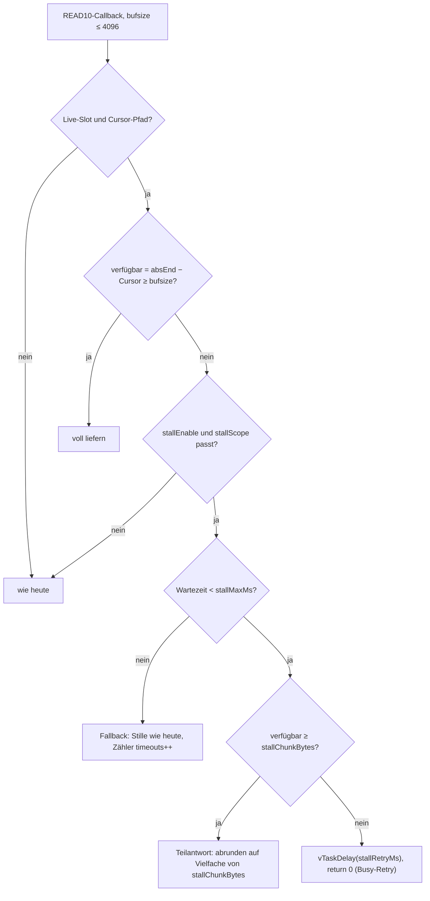

# Spezifikation Stall-Build (Bremsen) · Vorlage für das nächste Firmware-Go · 2026-10-08

**Status:** Vorlage. **Kein** Firmware-Go, kein OTA. Umsetzung erst nach ausdrücklicher Freigabe.
Ziel: **ein** Flash, der alle offenen HU-Fragen zum Bremsen (HU-Facts E7, Q10, R12, Teilantworten) **über Laufzeit-Stellschrauben** prüfbar macht — ohne weiteren Flash pro Variante.
Grundlage: [`ANALYSE-STREAM-WEG-2026-10-08.md`](../betrieb/artifacts-2026-10-08-feld/ANALYSE-STREAM-WEG-2026-10-08.md), [`SPIKE-TINYUSB-READ10`](../betrieb/artifacts-2026-10-06-lab/SPIKE-TINYUSB-READ10-2026-10-06.md), [`ESP-REVIEW-UND-STELLSCHRAUBEN`](../betrieb/artifacts-2026-10-08-feld/ESP-REVIEW-UND-STELLSCHRAUBEN-2026-10-08.md), Stufenplan 3.3.

Mit Standardwerten (`stallEnable=false`) verhält sich der Build **exakt wie 0.4.46**.

## 1. Verhalten

Ort: `UsbMscGadget::onRead`, Zweig `live` (heute `stream_->readAt(fileOff, out, bufsize)`), FW 0.4.46.

Regeln:

1. **Nie `return <0`** für Live-Lücken (STALL + Sense „Medium nicht vorhanden“, Spike).
2. **Busy-Retry** = `return 0`; TinyUSB ruft denselben Offset erneut auf, die HU sieht NAK. Vorher `vTaskDelay(pdMS_TO_TICKS(stallRetryMs))`, weil der usbd-Task die höchste Priorität hat (sonst laufen Pump-Task und WLAN nicht).
3. **Teilantwort** = Rückgabe < `bufsize`, immer Vielfaches von 512 B. TinyUSB sendet sie und ruft mit `offset += n` weiter.
4. **Wartezeit-Bezug** über `stallMaxMs`-Modus (Feld `stallTimer`):
   - `cmd`: Timer startet beim ersten Callback eines Kommandos (`offset == 0`), gilt für das ganze Kommando (testet ein Gesamtdauer-Limit der HU).
   - `cb`: Timer startet bei jedem Callback neu (testet ein Inaktivitäts-Limit, zusammen mit Teilantworten).
5. **Vorsprung** ergibt sich von selbst: Ringinhalt (heute 48 KiB = 8,2 s @48k) wird ohne Bremsen geliefert, erst danach greift die Bremse.
6. ID3-Kopf (fileOff < id3Len) wird nie gebremst.

## 2. Laufzeit-Stellschrauben (`/api/config`, NVS, `kConfigVersion` 4 → 5)

| Feld | Typ | Default | Werte | Zweck |
|---|---|---|---|---|
| `stallEnable` | bool | false | | Hauptschalter |
| `stallScope` | uint8 | 1 | 0 = aus, 1 = nur nach Kopf-Snap sequentiell (Replug-Pfad), 2 = alle Live-Reads | Tap-Pfad (R16, außer der Reihe) erst später |
| `stallTimer` | uint8 | 0 | 0 = `cmd`, 1 = `cb` | Gesamt- oder Inaktivitäts-Limit testen (E7) |
| `stallMaxMs` | uint16 | 500 | 0–15 000 | Höchstwartezeit, danach Fallback |
| `stallChunkBytes` | uint16 | 4096 | 512 / 1024 / 2048 / 4096 | 4096 = keine Teilantworten |
| `stallRetryMs` | uint8 | 2 | 1–20 | Pause vor `return 0` |
| `leadBytes` | uint16 | 0 | 0–49 152 | Tap-Pfad: so viele Bytes nach dem Kopf-Snap ungebremst liefern (ggf. Stille), damit das erste Kommando nicht auf den Producer-Start wartet (B5) |
| `underrunCursorHold` | bool | false | | Bei Stille-Fallback Cursor **nicht** weiterschieben; spätere Live-Daten setzen lückenlos fort (heute läuft der Cursor durch Stille weiter, R27) |
| `silenceMatchLive` | bool | false | | Stille im Live-Format (MPEG-2 L3, 22,05 kHz mono, 48k) statt `kSil` (MPEG-1 48 kHz stereo). Prüft die Hypothese „5–6 s statt 8,2 s wegen Formatwechsel“ (R25). Frame-Tabelle einmal mit ffmpeg erzeugen (Pi), als `const` einbauen |

Grenzen: `stallMaxMs` > 15 000 ablehnen (Task-Watchdog, HU-Reset-Gefahr). Änderungen wirken ab dem nächsten Kommando, kein Reboot.

## 3. Telemetrie (`/api/status` → `msc.stall`, `/api/metrics` → `mscTrace`)

| Feld | Bedeutung |
|---|---|
| `cmds` | gebremste Kommandos |
| `retries` | `return 0`-Aufrufe |
| `partials` / `partialBytes` | Teilantworten |
| `timeouts` | Fallback auf Stille nach `stallMaxMs` |
| `waitMsMax`, `waitMsLast`, `waitMsSum` | Wartezeit je Kommando |
| `waitHist` | Kommandos mit Wartezeit < 100 / < 500 / < 1000 / < 2000 / ≥ 2000 ms |
| `botResets` | Bulk-Only-Reset / Bus-Reset (TinyUSB-Reset-Callback, `tud_umount`) — **das** Signal, dass die HU abbricht |
| `turDuringStall` | sollte 0 sein (BOT, E6 [B]); > 0 hieße: Modell falsch |
| `mscTrace[].w` | Wartezeit je Callback in ms (neues Feld je Eintrag) |
| `mscTrace[].p` | 1 = Teilantwort |

Zusätzlich, unabhängig vom Bremsen (HU-Facts Q11, Plug-Reboots s3):

| Feld | Bedeutung |
|---|---|
| `sys.lastResetReason` | `esp_reset_reason()` beim Boot (z. B. `BROWNOUT`, `PANIC`, `TASK_WDT`, `POWERON`), Klartext |
| `sys.resetCount` | Boot-Zähler in NVS, je Grund (`brownout`, `panic`, `wdt`, `other`) |
| `sys.prevUptimeS` | Uptime vor dem letzten Reset (periodisch in NVS/RTC-RAM gesichert) |
| optional Coredump | `CONFIG_ESP_COREDUMP_ENABLE_TO_FLASH`, Abruf über `/api/coredump` — Backtrace bei Panic ohne Laptop |

`tools/feld_status_poll.py` und `feld_trace_poll.py` übernehmen die Felder (Pi-seitig, ohne Go möglich, sobald der Build existiert).

## 4. `readAt`-Sperre (Review-Punkt 4)

Heute liest `StreamBuffer::readAt` (usbd-Task) `absBase_/absEnd_/head_/size_` ohne Sperre, während der Pump-Task `push` schreibt. Mit Bremsen wird das kritisch, weil der Cursor genau an `absEnd_` läuft.

- Zu Beginn von `readAt` unter `portENTER_CRITICAL` einen **Schnappschuss** (`absBase, absEnd, head, size`) ziehen; `push` schreibt Index-Felder unter derselben Sperre.
- Kopieren außerhalb der Sperre aus dem Schnappschuss; der Producer überschreibt nur Bytes vor `absBase` (Ring-Überlauf). Läuft der Cursor dabei unter `absBase` (Ring voll überschrieben), wie heute auf `absBase` anheben und `headResyncs`-ähnlich zählen (`cursorLost`).
- Verfügbarkeit (`absEnd − Cursor`) aus demselben Schnappschuss berechnen, damit Bremsentscheidung und Kopie zusammenpassen.

## 5. Abnahme-Leiter

### 5.1 Lab (Lab-ESP .88, Lab-Pi, `nbt_hu_sim.py --golden REPLUG`)

| Schritt | Einstellung | Soll |
|---|---|---|
| L0 | `stallEnable=false` | REPLUG wie 0.4.46 (Sollwerte [`AUFTRAG-LAB-REALITAET`](../betrieb/artifacts-2026-10-08-feld/AUFTRAG-LAB-REALITAET-2026-10-08.md)) |
| L1 | an, `stallMaxMs=1000`, Chunk 4096, `cmd` | Nach dem Vorsprung `sg_ms_per_4k` ≈ 683 ms; `undDelta` = 0; `live_span.seq_gaps` = 0; Lesedauer ≈ 87 s |
| L2 | Chunk 512 | Teilantworten alle ~85 ms, `partials` > 0, Ergebnis wie L1 |
| L3 | `stallMaxMs=300` | `timeouts` > 0, danach Stille wie heute; kein `botResets` |
| L4 | `--cmd-timeout-ms 500` im Simulator, `stallMaxMs=1000` | SG-Timeout → Linux-Reset → `botResets` steigt; ESP bleibt stabil (kein Watchdog-Reboot) |
| L5 | `--replug-cmd-kib 64` | Gesamtwartezeit je Kommando ≈ 10,9 s → `cmd`-Timer schlägt bei `stallMaxMs<11000` zu; mit `cb` + Chunk 512 nicht |
| L6 | Producer-Lücke (`RealisticProducer gaps`) 5 s | Vorsprung fängt sie ab, keine Stille im Dump |

### 5.2 Auto (Feld-ESP .89, nur im Stand, Replug-Pfad)

Ablauf je Stufe: Sender tippen, ≥ 12 s warten, Replug, 2 min hören (Zählton `--marker --marker-period 1`), Status + Trace mitschneiden.

Leiter `stallMaxMs` (Timer `cmd`, Chunk 4096): **100 → 250 → 500 → 700 → 1000 → 2000 → 5000 → 11 000 ms**.
Danach dieselbe Leiter mit Chunk 512 und Timer `cb`.

Je Stufe festhalten: spielt weiter / Track-Skip / Meldung im HU-Display / USB neu angemeldet (`botResets`, neue Enumeration) / Hördauer.

**Abbruch:** zwei HU-Fehlerbilder in Folge → eine Stufe zurück, Stufe als Grenze notieren. HU nie im Fehlerzustand stehen lassen (Replug ohne Stall zur Kontrolle).

### 5.3 Auswertung

| Beobachtung | Schluss |
|---|---|
| Chunk 4096 scheitert ab X ms, Chunk 512 + `cb` geht weit darüber | HU misst **Inaktivität** → Bremsen mit Teilantworten tragfähig |
| Beide scheitern ab gleichem X | **Gesamtdauer**-Limit → Kommandogröße (Q10) entscheidet; X ≥ 0,7 s nötig für 4 KiB @48k, sonst höhere Bitrate (Tabelle 3.3 Stream-Analyse) |
| Ton nach dem Vorsprung, Lesedauer ≈ Echtzeit | R12 erfüllt: HU spielt inkrementell → Dauerstrom-Weg offen |
| Stille nach Vorsprung trotz Bremsen | HU dekodiert erst nach vollständigem Lesen oder puffert anders → PSRAM-Zeitversatz |
| `silenceMatchLive` verlängert das Hörfenster auf ~8 s | Formatwechsel erklärt die 5–6 s (R25) |

## 6. Nicht Teil dieses Builds

PSRAM-Ring, Slot-Geometrie (große Slots / Dateikette), Tap-Pfad außer der Reihe (feste Zuordnung Dateioffset → Strom). Eigene Spezifikation nach der Auswertung von 5.3.
