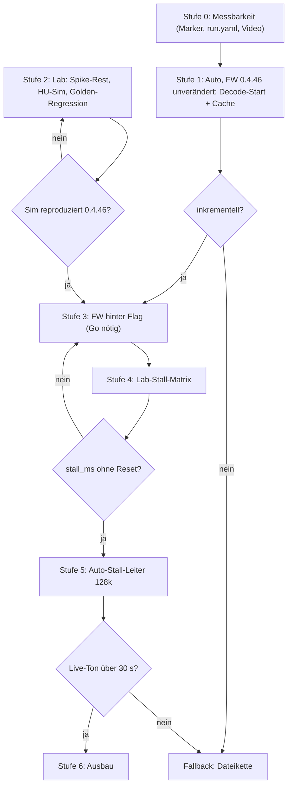

# Stufenplan: HU verstehen und Live-Ton hörbar machen

**Stand:** 2026-10-07 Abend (Stufe 3.2/3.3 feste Offset-Zuordnung; F1 [S] inkrementell + R23 P-Persistenz; T3-Abnahme für 3.2) · **FW-Freeze aktiv:** Stufe 3 ist nur spezifiziert; Umsetzung erst nach explizitem Go.
**Grundlagen:**
- [ANALYSE-HU-FILE-CACHE-BACKPRESSURE-2026-10-06.md](../betrieb/artifacts-2026-10-06-feld/ANALYSE-HU-FILE-CACHE-BACKPRESSURE-2026-10-06.md) (Modell und Lösung)
- [KONZEPT-HU-SIM-NBT-2026-10-06.md](../betrieb/artifacts-2026-10-06-lab/KONZEPT-HU-SIM-NBT-2026-10-06.md) (Lab-Simulator)
- [SPIKE-TINYUSB-READ10-2026-10-06.md](../betrieb/artifacts-2026-10-06-lab/SPIKE-TINYUSB-READ10-2026-10-06.md) (Rückgabe 0 / Teilantwort)
- [HU-Technical-Facts.md](../fahrzeug/HU-Technical-Facts.md) (Faktenbasis)

---

## 0. Ausgangslage in fünf Sätzen

1. Die HU liest die gewählte Datei mit ~0,7–1 MB/s bis EOF oder Abwahl, cacht sie und spielt aus dem Cache.
2. Der ESP liefert bei fehlenden Live-Daten Stille und zählt den Host-Cursor trotzdem weiter (`StreamBuffer::readAt`). Damit wird live Gelieferte nie mehr erreicht.
3. Hebel ist deshalb **Rückstau im MSC-Read-Pfad** (Stall), nicht Ringgröße, Prefill oder PSRAM.
4. TinyUSB unterstützt Stall ohne Blockade: Rückgabe 0 heißt „nochmal fragen“, eine Teilantwort in 512-B-Schritten ist möglich (Spike).
5. F1 ist praktisch **inkrementell [S]** (Abend-Stick); formal fehlt Video-Timing. Neu und entscheidend: die HU speichert **P** über Medienwechsel (R23) — Stall muss P≠0 beherrschen. Weiter offen: READ10-Toleranz (Q1) und P-Identität.

### Neue Funde aus dem Code (2026-10-06, Nachmittag)

| # | Fund | Quelle | Folge |
|---|------|--------|-------|
| N1 | Bridge drosselt den Audio-Strom per Token-Bucket auf **`AUDIO_TARGET_BPS = 9000` B/s**. Die gemessenen 8,4–8,9 KB/s „Burst“ sind diese Drossel, die den ffmpeg-Rückstau (Server-Burst) abbaut. | `esp32.pidrive-main/tools/pump_bridge.py` | Bei 48k bleibt das Polster (~3 KB/s × 60 s ≈ 180 KB ≈ 30 s). Bei **128k (16 KB/s) liegt die Drossel unter Echtzeit**, also Dauer-Underrun. Für Stufe 5 muss sie auf ≥ 24.000 B/s angehoben werden. |
| N2 | ffmpeg kodiert **mono, 22,05 kHz** (`-ac 1 -ar 22050`), also MPEG-2 Layer III (`FF F3`). | `pump_bridge.py`, `_ffmpeg_cmd_for_source` | Byte-Rate bleibt Bitrate/8; Rechnungen gelten weiter. |
| N3 | Der Stille-Frame `kSil` ist **MPEG-1, 44,1 kHz, Joint-Stereo** (`FF FB 30 64`). | `StreamBuffer.h`, `Mp3Silence.h` | Jeder Underrun wechselt mitten in der Datei MPEG-Version und Abtastrate. Decoder reagieren darauf oft mit Resync, Pause oder Abbruch (**R7**). |
| N4 | `return 0` in `tud_msc_read10_cb` wird von TinyUSB sofort erneut aufgerufen, es ist ein Busy-Retry. | Spike | Vor `return 0` mit `vTaskDelay(2 ms)` abgeben, sonst verhungert der Producer-Task. |
| N5 | Teilantworten müssen Vielfache von 512 B sein (Full-Speed, 64 B MPS; Short Packet beendet die Datenphase). | Spike | Regel im Stall-Adapter |

---

## Übersicht



| Stufe | Ort | Wer | FW-Änderung | Pi-Änderung | Dauer (Schätzung) |
|-------|-----|-----|-------------|-------------|-------------------|
| 0 | Pi, Doku | Du / Cursor | nein | Marker (optional) | 1–2 h |
| 1 | Auto | Du | nein | nein | 1 Termin, ~45 min |
| 2 | Lab (Debian) | zweite Cursor-Instanz | nein | nein | 1–2 Tage |
| 3 | Code | Cursor | **ja (Go)** | Drossel, Format | 1 Tag |
| 4 | Lab | zweite Instanz | Lab-Build | — | 0,5–1 Tag |
| 5 | Auto | Du | OTA Flag-Build | ja | 1–2 Termine |
| 6 | Auto + Lab | beide | ggf. | ggf. | offen |

---

## Stufe 0: Messbarkeit herstellen

**Frage:** Wie sehen und hören wir später eindeutig, was die HU wann tut?
**Kein Freeze-Bruch.** Die Marker sind eine Pi-Änderung und werden erst ab Stufe 5 gebraucht.

### 0.1 Feldprotokoll `run.yaml` pro Lauf
Liegt im jeweiligen Artefakt-Ordner. Es ersetzt verstreute Angaben in `OPERATOR-NOTES.txt`.

```yaml
run_id: 2026-10-07-feld-s1-fav0-a
stufe: 1
env: feld                 # feld | lab | sim
fw: 0.4.46-dev
fw_commit: <hash>
build_env: pidrive-s3-l3
geometry: L3              # fav0 8 MiB, fav1/fav2 512 KiB
bridge:
  bitrate: 48k
  audio_target_bps: 9000
  ffmpeg_ar: 22050
  ffmpeg_ac: 1
stall_ms: 0               # ab Stufe 3
station: Rock Antenne
clock_sync:               # einmal pro Lauf: Status-Poll-Zeile und Uhr im Video
  esp_uptime_ms: 0
  wall: 2026-10-07T08:00:00+02:00
actions:                  # Bedienschritte mit Wanduhr (aus Video)
  - {t: "08:00:05", op: select, uid: fav0}
observations:             # Ohr / Display
  - {t: "08:00:06.2", what: timer_start}
  - {t: "08:00:06.2", what: sound_start}
heard: none               # audio | silence | cover_only | none
notes: ""
```

### 0.2 Video als Ohr-Wahrheit
- Handy filmt Display **und** Lautsprecher, Uhrzeit sichtbar (zweites Handy mit Stoppuhr oder Pi-Uhr im Web-UI).
- Display-Elemente notieren: Titel, Cover, **Spielzeit-Zähler**, Track-Nummer.
- Zu Beginn jedes Laufs einmal Status-Poll auslösen und gleichzeitig ins Video sprechen. Das ergibt `clock_sync`.

### 0.3 Hörbarer Marker (für Stufe 5)
In `_ffmpeg_cmd_for_source` (Pi-Bridge) eine zweite ffmpeg-Quelle mischen: alle 10 s ein 150-ms-Ton mit 1 kHz.

```text
-f lavfi -i "aevalsrc='0.25*sin(2*PI*1000*t)*lt(mod(t,10),0.15)':s=22050:c=mono"
-filter_complex "[0:a][1:a]amix=inputs=2:duration=first:normalize=0"
```

- Die Bridge loggt `marker_t0 = <Wanduhr bei ffmpeg-Start>`. Piep k liegt bei Encoder-Zeit `t0 + 10·k`.
- **Latenz** = Piep im Video minus `t0 + 10·k`. Ein Sprung der Latenz zeigt eine Lücke oder Wiederholung.
- Schalter `--marker` (default aus), damit der Normalbetrieb unverändert bleibt.

### 0.4 Status-Poll-Takt
Für die Stufen 1 und 5 das Status-JSON **jede Sekunde** pollen, wie in `correlate-watch.jsonl`, und Wanduhr dazu schreiben. Nötige Felder: `readCount`, `bytesFile`, `slotMap.*.b`, `streamBytes`, `underruns`, `hostAbs`.

**Fertig, wenn:** `run.yaml`-Vorlage im Repo, Poll-Skript läuft mit Wanduhr, Marker-Schalter vorhanden (darf bis Stufe 5 warten).

---

## Stufe 1: Kernfrage im Auto — ohne FW-Änderung

**Fragen:**
- **F1:** Spielt die HU inkrementell oder Batch-then-Play?
- **F2:** Cacht sie eine Datei über Abwahl und über Remount?

**Warum ohne Ton:** Mit 0.4.46 liefert der Live-Slot praktisch nur Stille, weil der Cursor davonläuft. F1 wird deshalb über den **Spielzeit-Zähler** gemessen, gegen den **Lesefortschritt**. Beides funktioniert mit Stilledateien. Dass die HU Stille „spielt“, ist belegt (Fakt D2, 07:58).

### 1.1 Aufbau
- FW 0.4.46-dev, Env `pidrive-s3-l3` (fav0 = **8 MiB**, fav1/fav2 = 512 KiB).
- Für 1.2 die Bridge **stoppen**. So bekommt fav0 sicher die Nicht-Live-Füllung `Mp3Silence` mit Xing-Header, ohne Arm und Cursor-Effekte. Ist der Stopp nicht möglich, eine Station wählen, deren Slot nicht live armiert.
- 1-s-Status-Poll (0.4), Video (0.2).

### 1.2 Versuch F1: Decode-Start gegen Lesefortschritt
| Schritt | Aktion | Messung |
|---------|--------|---------|
| a | HU frisch gesteckt, Index abgeschlossen (TUR-Takt stabil) | Baseline `slotMap.fav0.b` |
| b | fav0 (8 MiB) wählen | t_sel (Video) |
| c | warten, bis `slotMap.fav0.b` nicht mehr steigt | t_eof = erster Poll mit b ≥ 8 MiB |
| d | Spielzeit-Zähler beobachten | t_timer = Zähler zeigt 0:01 |
| e | nach 60 s fav1 (512 KiB) wählen, dasselbe | Gegenprobe |
| f | 3 Wiederholungen je Slot, fav0/fav1 abwechselnd | Streuung |

**Auswertung:**

| Ergebnis | Bedeutung | Weiter |
|----------|-----------|--------|
| t_timer − t_sel ≈ 1 s bei fav0 **und** fav1, t_eof − t_sel ≈ 8–12 s bei fav0 | **inkrementell**: spielt, während noch gelesen wird | Stufe 3 wie spezifiziert |
| t_timer ≈ t_eof bei fav0 (8–12 s), bei fav1 ≈ 1 s | **Batch-then-Play** | Fallback (Dateikette); Stall nur als Hilfsmittel |
| Zähler startet, aber die HU liest fav0 nicht bis EOF | Lesen mit Limit (Read-Ahead-Fenster) | Fenstergröße aus `b` ablesen. Stall ist sehr gut geeignet. |

Plausibilitätsgrenze: Bei ~1 MB/s und 8 MiB unterscheiden sich die Fälle um ≥ 7 s. Das ist im Video eindeutig.

### 1.3 Gegenprobe mit echter MP3 (optional, ohne ESP)
USB-Stick mit zwei Dateien: 128-kbit-MP3 mit 5 MB und mit 100 MB (gleicher Inhalt, geloopt).
- Zeit von Auswahl bis Ton bei beiden messen. Wächst die Verzögerung mit der Dateigröße, spricht das für Batch-then-Play.
- Besser über einen USB-1.1-Hub (erzwingt Full-Speed, ~1 MB/s): Dann dauert ein Batch-Read von 100 MB ≈ 100 s und ist unübersehbar.
- Diese Probe beantwortet F1 mit echtem Ton. Sie sagt nichts über ESP-spezifisches Verhalten.

### 1.4 Versuch F2: Cache-Lebensdauer
| Schritt | Aktion | Messung |
|---------|--------|---------|
| a | fav1 wählen, bis EOF lesen lassen | `slotMap.fav1.b`, `readCount` |
| b | fav2 wählen, 30 s warten, fav1 erneut wählen | Liest die HU fav1 neu (`b` steigt um 512 KiB)? |
| c | wie b, aber 5 min warten | Cache-Alterung |
| d | ESP abziehen, 10 s, stecken, nach Index fav1 wählen | Cache über Remount (gleiche Serial) |
| e | wie d, aber mit Lab-Build anderer Serial (falls verfügbar) | Cache-Key = Serial? |

**Auswertung:** Für die Stall-Lösung zählt vor allem, ob die HU **nach Remount** neu liest. Wenn nicht, braucht Muster B in Stufe 6 einen Serial- oder Inhaltswechsel.

### 1.5 Nebenbei mitnehmen
- Track-Wechsel-Lücke an EOF stoppen (bekannt ~6 s): Zeit zwischen Ende Spielzeit fav1 (87 s) und Start nächster Track.
- Next-Track-Prefetch: Welcher Slot wird nach EOF gelesen, und wann?

### 1.6 Später (nicht mit F1 vermischen): Cache-Kapazität Q4a–c
Drei Fav-Slots reichen nicht, um die HU-Cachegröße zu schätzen. Nach F1/F2: Eager einer Datei (Größenleiter), Multi-File Hit/Miss-Matrix, Eviction-Probe — Katalog [`EXPERIMENTKATALOG-Q4-CACHE-MARKER-2026-10-07.md`](../betrieb/artifacts-2026-10-06-feld/EXPERIMENTKATALOG-Q4-CACHE-MARKER-2026-10-07.md). Live-Stall und Cache-Matrix **getrennte** Experimente.

**Fertig, wenn:** F1 eindeutig entschieden, F2 a–d beantwortet, alle Läufe mit `run.yaml` abgelegt unter `docs/betrieb/artifacts-<datum>-feld-s1/`. Ergebnisse als Fakten in [HU-Technical-Facts.md](../fahrzeug/HU-Technical-Facts.md) eintragen (Q-Fragen schließen).

---

## Stufe 2: Lab vorbereiten (parallel zu Stufe 1)

**Fragen:**
- Trägt der TinyUSB-Mechanismus auf unserem Build?
- Bildet der Simulator 0.4.46 so genau nach, dass seine Stall-Ergebnisse etwas bedeuten?

### 2a TinyUSB-Spike
**Erledigt:** Upstream-Code gelesen, siehe [SPIKE-TINYUSB-READ10-2026-10-06.md](../betrieb/artifacts-2026-10-06-lab/SPIKE-TINYUSB-READ10-2026-10-06.md).
**Rest auf dem Debian-Container (nur lesen, ~5 min):**
- `USBMSC.cpp` reicht den Rückgabewert 1:1 durch?
- Priorität und Core des USB-Tasks (`esp32-hal-tinyusb.c`) gegenüber PumpServer/lwIP
- `CFG_TUD_MSC_EP_BUFSIZE` = 4096? → **Lab C3 2026-10-07 bestätigt:** `esp_readCount_delta/reads` = 1/4/16 bei READ10 4/16/64 KiB ([`C1-C7-ERGEBNIS.md`](../betrieb/artifacts-2026-10-07-lab/C1-C7-ERGEBNIS.md)).

Befehle stehen im Spike-Dokument.

### 2b HU-Simulator `nbt_hu_sim.py`
Umsetzung durch die zweite Cursor-Instanz nach [KONZEPT-HU-SIM-NBT](../betrieb/artifacts-2026-10-06-lab/KONZEPT-HU-SIM-NBT-2026-10-06.md). Reihenfolge und Abnahme:

| Schritt | Inhalt | Abnahme |
|---------|--------|---------|
| 2b.1 | **Profil-Extraktor** `nbt_profile_extract.py`: liest `status-*.json`, `st-*.json`, `correlate-watch.jsonl`, Bridge-Logs → `tools/profiles/nbt_evo_2026-10-06.json` | Read-Gap-Median 3–5 ms, Read-Größe 4096, Scan-Reihenfolge wie Feld |
| 2b.2 | **Producer realistisch:** `rate = min(AUDIO_TARGET_BPS, Rückstau + Echtzeit)`, Start 3,4 s, Rückstau ~180 KB, Gaps 0,5 s und 3 s. Frames im **Feldformat** (MPEG-2 22,05 kHz mono) mit PDSQ-Stempel | 48k-Lauf ergibt 8,4–8,9 KB/s für ~60 s, dann 6,0 KB/s |
| 2b.3 | **HU-Zustandsmodell:** Index-Scan, Auswahl (Head-Reads), Eager-Read 4 KiB / 4 ms bis EOF oder Abwahl, Next-Prefetch, Cache je Serial+Datei, Wiedergabeuhr, EOF +6 s → Track +1 | Ablaufdiagramm aus HU-Facts wird durchlaufen |
| 2b.4 | **Klassifikator** pro 4-KiB-Read: `ID3` / `LIVE` (`FF F3` + PDSQ) / `SILENCE` (`kSil`-Muster `FF FB 30 64`) / `SEED` / `OTHER` | 100 % Treffer auf aufgezeichneten Lab-Reads |
| 2b.5 | **Virtuelles Ohr:** HU-Puffer = empfangene Live-Sekunden − gespielte. Meldet Dropout, Lücke, Duplikat, Stille-im-Spiel, Latenz | Report-JSON |
| 2b.6 | **Golden-Regression** gegen Lab-ESP mit 0.4.46, Env `pidrive-s3-l3` | siehe unten |

**Golden-Regression (Pflicht, Toleranz ±1 Read = ±4096 B):**

| ID | Feldsituation | Sim muss zeigen |
|----|---------------|-----------------|
| G1 | 07:58 fav1, Muster A | 86.016 B vor Arm; danach `underruns` = `hostAbs` = 438.272; 0 B LIVE |
| G2 | 08:04, Muster B (Datei schon im Cache) | kein Body-Read nach Arm, `hostAbs = 0` |
| G3 | 01.10.-Äquivalent: Ring voll beim Read | genau 49.152 B LIVE, danach Stille |
| G4 | Next-Prefetch nach EOF fav1 | Head-Reads auf fav2 innerhalb ~1 s nach EOF |
| G5 | Producer-Profil | wie 2b.2 |

**Hinweis für Lab-Betrieb:** Gerät nie mounten (nur SG_IO, `/dev/sgN`). `SgIoHdr.duration` je Kommando loggen. Vor jedem Lauf `power-cycle` oder Reset gegen Restzustand (O6-Hygiene).

**Fertig, wenn:** G1–G5 grün und drei Läufe hintereinander reproduzierbar sind. Erst dann sind Stall-Ergebnisse aus Stufe 4 belastbar.

---

## Stufe 3: Firmware hinter Flag — **nur mit Freeze-Go**

**Frage:** Lässt sich Rückstau so einbauen, dass 0.4.46-Verhalten bei `stall_ms = 0` **bitgleich** bleibt?
**Status:** Spezifikation. Der Code entsteht erst nach Go und wird nicht ohne Freigabe geflasht.

### 3.1 Telemetrie (Voraussetzung, klein)
- `streamBytesServed_ = 0` in `UsbMscGadget::startStream()`. `underruns_` wird bereits über `StreamBuffer::start()` → `clear()` zurückgesetzt.
- `streamBytesServed_` zählt nur **echte Live-Bytes** (Rückgabe von `readAt`), nicht `bufsize`.
- Neue Zähler im Status: `stallPolls`, `stallMsMax`, `stallTimeouts`, `partialReplies`, `liveServed`, `silServed`.
- **Per-Read-Trace:** den vorhandenen Export `msc.reads` (`MscReadBurst`, Drain in `loop()`) um Felder erweitern: `fileOff0`, `live`, `sil`, `stallMs`, `cur` (hostAbsCursor), `end` (absEnd). Die Bridge schreibt diese als JSONL mit Wanduhr. Das ersetzt das 96er-`mscTrace`-Fenster als Hauptquelle.

### 3.2 StreamBuffer: feste Zuordnung Dateioffset → Stromoffset

> **Geändert 2026-10-07 (Risiko R10).** Der frühere Entwurf (`availAtCursor`/`readAtStrict` mit zählendem `hostAbsCursor_`) setzt voraus, dass die HU sequenziell liest. Das stimmt nicht. Die HU liest Segmente außer der Reihe, rückwärts und vorwärts um die Wiedergabeposition, bis 968 KiB voraus (HU-Facts R16/R17). Ein zählender Cursor würde dabei Live-Bytes an falsche Dateioffsets vergeben. Ersetzt durch eine feste, zustandslose Zuordnung.

Beim Arm wird **einmal** festgelegt:

```text
armFileOff_ = id3Len                  // erster Body-Offset der Live-Datei
armAbs_     = max(absBase_, absEnd_ - preroll)   // Stromposition, die bei armFileOff_ liegt
pos(fileOff) = armAbs_ + (fileOff - armFileOff_) // gilt für die ganze Session, nie fortgeschrieben
```

Jeder Read wird nach `s = pos(fileOff)` gegen den Ring `[absBase_, absEnd_)` eingeordnet:

| Klasse | Bedingung | Antwort | Zähler |
|--------|-----------|---------|--------|
| Kopf | `fileOff < armFileOff_` | Sticky-ID3 wie heute | — |
| vergangen | `s + n ≤ absBase_` | sofort `kSil` | `liveMissPast` |
| vorhanden | `s + n ≤ absEnd_` (Teil-Überlappung mit Vergangenem: Live-Teil + `kSil`) | Live | `liveServed` |
| nahe Zukunft | `s < absEnd_ + stallAhead` | Stall / Teilantwort (3.3) | `stallPolls`, `partialReplies` |
| ferne Zukunft | `s ≥ absEnd_ + stallAhead` | sofort `kSil` | `liveMissFar` |

```cpp
// Stromposition für einen Dateioffset (nur gültig, wenn armed_).
uint32_t posFor(uint32_t fileOff) const { return armAbs_ + (fileOff - armFileOff_); }

// Bytes ab posFor(fileOff), die jetzt lieferbar sind; 0 wenn vergangen oder Zukunft.
size_t availAt(uint32_t fileOff) const;

// Kopiert alles Lieferbare aus dem Ring, füllt den Rest frame-ausgerichtet mit kSil.
// Bewegt keinen Zustand. Rückgabe: Anzahl Live-Bytes.
size_t readMapped(uint32_t fileOff, uint8_t* out, size_t n);
```

Eigenschaften:
- **Idempotent:** Ein erneuter Read desselben Offsets liefert denselben Inhalt, solange er im Ring liegt (Rückwärtssegmente, Wiederanlauf R20).
- **Frame-Grenzen bleiben erhalten:** Die Zuordnung ist linear und beginnt an einer Frame-Grenze (`armAbs_` auf Frame-Start runden). Nur an Übergängen zu `kSil` gibt es einen Resync.
- **`stallAhead`** begrenzt, wie weit voraus gestallt wird. Startwert `= stall_ms × Bitrate/8` (das, was der Producer in der Stall-Zeit liefert), mindestens 4 KiB. Alles darüber kann innerhalb von `stall_ms` nicht kommen und bekommt sofort Stille.
- **`preroll`** (Startwert: Ringfüllung beim Arm) bestimmt die Latenz. Mehr Preroll heißt weniger Stall beim ersten Lauf (360 KiB, R17), aber mehr Verzögerung zum Radio.
- `readAt` und `hostAbsCursor_` bleiben für `stall_ms = 0` unverändert (Bitgleichheit).

**Was die Zuordnung nicht löst:** Liest die HU bei frischer Auswahl weit vor die Live-Kante, z. B. 360 KiB ≈ 61 s bei 48k oder ≈ 23 s bei 128k, landen diese Offsets als Stille im HU-Cache. Ob das bei **Auswahl ab Kopf** passiert, klärt Q8 im nächsten Feldtermin ([`FELDPROTOKOLL-NAECHSTER-TERMIN.md`](../betrieb/artifacts-2026-10-07-feld/FELDPROTOKOLL-NAECHSTER-TERMIN.md)). Das Ergebnis entscheidet zwischen zwei Wegen: Stall nur für den ersten sequenziellen Lauf, oder Stall auch für vorauslesende Segmente mit großem `stallAhead` bei hoher Bitrate.

**Abnahme Lab (T3 → Stufe 3.2):** Gleiche OOO-Lesereihenfolge wie Lab-Probe T3 (`docs/betrieb/artifacts-2026-10-07-lab/T1-T4-ERGEBNIS.md`, Lauf `T3-1616/`). Erwartung nach Umsetzung der festen Zuordnung: `abs0−off` **konstant** über die LIVE-Reads (heute mit zählendem Cursor 0.4.46: **FAIL**, 53 unique Werte). Ohne bestandenes T3 kein Stall-Go.

### 3.3 Stall-Adapter im Live-Pfad von `onRead`
Heute ([UsbMscGadget.cpp](../../../../esp32.pidrive-main/esp32.pidrive-main/src/msc/UsbMscGadget.cpp), ~Zeile 739):

```cpp
if (live) {
    stream_->readAt(fileOff, out, bufsize);
    streamBytesServed_ += bufsize;
}
```

Entwurf:

```cpp
if (live) {
    const bool stallable = stallMs_ > 0 && fileOff >= stream_->id3Len()
                           && stream_->isNearFuture(fileOff, bufsize, stallAhead_);
    if (stallable) {
        const size_t avail = stream_->availAt(fileOff);
        if (avail < bufsize) {
            const uint32_t now = millis();
            if (stallKeyLba_ != lba || stallKeyOff_ != offset) {
                stallKeyLba_ = lba; stallKeyOff_ = offset; stallT0_ = now;
            }
            if (now - stallT0_ < stallMs_) {
                const size_t part = avail & ~(size_t)511;
                if (part == 0) {
                    stallPolls_++;
                    vTaskDelay(pdMS_TO_TICKS(2));
                    return 0;                       // TinyUSB ruft gleiche LBA erneut
                }
                bufsize = part;                     // Teilantwort, Vielfaches von 512
                partialReplies_++;
            } else {
                stallTimeouts_++;                   // Rest als Stille; Zuordnung bleibt fest
            }
            stallMsMax_ = max(stallMsMax_, now - stallT0_);
        }
    }
    const size_t liveN = stallMs_ > 0 ? stream_->readMapped(fileOff, out, bufsize)
                                      : (stream_->readAt(fileOff, out, bufsize), bufsize);
    streamBytesServed_ += liveN;
}
```

`isNearFuture(fileOff, n, ahead)` heißt: `posFor(fileOff) + n > absEnd_` und `posFor(fileOff) < absEnd_ + ahead`. Vergangene und vorhandene Bereiche brauchen keinen Stall, ferne Zukunft bekommt sofort Stille (Tabelle 3.2).

Regeln:
- **Stall nur** für den aktiven Live-Slot, Offset hinter dem ID3-Block und Stromposition in der nahen Zukunft. Die Lesereihenfolge spielt keine Rolle mehr.
- **Sofort Stille** für ferne Zukunft, vergangene Ringbereiche, Nicht-Live-Slots, Next-Prefetch und Index-Scan.
- Trace pro Read: `fileOff`, `pos`, `absBase`, `absEnd`, Klasse, `live`, `stallMs`. Nur damit lässt sich im Lab (C4) und im Feld prüfen, welcher Dateioffset welchen Strominhalt bekommen hat.
- Der Pfad mit `return 0` darf `noteDataRead` nicht aufrufen. Sonst zählt jeder Retry als Read und verfälscht die Play-Erkennung.
- Der statische FAT-, Root- und Dir-Teil von `onRead` bleibt unberührt, denn er läuft vor dem File-Payload.
- `bufsize` wird vor dem Payload-Zweig verkleinert. Der Demo- und Zero-Fill oben in `onRead` schreibt dann nur ins Puffer-Ende, das nicht gesendet wird.

### 3.4 Steuerung
- `stall_ms` über HTTP (`/cfg?stall_ms=`) und Pump-Kommando. Default 0, also bitgleich mit 0.4.46.
- Bereich 0–5000, Stufen wie in der Leiter.
- Version `0.4.47-dev`. **Kein** Default-Wechsel ohne Feldfreigabe.

### 3.5 Pi-Seite (kein FW-Freeze, aber gleichzeitig ausrollen)
| Änderung | Datei | Wert |
|----------|-------|------|
| Drossel an Bitrate koppeln | `pump_bridge.py` `AUDIO_TARGET_BPS` | `1,5 × bitrate/8`, also 9.000 (48k), 18.000 (96k), 24.000 (128k) |
| Format an `kSil` angleichen (R7) | `_ffmpeg_cmd_for_source` | Option `--ar 44100 --ac 2`. Damit sind Live und Stille beide MPEG-1 44,1 kHz. Default bleibt 22050/1 bis zum A/B-Test. |
| Marker | siehe 0.3 | `--marker` |

### 3.6 Großer Live-Slot (nur wenn Stufe 1 = inkrementell)
- Neues Env `pidrive-s3-l3big`: Live-Slot ≥ 64 MiB (48k ≈ 3,1 h, 128k ≈ 70 min), übrige Slots wie L3.
- Zu prüfen in `MscGeometry.h`: Volumen- und FAT16-Größe, Cluster-Ketten in `patchFatFixed`, Index-Zeit der HU bei größerem Volumen (in Stufe 4 per Sim, in Stufe 5 im Auto).
- Für den ersten Stall-Test reicht fav0 mit 8 MiB (8,7 min bei 128k). Der große Slot ist **kein** Muss für Stufe 5.

**Fertig, wenn:** Bei `stall_ms = 0` sind Golden G1–G5 unverändert, das ist der Bitgleichheits-Nachweis. Der Build läuft im Lab, und die Zähler sind im Status sichtbar.

---

## Stufe 4: Lab-Stall-Matrix

**Frage:** Bei welchem `stall_ms` liefert der ESP lückenlos, ohne dass der Linux-Host zurücksetzt? Und wie verhält sich das System bei WLAN-Lücken?

### 4.1 Mechanik-Nachweis (aus dem Spike)
| Test | Erwartung |
|------|-----------|
| `stall_ms = 1000`, leerer Ring, SG_IO-Timeout 5 s | `duration` ≈ 1000 ms, Daten = Stille, Status OK |
| wie oben, Producer läuft | `duration` = Zeit bis 512 B, Daten LIVE, Teilantworten sichtbar |
| SG_IO-Timeout 500 ms < `stall_ms` | Linux bricht ab und sendet BOT-Reset; Gerät antwortet danach ohne Re-Enumeration |
| CPU-Check | Producer-Rate während Stall unverändert (Falle 1 aus dem Spike) |

### 4.2 Matrix
`stall_ms` {0, 300, 700, 1500, 3000} × Bitrate {48k, 96k, 128k} × SG_IO-Timeout {2, 5, 10 s} × Gap {0, 0,5 s, 3 s}.
Das sind 135 Zellen. Zuerst die Diagonale fahren (128k, Timeout 5 s, alle Stalls und Gaps), dann gezielt verdichten.

**PASS je Zelle:**
- virtuelles Ohr: ≥ 30 s ohne Dropout
- 0 Duplikate, PDSQ-Sequenz lückenlos
- kein USB- oder BOT-Reset
- `stallTimeouts` = 0 bei Gap 0

### 4.3 Erwartete Rechenwerte (zur Plausibilisierung)
| Bitrate | Echtzeit | Wartezeit pro 512 B bei leerem Ring | pro 4 KiB |
|---------|----------|------------------------------------|-----------|
| 48k | 6.000 B/s | 85 ms | 0,68 s |
| 96k | 12.000 B/s | 43 ms | 0,34 s |
| 128k | 16.000 B/s | 32 ms | 0,26 s |

Mit Teilantworten muss ein READ10 nie die volle 4-KiB-Zeit hängen, solange der Producer kontinuierlich liefert. Kritisch sind nur Gaps: Ein WLAN-Aussetzer von 3 s braucht `stall_ms` ≥ 3000 oder ein Polster in der HU (Burst in den ersten 60 s).

**Ergebnis:** Startwert `stall_ms` für das Auto. Das ist der kleinste Wert, bei dem Gap 0 und 0,5 s grün sind. Dazu eine Tabelle „Gap-Toleranz je stall_ms“.

**Fertig, wenn:** Mechanik-Tests grün, Diagonale grün, Startwert dokumentiert unter `docs/betrieb/artifacts-<datum>-lab-s4/`.

---

## Stufe 5: Auto-Stall-Leiter bei 128k

**Frage:** Toleriert die HU hängende READ10, und hört man Live-Ton am Stück?

### 5.1 Aufbau
- OTA mit Flag-Build 0.4.47-dev, zunächst `stall_ms = 0`. Erster Kontrolllauf: Verhalten wie 0.4.46.
- Bridge mit `--bitrate 128k`, `AUDIO_TARGET_BPS = 24000`, `--marker`.
- Video, 1-s-Poll, Per-Read-Trace (3.1).

### 5.2 Leiter
| Schritt | `stall_ms` | Dauer | Abbruch, wenn |
|---------|-----------|-------|---------------|
| L0 | 0 | 1 min | — (Referenz, erwartet: kein Ton) |
| L1 | 300 | 2 min | Bus-Reset, „USB-Gerät nicht lesbar“, Track-Skip, Re-Enumeration |
| L2 | 700 | 2 min | wie L1 |
| L3 | 1500 | 2 min | wie L1 |
| L4 | 3000 | 2 min | wie L1 |

Ablauf je Schritt: `stall_ms` setzen, Station wählen, Marker-Pieps zählen, Latenz notieren.
Bei Abbruch eine Stufe zurück. Die HU-Toleranz liegt dann zwischen den beiden Werten (R1 eingegrenzt).

### 5.3 Format-A/B (R7), sobald eine Stufe Ton bringt
Gleiche Stufe zweimal, einmal mit `-ar 22050 -ac 1` (Ist), einmal mit `-ar 44100 -ac 2`. Gezählt wird, ob Ton nach einem provozierten Underrun (Pi-WLAN kurz trennen) wiederkommt.

### 5.4 Auswertung
| Größe | Quelle |
|-------|--------|
| Ton ab t_sel | Video |
| Ton-Dauer am Stück | Video, Marker |
| Latenz und Drift | Marker gegen `marker_t0` |
| `stallPolls`, `stallMsMax`, `stallTimeouts`, `partialReplies` | Status |
| Lesetempo der HU während Live | Per-Read-Trace: soll ≈ Producer-Rate sein |

**Ziel:** > 30 s Live-Ton am Stück, mit dokumentierter Latenz.
**Fertig, wenn:** Ziel erreicht und reproduziert (2 Stationen), oder die Toleranzgrenze bekannt ist, was dann zum Fallback führt.

---

## Stufe 6: Ausbau

| Thema | Vorgehen | Abhängig von |
|-------|----------|--------------|
| **Muster B** (Datei schon im Cache, Stille gecacht) | Nach Ergebnis F2 (Stufe 1): Remount, UNIT ATTENTION oder Serial-Wechsel bei Senderwechsel. Alternativ: Body-Reads auf den Live-Slot vor Arm ebenfalls stallen statt Stille | 1.4 |
| **Großer Live-Slot** | `pidrive-s3-l3big` im Auto, Index-Zeit messen | 3.6 |
| **Bitrate senken** | 96k, dann 48k mit `stall_ms` aus der Leiter. Bei 48k sind Einzelstalls länger, durch Teilantworten aber nur 85 ms je 512 B | 5 |
| **Dauerlauf** | 30 min, WLAN-Aussetzer provozieren, Senderwechsel ×10 | alles |
| **Drift** | Latenz über 30 min aus Markern. Erwartet ~0,4 s/h, das ist harmlos | 5 |
| **Doku** | HU-Facts Q1–Q6 schließen, `MSC-AKTUELL.md` Phase neu setzen, Defaults erst nach Dauerlauf | — |

---

## Fallback: Dateikette (falls Batch-then-Play oder keine Stall-Toleranz)


- Live-Strom in Dateien mit 10–20 s Audio (48k: 60–120 KB) zerlegen. Die HU holt die nächste per Next-Track-Prefetch.
- Eine Datei wird erst „sichtbar“ bzw. lesbar, wenn sie vollständig gepuffert ist. Davor bekommt der Prefetch Stall oder Stille.
- Bekannte Kosten: Lücke beim Track-Wechsel (~6 s gemessen, Ursache unklar). Lohnt nur, wenn die Lücke durch kurze EOF-Abstände oder Prefetch verschwindet. Das muss im Auto gemessen werden.
- Erst hier wird ein größerer Puffer (PSRAM) wieder relevant: mindestens 2 Dateien × 120 KB.

---

## Risiken und offene Punkte

| ID | Risiko | Wird geklärt in |
|----|--------|-----------------|
| R1 | HU-READ10-Timeout unbekannt | Stufe 5 Leiter |
| R2 | Batch-then-Play | Stufe 1 (F1) |
| R3 | Muster B: Prefetch vor Play cacht Stille | Stufe 1 (F2), Stufe 6 |
| R4 | 164-KiB-Fall vom 01.10. ungeklärt (FW 0.4.31) | Sim-Gegenprobe, niedrige Priorität |
| R5 | TinyUSB-Semantik | Spike erledigt, Rest Stufe 2a / 4.1 |
| R6 | Spieldauer-Anzeige aus Dateigröße | Stufe 1 nebenbei |
| **R7** | **Format-Wechsel Live (MPEG-2 22,05 kHz mono) ↔ Stille (MPEG-1 44,1 kHz)** bei jedem Underrun | Stufe 5.3 A/B |
| **R8** | **Bridge-Drossel 9.000 B/s unter Echtzeit bei 128k** | Stufe 3.5 (Pi) |
| R9 | Busy-Retry verhungert Producer | Stufe 4.1 CPU-Check |
| **R10** | **HU liest außer der Reihe und weit voraus** (Segmente bis 968 KiB um die Wiedergabeposition, erster Lauf 360 KiB ≈ 61 s bei 48k). Zählender Cursor vergibt Live-Bytes an falsche Offsets; Vorauslesen cacht Stille. Feld s2: oft Resume trotz UI-Tap (R23/P) | 3.2 feste Zuordnung + T3-Abnahme (`abs0−off` const); Lab C4/C6; Feld Q8. **Stall-Go erst nach F1-Formalgo, P-Quelle und T3** |
| R11 | Lesetakt 5,1 statt 4,0 ms, sobald der ESP Play erkennt (Ursache unbekannt) | Lab C2 |

## Was bewusst nicht passiert
- Kein weiteres Prefill- oder Ringgrößen-Tuning ohne Stall.
- Kein Stall im Auto, bevor Golden-Regression (Stufe 2) und Lab-Mechanik (4.1) grün sind.
- Keine Defaults ändern (`stall_ms`, Bitrate, Format), bevor der Dauerlauf grün ist.
- Kein `return -1` für Live-Lücken (Medienfehler bei der HU).
